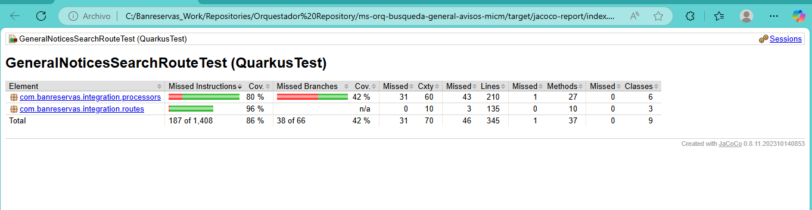

# ms-orq-cliente-banreservas

Este proyecto es un microservicio SOAP funcionando como orquestador encargado de consumir los servicios **LogInMICM_WS** y **BusquedaGeneralAvisosMICM_WS** de legado.

Si quieres aprender más de Quarkus, por favor visita el [sitio web oficial](https://quarkus.io/).

## Ejecución de la aplicación en modo de desarrollo

Puedes ejecutar tu aplicación en modo de desarrollo, lo que permite la codificación en vivo, utilizando el siguiente comando:

```shell script
./mvnw compile quarkus:dev
```

> **_NOTA:_**  Quarkus incluye una interfaz Dev UI que está disponible solo en modo de desarrollo en http://localhost:8080/q/dev/.

## Empaquetado y ejecución de la aplicación

La aplicación se puede empaquetar utilizando:


```shell script
./mvnw package
```
Este comando genera el archivo quarkus-run.jar en el directorio target/quarkus-app/. Ten en cuenta que no es un über-jar, ya que las dependencias se copian en el directorio target/quarkus-app/lib/.

La aplicación se puede ejecutar utilizando:

```shell script
java -jar target/quarkus-app/quarkus-run.jar
```
Si deseas construir un über-jar, ejecuta el siguiente comando:

```shell script
./mvnw package -Dquarkus.package.jar.type=uber-jar
```

La aplicación empaquetada como un über-jar se puede ejecutar utilizando:

```shell script
java -jar target/*-runner.jar
```

## Creación de un ejecutable nativo

Puedes crear un ejecutable nativo utilizando:

```shell script
./mvnw package -Dnative
```

O, si no tienes GraalVM instalado, puedes construir el ejecutable nativo en un contenedor utilizando:

```shell script
./mvnw package -Dnative -Dquarkus.native.container-build=true
```

Luego, puedes ejecutar tu ejecutable nativo con:

```shell script
./target/ms-orq-cliente-banreservas-1.0.0-SNAPSHOT-runner
```

Para obtener más información sobre cómo construir ejecutables nativos, consulta https://quarkus.io/guides/maven-tooling.

## Guías Relacionadas

- **Quarkus CXF:** Capacidades principales para implementar clientes SOAP y servicios JAX-WS.
- **RESTEasy Reactive:** Implementación de Jakarta REST utilizando procesamiento en tiempo de compilación y Vert.x.
- **SmallRye OpenTracing:** Trazado de servicios con SmallRye OpenTracing.
- **SmallRye OpenAPI:** Documenta tus APIs REST con OpenAPI, incluye Swagger UI.
- **Jacoco - Cobertura de Código:** Soporte para cobertura de pruebas con Jacoco.
- **SmallRye Health:** Monitorea la salud de tu aplicación usando SmallRye Health.
- **Micrometer Metrics:** Instrumenta el tiempo de ejecución y tu aplicación con métricas dimensionales usando Micrometer.

## Endpoints

**POST:** /cards/movements/api/v1/get/getCardMovementsCRM

**Descripción:** Este endpoint permite obtener los movimientos financieros de un cliente en CRM.

**GET:** /cards/movements/api/v1/health

**Descripción:** Monitorea la salud de tu aplicación utilizando SmallRye Health.

**GET:** /cards/movements/api/v1/swagger-ui

**Descripción:** Para acceder a Swagger UI y ver la documentación de las apis.

**Códigos de Respuesta:**

    200 OK - Exitoso: Éxito en la operación.
    400 Bad Request - BAD_REQUEST: Solicitud incorrecta.
    401 Unauthorized - UNAUTHOTIZE: No autorizado.
    500 Internal Server Error - INTERNAL_SERVER_ERROR: Error interno del servidor.
    503 BAD_GATEWAY: Error de conexión al servicio.
    500 UNEXPECTED_ERROR: Error interno inesperado del servidor.

## Integración con Servicios Externos

El servicio invoca un servicio REST llamado ms-get-cards-movements, que devuelve información sobre movimientos de tarjeta de un cliente en CRM.

### Ejemplo de Solicitud (Request):

### Encabezados de la Solicitud

- **SOAPAction:** http://tempuri.org/BusquedaGeneralAvisosMICM
- **Authorization:** Bearer eyj
- **sessionId:** ID único de la transacción.

## Cuerpo de la Solicitud (Request Body)

```xml
   <?xml version="1.0" encoding="utf-8"?>
<soap:Envelope xmlns:soap="http://schemas.xmlsoap.org/soap/envelope/">
  <soap:Body>
    <BusquedaGeneralAvisosMICM xmlns="http://tempuri.org/">
      <request>
        <Canal>Web</Canal>
        <Usuario>UsuarioPrueba</Usuario>
        <Terminal>TerminalPrueba</Terminal>
        <FechaHora>2025-06-04T14:30:00</FechaHora>
        <Version>1.0</Version>
        <IdOperacion>37544</IdOperacion>
      </request>
    </BusquedaGeneralAvisosMICM>
  </soap:Body>
</soap:Envelope>
```

## Documentación de Respuestas

##### Códigos de Respuesta

La API de ms-orq-cliente-banreservas utiliza varios códigos de respuesta para indicar el estado de la solicitud. A continuación se describen los códigos de respuesta específicos utilizados por la API:

- **Código de Respuesta:** 200
- **Descripción:** Success.

```xml
 <soap:Envelope xmlns:soap="http://schemas.xmlsoap.org/soap/envelope/">
    <soap:Body>
        <BusquedaGeneralAvisosMICMResponse xmlns="http://tempuri.org/">
            <BusquedaGeneralAvisosMICMResult>
                <Canal>Web</Canal>
                <Usuario>UsuarioPrueba</Usuario>
                <Terminal>TerminalPrueba</Terminal>
                <FechaHora>2025-06-04T14:30:00</FechaHora>
                <TRN_ID>37544</TRN_ID>
                <Resultado>0</Resultado>
                <Mensaje>Consulta exitosa</Mensaje>
                <Version>1.0</Version>
                <Avisos>
                    <Avisos>
                        <id>404209</id>
                        <IdTipoAvisoInscripcion>1</IdTipoAvisoInscripcion>
                        <Aviso>Inscripción de  Aviso de Garantía Mobiliaria</Aviso>
                        <NumeroRegistro>2025-010000404209</NumeroRegistro>
                        <FechaRegistro>2025-06-05T15:42:54.310</FechaRegistro>
                        <FechaVencimiento>2024-04-09T00:00:00</FechaVencimiento>
                        <IdUsuario>1196</IdUsuario>
                        <Usuario>Idamis Magdalena Lozada Manzueta</Usuario>
                        <IdOrganizacion>1076</IdOrganizacion>
                        <Organizacion>Banco de Reservas de la República Dominicana.</Organizacion>
                        <IdSucusal>1182</IdSucusal>
                        <Sucursal>La Principal</Sucursal>
                        <IdEstado>6</IdEstado>
                        <Estado>Vencido</Estado>
                        <moneda>DOP</moneda>
                        <Monto>1500000</Monto>
                    </Avisos>
                    <Avisos>
                        <id>404197</id>
                        <IdTipoAvisoInscripcion>1</IdTipoAvisoInscripcion>
                        <Aviso>Inscripción de  Aviso de Garantía Mobiliaria</Aviso>
                        <NumeroRegistro>2025-010000404197</NumeroRegistro>
                        <FechaRegistro>2025-05-29T19:05:39.733</FechaRegistro>
                        <FechaVencimiento>2029-04-23T00:00:00</FechaVencimiento>
                        <IdUsuario>1196</IdUsuario>
                        <Usuario>Idamis Magdalena Lozada Manzueta</Usuario>
                        <IdOrganizacion>1076</IdOrganizacion>
                        <Organizacion>Banco de Reservas de la República Dominicana.</Organizacion>
                        <IdSucusal>1182</IdSucusal>
                        <Sucursal>La Principal</Sucursal>
                        <IdEstado>1</IdEstado>
                        <Estado>Activo</Estado>
                        <moneda>DOP</moneda>
                        <Monto>1200000</Monto>
                    </Avisos>
                    <Avisos>
                        <id>404196</id>
                        <IdTipoAvisoInscripcion>1</IdTipoAvisoInscripcion>
                        <Aviso>Inscripción de  Aviso de Garantía Mobiliaria</Aviso>
                        <NumeroRegistro>2025-010000404196</NumeroRegistro>
                        <FechaRegistro>2025-05-29T18:55:23.790</FechaRegistro>
                        <FechaVencimiento>2029-04-23T00:00:00</FechaVencimiento>
                        <IdUsuario>1196</IdUsuario>
                        <Usuario>Idamis Magdalena Lozada Manzueta</Usuario>
                        <IdOrganizacion>1076</IdOrganizacion>
                        <Organizacion>Banco de Reservas de la República Dominicana.</Organizacion>
                        <IdSucusal>1182</IdSucusal>
                        <Sucursal>La Principal</Sucursal>
                        <IdEstado>1</IdEstado>
                        <Estado>Activo</Estado>
                        <moneda>DOP</moneda>
                        <Monto>1200000</Monto>
                    </Avisos>
                    <Avisos>
                        <id>404154</id>
                        <IdTipoAvisoInscripcion>1</IdTipoAvisoInscripcion>
                        <Aviso>Inscripción de  Aviso de Garantía Mobiliaria</Aviso>
                        <NumeroRegistro>2025-010000404154</NumeroRegistro>
                        <FechaRegistro>2025-05-08T14:13:22.537</FechaRegistro>
                        <FechaVencimiento>2029-05-17T00:00:00</FechaVencimiento>
                        <IdUsuario>1196</IdUsuario>
                        <Usuario>Idamis Magdalena Lozada Manzueta</Usuario>
                        <IdOrganizacion>1076</IdOrganizacion>
                        <Organizacion>Banco de Reservas de la República Dominicana.</Organizacion>
                        <IdSucusal>1182</IdSucusal>
                        <Sucursal>La Principal</Sucursal>
                        <IdEstado>1</IdEstado>
                        <Estado>Activo</Estado>
                        <moneda>DOP</moneda>
                        <Monto>384000</Monto>
                    </Avisos>
                    <Avisos>
                        <id>404134</id>
                        <IdTipoAvisoInscripcion>1</IdTipoAvisoInscripcion>
                        <Aviso>Inscripción de  Aviso de Garantía Mobiliaria</Aviso>
                        <NumeroRegistro>2025-010000404134</NumeroRegistro>
                        <FechaRegistro>2025-04-24T16:33:40.257</FechaRegistro>
                        <FechaVencimiento>2023-03-27T05:44:37.843</FechaVencimiento>
                        <IdUsuario>1196</IdUsuario>
                        <Usuario>Idamis Magdalena Lozada Manzueta</Usuario>
                        <IdOrganizacion>1076</IdOrganizacion>
                        <Organizacion>Banco de Reservas de la República Dominicana.</Organizacion>
                        <IdSucusal>1182</IdSucusal>
                        <Sucursal>La Principal</Sucursal>
                        <IdEstado>6</IdEstado>
                        <Estado>Vencido</Estado>
                        <moneda>string</moneda>
                        <Monto>0</Monto>
                    </Avisos>
                    <Avisos>
                        <id>404133</id>
                        <IdTipoAvisoInscripcion>1</IdTipoAvisoInscripcion>
                        <Aviso>Inscripción de  Aviso de Garantía Mobiliaria</Aviso>
                        <NumeroRegistro>2025-010000404133</NumeroRegistro>
                        <FechaRegistro>2025-04-24T16:30:01.283</FechaRegistro>
                        <FechaVencimiento>2023-03-27T05:44:37.843</FechaVencimiento>
                        <IdUsuario>1196</IdUsuario>
                        <Usuario>Idamis Magdalena Lozada Manzueta</Usuario>
                        <IdOrganizacion>1076</IdOrganizacion>
                        <Organizacion>Banco de Reservas de la República Dominicana.</Organizacion>
                        <IdSucusal>1182</IdSucusal>
                        <Sucursal>La Principal</Sucursal>
                        <IdEstado>6</IdEstado>
                        <Estado>Vencido</Estado>
                        <moneda>string</moneda>
                        <Monto>0</Monto>
                    </Avisos>
                    <Avisos>
                        <id>404132</id>
                        <IdTipoAvisoInscripcion>1</IdTipoAvisoInscripcion>
                        <Aviso>Inscripción de  Aviso de Garantía Mobiliaria</Aviso>
                        <NumeroRegistro>2025-010000404132</NumeroRegistro>
                        <FechaRegistro>2025-04-24T16:29:20.583</FechaRegistro>
                        <FechaVencimiento>2023-03-27T05:44:37.843</FechaVencimiento>
                        <IdUsuario>1196</IdUsuario>
                        <Usuario>Idamis Magdalena Lozada Manzueta</Usuario>
                        <IdOrganizacion>1076</IdOrganizacion>
                        <Organizacion>Banco de Reservas de la República Dominicana.</Organizacion>
                        <IdSucusal>1182</IdSucusal>
                        <Sucursal>La Principal</Sucursal>
                        <IdEstado>6</IdEstado>
                        <Estado>Vencido</Estado>
                        <moneda>string</moneda>
                        <Monto>0</Monto>
                    </Avisos>
                    <Avisos>
                        <id>404131</id>
                        <IdTipoAvisoInscripcion>1</IdTipoAvisoInscripcion>
                        <Aviso>Inscripción de  Aviso de Garantía Mobiliaria</Aviso>
                        <NumeroRegistro>2025-010000404131</NumeroRegistro>
                        <FechaRegistro>2025-04-24T16:27:01.697</FechaRegistro>
                        <FechaVencimiento>2023-03-27T05:44:37.843</FechaVencimiento>
                        <IdUsuario>1196</IdUsuario>
                        <Usuario>Idamis Magdalena Lozada Manzueta</Usuario>
                        <IdOrganizacion>1076</IdOrganizacion>
                        <Organizacion>Banco de Reservas de la República Dominicana.</Organizacion>
                        <IdSucusal>1182</IdSucusal>
                        <Sucursal>La Principal</Sucursal>
                        <IdEstado>6</IdEstado>
                        <Estado>Vencido</Estado>
                        <moneda>string</moneda>
                        <Monto>0</Monto>
                    </Avisos>
                    <Avisos>
                        <id>404130</id>
                        <IdTipoAvisoInscripcion>1</IdTipoAvisoInscripcion>
                        <Aviso>Inscripción de  Aviso de Garantía Mobiliaria</Aviso>
                        <NumeroRegistro>2025-010000404130</NumeroRegistro>
                        <FechaRegistro>2025-04-24T16:25:34.323</FechaRegistro>
                        <FechaVencimiento>2023-03-27T05:44:37.843</FechaVencimiento>
                        <IdUsuario>1196</IdUsuario>
                        <Usuario>Idamis Magdalena Lozada Manzueta</Usuario>
                        <IdOrganizacion>1076</IdOrganizacion>
                        <Organizacion>Banco de Reservas de la República Dominicana.</Organizacion>
                        <IdSucusal>1182</IdSucusal>
                        <Sucursal>La Principal</Sucursal>
                        <IdEstado>6</IdEstado>
                        <Estado>Vencido</Estado>
                        <moneda>string</moneda>
                        <Monto>0</Monto>
                    </Avisos>
                    <Avisos>
                        <id>404129</id>
                        <IdTipoAvisoInscripcion>1</IdTipoAvisoInscripcion>
                        <Aviso>Inscripción de  Aviso de Garantía Mobiliaria</Aviso>
                        <NumeroRegistro>2025-010000404129</NumeroRegistro>
                        <FechaRegistro>2025-04-24T16:24:43.940</FechaRegistro>
                        <FechaVencimiento>2023-03-27T05:44:37.843</FechaVencimiento>
                        <IdUsuario>1196</IdUsuario>
                        <Usuario>Idamis Magdalena Lozada Manzueta</Usuario>
                        <IdOrganizacion>1076</IdOrganizacion>
                        <Organizacion>Banco de Reservas de la República Dominicana.</Organizacion>
                        <IdSucusal>1182</IdSucusal>
                        <Sucursal>La Principal</Sucursal>
                        <IdEstado>6</IdEstado>
                        <Estado>Vencido</Estado>
                        <moneda>string</moneda>
                        <Monto>0</Monto>
                    </Avisos>
                </Avisos>
                <TotalRegistro>209662</TotalRegistro>
            </BusquedaGeneralAvisosMICMResult>
        </BusquedaGeneralAvisosMICMResponse>
    </soap:Body>
</soap:Envelope>
```


- **Código de Respuesta:** 400
- **Descripción:** Bad Request, uno o más encabezados parametros están vacíos.

```xml
   <soap:Envelope xmlns:soap="http://schemas.xmlsoap.org/soap/envelope/">
    <soap:Body>
        <BusquedaGeneralAvisosMICMResponse>
            <BusquedaGeneralAvisosMICMResult>
                <Avisos/>
                <TotalRegistro>0</TotalRegistro>
                <Canal>null</Canal>
                <Usuario>null</Usuario>
                <Terminal>null</Terminal>
                <FechaHora>null</FechaHora>
                <TRN_ID>123</TRN_ID>
                <Resultado>1</Resultado>
                <Mensaje>El campo 'IdOperacion' es obligatorio</Mensaje>
                <Version>null</Version>
            </BusquedaGeneralAvisosMICMResult>
        </BusquedaGeneralAvisosMICMResponse>
    </soap:Body>
</soap:Envelope>
```

- **Código de Respuesta:** 401
- **Descripción:** Unauthorized, autenticación fallida.

```xml
   <soap:Envelope xmlns:soap="http://schemas.xmlsoap.org/soap/envelope/">
    <soap:Body>
        <BusquedaGeneralAvisosMICMResponse>
            <BusquedaGeneralAvisosMICMResult>
                <Avisos/>
                <TotalRegistro>0</TotalRegistro>
                <Canal>null</Canal>
                <Usuario>null</Usuario>
                <Terminal>null</Terminal>
                <FechaHora>null</FechaHora>
                <TRN_ID>123</TRN_ID>
                <Resultado>1</Resultado>
                <Mensaje>Unauthorized.</Mensaje>
                <Version>null</Version>
            </BusquedaGeneralAvisosMICMResult>
        </BusquedaGeneralAvisosMICMResponse>
    </soap:Body>
</soap:Envelope>
```

- **Código de Respuesta:** 500
- **Descripción:** Error interno del servidor.

```xml
   <soap:Envelope xmlns:soap="http://schemas.xmlsoap.org/soap/envelope/">
    <soap:Body>
        <BusquedaGeneralAvisosMICMResponse>
            <BusquedaGeneralAvisosMICMResult>
                <Avisos/>
                <TotalRegistro>0</TotalRegistro>
                <Canal>null</Canal>
                <Usuario>null</Usuario>
                <Terminal>null</Terminal>
                <FechaHora>null</FechaHora>
                <TRN_ID>123</TRN_ID>
                <Resultado>1</Resultado>
                <Mensaje>Error</Mensaje>
                <Version>null</Version>
            </BusquedaGeneralAvisosMICMResult>
        </BusquedaGeneralAvisosMICMResponse>
    </soap:Body>
</soap:Envelope>
```

- **Código de Respuesta:** 400
- **Descripción:** Uno o más encabezados necesarios están vacíos.

```xml
   <soap:Envelope xmlns:soap="http://schemas.xmlsoap.org/soap/envelope/">
    <soap:Body>
        <BusquedaGeneralAvisosMICMResponse>
            <BusquedaGeneralAvisosMICMResult>
                <Avisos/>
                <TotalRegistro>0</TotalRegistro>
                <Canal>null</Canal>
                <Usuario>null</Usuario>
                <Terminal>null</Terminal>
                <FechaHora>null</FechaHora>
                <TRN_ID>123</TRN_ID>
                <Resultado>1</Resultado>
                <Mensaje>El campo 'IdOperacion' es obligatorio</Mensaje>
                <Version>null</Version>
            </BusquedaGeneralAvisosMICMResult>
        </BusquedaGeneralAvisosMICMResponse>
    </soap:Body>
</soap:Envelope>
```

- **Código de Respuesta:** 503
- **Descripción:** Error de conexión al servicio.

```xml
     <soap:Envelope xmlns:soap="http://schemas.xmlsoap.org/soap/envelope/">
    <soap:Body>
        <BusquedaGeneralAvisosMICMResponse>
            <BusquedaGeneralAvisosMICMResult>
                <Avisos/>
                <TotalRegistro>0</TotalRegistro>
                <Canal>null</Canal>
                <Usuario>null</Usuario>
                <Terminal>null</Terminal>
                <FechaHora>null</FechaHora>
                <TRN_ID>123</TRN_ID>
                <Resultado>1</Resultado>Validación fallida: Error de conexión.</Mensaje>
                <Version>null</Version>
            </BusquedaGeneralAvisosMICMResult>
        </BusquedaGeneralAvisosMICMResponse>
    </soap:Body>
</soap:Envelope>
```

Cobertura de pruebas unitarias:


## Configuración de Quarkus

##### Configuración de CXF para el Cliente SOAP

La integración con el servicio REST ms-orq-cliente-banreservas requiere la siguiente configuración para consumo:

```properties

backend.notices.service.url=https://ms-busqueda-general-avisos-dev.apps.az-aro-dev.banreservas.com/api/v1/busqueda-general-avisos-micm
backend.service.timeout=35000
login.micm.service.url=https://ms-login-micm-dev.apps.az-aro-dev.banreservas.com/api/v1/login-micm
login.service.timeout=30000
login.micm.services.email=ilozada@banreservas.com
login.micm.services.password=Inicio.01
banreservas.client.service.soap.address=/generalNoticesSearch
banreservas.client.service.soap.endpoint=generalNoticesSearch
banreservas.client.service.soap.logging=true

```

##### Exclusión de Clases en Jacoco

Para excluir ciertas clases del reporte de cobertura de código con Jacoco, utiliza la siguiente configuración:

```properties
quarkus.jacoco.excludes=**/org/tempuri/*.class
```
##### Configuración de swagger-ui

Para documentar tus API REST utilizando swagger-ui y hacerlas accesibles:

```properties
quarkus.swagger-ui.path=/transit/account/api/v1/swagger-ui
```

##### Configuración de Health Check

Monitorea la salud de tu aplicación utilizando SmallRye Health:

```properties
quarkus.smallrye-health.root-path=/transit/account/api/v1/health
```

##### Configuración de LogAppender (Auditoría)

Para configurar de manera correcta la auditoría a nivel de logs requerimos:

```properties
log.appender.applicationName=ms-orq-cliente-banreservas
log.appender.urlService=http://localhost:3000
log.appender.ofuscado=NumeroProducto[0:4]
log.appender.queue=my-default-queue-audit
```

##### WSDL

WSDL del servicio:

```xml
<?xml version="1.0" encoding="utf-8"?>
<wsdl:definitions xmlns:s="http://www.w3.org/2001/XMLSchema" xmlns:soap12="http://schemas.xmlsoap.org/wsdl/soap12/" xmlns:http="http://schemas.xmlsoap.org/wsdl/http/" xmlns:mime="http://schemas.xmlsoap.org/wsdl/mime/" xmlns:tns="http://tempuri.org/" xmlns:soap="http://schemas.xmlsoap.org/wsdl/soap/" xmlns:tm="http://microsoft.com/wsdl/mime/textMatching/" xmlns:soapenc="http://schemas.xmlsoap.org/soap/encoding/" targetNamespace="http://tempuri.org/" xmlns:wsdl="http://schemas.xmlsoap.org/wsdl/">
  <wsdl:types>
    <s:schema elementFormDefault="qualified" targetNamespace="http://tempuri.org/">
      <s:element name="GenerarPinTarjetaCodigo">
        <s:complexType>
          <s:sequence>
            <s:element minOccurs="0" maxOccurs="1" name="request" type="tns:GenerarPinTarjetaCodigoRequest" />
          </s:sequence>
        </s:complexType>
      </s:element>
      <s:complexType name="GenerarPinTarjetaCodigoRequest">
        <s:complexContent mixed="false">
          <s:extension base="tns:RequestHeader">
            <s:sequence>
              <s:element minOccurs="0" maxOccurs="1" name="Tarjeta" type="s:string" />
            </s:sequence>
          </s:extension>
        </s:complexContent>
      </s:complexType>
      <s:complexType name="RequestHeader">
        <s:sequence>
          <s:element minOccurs="0" maxOccurs="1" name="Canal" type="s:string" />
          <s:element minOccurs="0" maxOccurs="1" name="Usuario" type="s:string" />
          <s:element minOccurs="0" maxOccurs="1" name="Terminal" type="s:string" />
          <s:element minOccurs="0" maxOccurs="1" name="FechaHora" type="s:string" />
          <s:element minOccurs="0" maxOccurs="1" name="Version" type="s:string" />
        </s:sequence>
      </s:complexType>
      <s:element name="GenerarPinTarjetaCodigoResponse">
        <s:complexType>
          <s:sequence>
            <s:element minOccurs="0" maxOccurs="1" name="GenerarPinTarjetaCodigoResult" type="tns:GenerarPinTarjetaCodigoResponse" />
          </s:sequence>
        </s:complexType>
      </s:element>
      <s:complexType name="GenerarPinTarjetaCodigoResponse">
        <s:complexContent mixed="false">
          <s:extension base="tns:ResponseHeader">
            <s:sequence>
              <s:element minOccurs="0" maxOccurs="1" name="Codigos" type="tns:ArrayOfCodigo" />
            </s:sequence>
          </s:extension>
        </s:complexContent>
      </s:complexType>
      <s:complexType name="ResponseHeader">
        <s:sequence>
          <s:element minOccurs="0" maxOccurs="1" name="Canal" type="s:string" />
          <s:element minOccurs="0" maxOccurs="1" name="Usuario" type="s:string" />
          <s:element minOccurs="0" maxOccurs="1" name="Terminal" type="s:string" />
          <s:element minOccurs="0" maxOccurs="1" name="FechaHora" type="s:string" />
          <s:element minOccurs="0" maxOccurs="1" name="TRN_ID" type="s:string" />
          <s:element minOccurs="1" maxOccurs="1" name="Resultado" type="s:short" />
          <s:element minOccurs="0" maxOccurs="1" name="Mensaje" type="s:string" />
          <s:element minOccurs="0" maxOccurs="1" name="Version" type="s:string" />
        </s:sequence>
      </s:complexType>
      <s:complexType name="ArrayOfCodigo">
        <s:sequence>
          <s:element minOccurs="0" maxOccurs="unbounded" name="Codigo" nillable="true" type="tns:Codigo" />
        </s:sequence>
      </s:complexType>
      <s:complexType name="Codigo">
        <s:sequence>
          <s:element minOccurs="1" maxOccurs="1" name="Posicion" type="s:int" />
          <s:element minOccurs="0" maxOccurs="1" name="Valor" type="s:string" />
        </s:sequence>
      </s:complexType>
      <s:element name="ConsolidacionEdesur">
        <s:complexType>
          <s:sequence>
            <s:element minOccurs="0" maxOccurs="1" name="request" type="tns:ConsolidacionEDESURRequest" />
          </s:sequence>
        </s:complexType>
      </s:element>
      <s:complexType name="ConsolidacionEDESURRequest">
        <s:complexContent mixed="false">
          <s:extension base="tns:RequestHeader">
            <s:sequence>
              <s:element minOccurs="0" maxOccurs="1" name="GuidOrigen" type="s:string" />
              <s:element minOccurs="1" maxOccurs="1" name="TipoPago" type="tns:tipoCodigoPago" />
              <s:element minOccurs="0" maxOccurs="1" name="Transacciones" type="tns:ArrayOfDatoCierreEDESUR" />
            </s:sequence>
          </s:extension>
        </s:complexContent>
      </s:complexType>
      <s:simpleType name="tipoCodigoPago">
        <s:restriction base="s:string">
          <s:enumeration value="CuentaCorrienteOAhorro" />
          <s:enumeration value="Efectivo" />
          <s:enumeration value="TarjetaCredito" />
        </s:restriction>
      </s:simpleType>
      <s:complexType name="ArrayOfDatoCierreEDESUR">
        <s:sequence>
          <s:element minOccurs="0" maxOccurs="unbounded" name="DatoCierreEDESUR" nillable="true" type="tns:DatoCierreEDESUR" />
        </s:sequence>
      </s:complexType>
      <s:complexType name="DatoCierreEDESUR">
        <s:sequence>
          <s:element minOccurs="0" maxOccurs="1" name="SVAR" type="s:string" />
          <s:element minOccurs="0" maxOccurs="1" name="GuidDetalle" type="s:string" />
          <s:element minOccurs="1" maxOccurs="1" name="Monto" type="s:decimal" />
        </s:sequence>
      </s:complexType>
      <s:element name="ConsolidacionEdesurResponse">
        <s:complexType>
          <s:sequence>
            <s:element minOccurs="0" maxOccurs="1" name="ConsolidacionEdesurResult" type="tns:ConsolidacionEDESURResponse" />
          </s:sequence>
        </s:complexType>
      </s:element>
      <s:complexType name="ConsolidacionEDESURResponse">
        <s:complexContent mixed="false">
          <s:extension base="tns:ResponseHeader">
            <s:sequence>
              <s:element minOccurs="0" maxOccurs="1" name="GuidOrigen" type="s:string" />
              <s:element minOccurs="0" maxOccurs="1" name="TransaccionesProcesadas" type="tns:ArrayOfDetalleTransaccion" />
            </s:sequence>
          </s:extension>
        </s:complexContent>
      </s:complexType>
      <s:complexType name="ArrayOfDetalleTransaccion">
        <s:sequence>
          <s:element minOccurs="0" maxOccurs="unbounded" name="DetalleTransaccion" nillable="true" type="tns:DetalleTransaccion" />
        </s:sequence>
      </s:complexType>
      <s:complexType name="DetalleTransaccion">
        <s:sequence>
          <s:element minOccurs="1" maxOccurs="1" name="NIC" type="s:int" />
          <s:element minOccurs="0" maxOccurs="1" name="SVAR" type="s:string" />
          <s:element minOccurs="0" maxOccurs="1" name="CodigoRespuesta" type="s:string" />
          <s:element minOccurs="0" maxOccurs="1" name="DescRespuesta" type="s:string" />
          <s:element minOccurs="0" maxOccurs="1" name="GuidDetalle" type="s:string" />
          <s:element minOccurs="1" maxOccurs="1" name="Monto" type="s:decimal" />
        </s:sequence>
      </s:complexType>
      <s:element name="ConciliacionEDENORTE">
        <s:complexType>
          <s:sequence>
            <s:element minOccurs="0" maxOccurs="1" name="request" type="tns:ConciliacionEDENORTERequest" />
          </s:sequence>
        </s:complexType>
      </s:element>
      <s:complexType name="ConciliacionEDENORTERequest">
        <s:complexContent mixed="false">
          <s:extension base="tns:RequestHeader">
            <s:sequence>
              <s:element minOccurs="1" maxOccurs="1" name="CajaId" type="s:int" />
              <s:element minOccurs="0" maxOccurs="1" name="Pagos" type="tns:ArrayOfMovimientoPago" />
            </s:sequence>
          </s:extension>
        </s:complexContent>
      </s:complexType>
      <s:complexType name="ArrayOfMovimientoPago">
        <s:sequence>
          <s:element minOccurs="0" maxOccurs="unbounded" name="MovimientoPago" nillable="true" type="tns:MovimientoPago" />
        </s:sequence>
      </s:complexType>
      <s:complexType name="MovimientoPago">
        <s:sequence>
          <s:element minOccurs="1" maxOccurs="1" name="IdTransaccionEdenorte" type="s:long" />
          <s:element minOccurs="1" maxOccurs="1" name="MontoPagado" type="s:decimal" />
        </s:sequence>
      </s:complexType>
      <s:element name="ConciliacionEDENORTEResponse">
        <s:complexType>
          <s:sequence>
            <s:element minOccurs="0" maxOccurs="1" name="ConciliacionEDENORTEResult" type="tns:ConciliacionEdenorteResponse" />
          </s:sequence>
        </s:complexType>
      </s:element>
      <s:complexType name="ConciliacionEdenorteResponse">
        <s:complexContent mixed="false">
          <s:extension base="tns:ResponseHeader" />
        </s:complexContent>
      </s:complexType>
      <s:element name="MovimientosCuenta">
        <s:complexType>
          <s:sequence>
            <s:element minOccurs="0" maxOccurs="1" name="request" type="tns:MovimientosCuentaRequest" />
          </s:sequence>
        </s:complexType>
      </s:element>
      <s:complexType name="MovimientosCuentaRequest">
        <s:complexContent mixed="false">
          <s:extension base="tns:RequestHeader">
            <s:sequence>
              <s:element minOccurs="0" maxOccurs="1" name="Producto" type="tns:Producto" />
              <s:element minOccurs="1" maxOccurs="1" name="CantidadMovimientos" type="s:int" />
              <s:element minOccurs="1" maxOccurs="1" name="FechaInicial" type="s:dateTime" />
              <s:element minOccurs="1" maxOccurs="1" name="FechaFinal" type="s:dateTime" />
              <s:element minOccurs="1" maxOccurs="1" name="MontoMenor" type="s:decimal" />
              <s:element minOccurs="1" maxOccurs="1" name="MontoMayor" type="s:decimal" />
              <s:element minOccurs="1" maxOccurs="1" name="TipoTransaccion" type="tns:TiposTransacciones" />
              <s:element minOccurs="0" maxOccurs="1" name="IdPaginacion" type="s:string" />
              <s:element minOccurs="1" maxOccurs="1" name="Direccion" type="tns:DireccionPaginacion" />
            </s:sequence>
          </s:extension>
        </s:complexContent>
      </s:complexType>
      <s:complexType name="Producto">
        <s:sequence>
          <s:element minOccurs="0" maxOccurs="1" name="NumeroProducto" type="s:string" />
          <s:element minOccurs="1" maxOccurs="1" name="TipoProducto" type="tns:TiposProductos" />
          <s:element minOccurs="1" maxOccurs="1" name="Moneda" type="tns:Moneda" />
        </s:sequence>
      </s:complexType>
      <s:simpleType name="TiposProductos">
        <s:restriction base="s:string">
          <s:enumeration value="CuentaCorriente" />
          <s:enumeration value="CuentaAhorro" />
          <s:enumeration value="TarjetaCredito" />
          <s:enumeration value="Certificado" />
          <s:enumeration value="TarjetaDebito" />
          <s:enumeration value="Prestamo" />
          <s:enumeration value="CartaCredito" />
        </s:restriction>
      </s:simpleType>
      <s:simpleType name="Moneda">
        <s:restriction base="s:string">
          <s:enumeration value="DOP" />
          <s:enumeration value="USD" />
          <s:enumeration value="EUR" />
          <s:enumeration value="MULTIMONEDA" />
          <s:enumeration value="DEFAULT" />
        </s:restriction>
      </s:simpleType>
      <s:simpleType name="TiposTransacciones">
        <s:restriction base="s:string">
          <s:enumeration value="Debito" />
          <s:enumeration value="Credito" />
          <s:enumeration value="Ambos" />
        </s:restriction>
      </s:simpleType>
      <s:simpleType name="DireccionPaginacion">
        <s:restriction base="s:string">
          <s:enumeration value="Proximo" />
          <s:enumeration value="Anterior" />
        </s:restriction>
      </s:simpleType>
      <s:element name="MovimientosCuentaResponse">
        <s:complexType>
          <s:sequence>
            <s:element minOccurs="0" maxOccurs="1" name="MovimientosCuentaResult" type="tns:MovimientosCuentaResponse" />
          </s:sequence>
        </s:complexType>
      </s:element>
      <s:complexType name="MovimientosCuentaResponse">
        <s:complexContent mixed="false">
          <s:extension base="tns:ResponseHeader">
            <s:sequence>
              <s:element minOccurs="1" maxOccurs="1" name="UltimaPagina" type="s:boolean" />
              <s:element minOccurs="0" maxOccurs="1" name="DetalleMovimientosCuenta" type="tns:ArrayOfMovimientoCuenta" />
            </s:sequence>
          </s:extension>
        </s:complexContent>
      </s:complexType>
      <s:complexType name="ArrayOfMovimientoCuenta">
        <s:sequence>
          <s:element minOccurs="0" maxOccurs="unbounded" name="MovimientoCuenta" nillable="true" type="tns:MovimientoCuenta" />
        </s:sequence>
      </s:complexType>
      <s:complexType name="MovimientoCuenta">
        <s:sequence>
          <s:element minOccurs="1" maxOccurs="1" name="NroTransaccion" type="s:long" />
          <s:element minOccurs="1" maxOccurs="1" name="Fecha" type="s:dateTime" />
          <s:element minOccurs="1" maxOccurs="1" name="Debito" type="s:decimal" />
          <s:element minOccurs="1" maxOccurs="1" name="Credito" type="s:decimal" />
          <s:element minOccurs="0" maxOccurs="1" name="Concepto" type="s:string" />
          <s:element minOccurs="1" maxOccurs="1" name="Balance" type="s:decimal" />
          <s:element minOccurs="1" maxOccurs="1" name="Moneda" type="tns:TiposMonedas" />
          <s:element minOccurs="0" maxOccurs="1" name="Referencia" type="s:string" />
          <s:element minOccurs="0" maxOccurs="1" name="Descripcion" type="s:string" />
          <s:element minOccurs="0" maxOccurs="1" name="IdPaginacion" type="s:string" />
          <s:element minOccurs="0" maxOccurs="1" name="Oficina" type="s:string" />
          <s:element minOccurs="1" maxOccurs="1" name="FechaReal" type="s:dateTime" />
          <s:element minOccurs="0" maxOccurs="1" name="Causal" type="s:string" />
        </s:sequence>
      </s:complexType>
      <s:simpleType name="TiposMonedas">
        <s:restriction base="s:string">
          <s:enumeration value="DOP" />
          <s:enumeration value="USD" />
          <s:enumeration value="EUR" />
          <s:enumeration value="Default" />
        </s:restriction>
      </s:simpleType>
      <s:element name="DetalleCuentas">
        <s:complexType>
          <s:sequence>
            <s:element minOccurs="0" maxOccurs="1" name="request" type="tns:DetalleCuentasRequest" />
          </s:sequence>
        </s:complexType>
      </s:element>
      <s:complexType name="DetalleCuentasRequest">
        <s:complexContent mixed="false">
          <s:extension base="tns:RequestHeader">
            <s:sequence>
              <s:element minOccurs="0" maxOccurs="1" name="Producto" type="tns:Producto" />
            </s:sequence>
          </s:extension>
        </s:complexContent>
      </s:complexType>
      <s:element name="DetalleCuentasResponse">
        <s:complexType>
          <s:sequence>
            <s:element minOccurs="0" maxOccurs="1" name="DetalleCuentasResult" type="tns:DetalleCuentasResponse" />
          </s:sequence>
        </s:complexType>
      </s:element>
      <s:complexType name="DetalleCuentasResponse">
        <s:complexContent mixed="false">
          <s:extension base="tns:ResponseHeader">
            <s:sequence>
              <s:element minOccurs="0" maxOccurs="1" name="Cuenta" type="tns:ProductoCuenta" />
              <s:element minOccurs="0" maxOccurs="1" name="Saldos" type="tns:Saldos" />
              <s:element minOccurs="0" maxOccurs="1" name="Fechas" type="tns:FechasCuenta" />
              <s:element minOccurs="0" maxOccurs="1" name="Cliente" type="tns:ClienteProducto" />
              <s:element minOccurs="0" maxOccurs="1" name="CodigoEstado" type="s:string" />
              <s:element minOccurs="0" maxOccurs="1" name="EstadoCuenta" type="tns:EstadoDeCuenta" />
              <s:element minOccurs="0" maxOccurs="1" name="TransitoCuenta" type="tns:TransitoCuenta" />
              <s:element minOccurs="0" maxOccurs="1" name="LineaDeEfectivo" type="tns:LineaDeEfectivo" />
              <s:element minOccurs="0" maxOccurs="1" name="SobreGiro" type="tns:SobreGiro" />
              <s:element minOccurs="0" maxOccurs="1" name="MontosBloqueados" type="tns:ArrayOfMontoBloqueado" />
              <s:element minOccurs="0" maxOccurs="1" name="Relacionados" type="tns:ArrayOfRelacionado" />
            </s:sequence>
          </s:extension>
        </s:complexContent>
      </s:complexType>
      <s:complexType name="ProductoCuenta">
        <s:sequence>
          <s:element minOccurs="0" maxOccurs="1" name="Producto" type="tns:Producto" />
          <s:element minOccurs="1" maxOccurs="1" name="CodigoTipoProducto" type="s:int" />
          <s:element minOccurs="0" maxOccurs="1" name="DescripcionProducto" type="s:string" />
          <s:element minOccurs="0" maxOccurs="1" name="Estado" type="s:string" />
          <s:element minOccurs="0" maxOccurs="1" name="CodigoEstado" type="s:string" />
          <s:element minOccurs="1" maxOccurs="1" name="ClienteImportante" type="s:boolean" />
          <s:element minOccurs="0" maxOccurs="1" name="PuntoDeAtencion" type="s:string" />
          <s:element minOccurs="0" maxOccurs="1" name="AliasCuenta" type="s:string" />
          <s:element minOccurs="0" maxOccurs="1" name="CodigoOficialCuenta" type="s:string" />
          <s:element minOccurs="0" maxOccurs="1" name="MotivoCancelacion" type="s:string" />
          <s:element minOccurs="0" maxOccurs="1" name="NombreEjecutivoCuenta" type="s:string" />
          <s:element minOccurs="0" maxOccurs="1" name="SubtituloCuenta" type="s:string" />
        </s:sequence>
      </s:complexType>
      <s:complexType name="Saldos">
        <s:sequence>
          <s:element minOccurs="1" maxOccurs="1" name="SaldoHoy" type="s:decimal" />
          <s:element minOccurs="1" maxOccurs="1" name="SaldoEfectivoHoy" type="s:decimal" />
          <s:element minOccurs="1" maxOccurs="1" name="DepositoChequesHoy" type="s:decimal" />
          <s:element minOccurs="1" maxOccurs="1" name="SaldoDisponible" type="s:decimal" />
          <s:element minOccurs="1" maxOccurs="1" name="SaldoMinimo" type="s:decimal" />
          <s:element minOccurs="1" maxOccurs="1" name="BalanceAyer" type="s:decimal" />
          <s:element minOccurs="1" maxOccurs="1" name="Tasa" type="s:decimal" />
          <s:element minOccurs="1" maxOccurs="1" name="InteresAcumulado" type="s:decimal" />
          <s:element minOccurs="1" maxOccurs="1" name="InteresPeriodoAnterior" type="s:decimal" />
          <s:element minOccurs="1" maxOccurs="1" name="SaldoUltimoPosteo" type="s:decimal" />
          <s:element minOccurs="1" maxOccurs="1" name="SaldoPromedioAnterior" type="s:decimal" />
          <s:element minOccurs="1" maxOccurs="1" name="ComisionCierre" type="s:decimal" />
          <s:element minOccurs="1" maxOccurs="1" name="ComisionRetirosMensuales" type="s:decimal" />
          <s:element minOccurs="1" maxOccurs="1" name="BalanceTotalAyer" type="s:decimal" />
          <s:element minOccurs="1" maxOccurs="1" name="SaldoPromedioAnual" type="s:decimal" />
          <s:element minOccurs="1" maxOccurs="1" name="DepositosUltimos6Meses" type="s:decimal" />
          <s:element minOccurs="1" maxOccurs="1" name="CreditosUlt6Meses" type="s:decimal" />
          <s:element minOccurs="0" maxOccurs="1" name="SaldosPromedios" type="tns:ArrayOfDecimal" />
          <s:element minOccurs="0" maxOccurs="1" name="DepositosMes" type="tns:ArrayOfDecimal1" />
          <s:element minOccurs="0" maxOccurs="1" name="CreditosMes" type="tns:ArrayOfDecimal2" />
        </s:sequence>
      </s:complexType>
      <s:complexType name="ArrayOfDecimal">
        <s:sequence>
          <s:element minOccurs="0" maxOccurs="unbounded" name="SaldoPromedio" type="s:decimal" />
        </s:sequence>
      </s:complexType>
      <s:complexType name="ArrayOfDecimal1">
        <s:sequence>
          <s:element minOccurs="0" maxOccurs="unbounded" name="DepositoMes" type="s:decimal" />
        </s:sequence>
      </s:complexType>
      <s:complexType name="ArrayOfDecimal2">
        <s:sequence>
          <s:element minOccurs="0" maxOccurs="unbounded" name="CreditoMes" type="s:decimal" />
        </s:sequence>
      </s:complexType>
      <s:complexType name="FechasCuenta">
        <s:sequence>
          <s:element minOccurs="1" maxOccurs="1" name="FechaReApertura" type="s:dateTime" />
          <s:element minOccurs="1" maxOccurs="1" name="FechaUltimaActividad" type="s:dateTime" />
          <s:element minOccurs="1" maxOccurs="1" name="FechaUltimoPosteo" type="s:dateTime" />
          <s:element minOccurs="1" maxOccurs="1" name="FechaCierre" type="s:dateTime" />
          <s:element minOccurs="1" maxOccurs="1" name="FechaCorte" type="s:dateTime" />
        </s:sequence>
      </s:complexType>
      <s:complexType name="ClienteProducto">
        <s:sequence>
          <s:element minOccurs="0" maxOccurs="1" name="NombresCliente" type="s:string" />
          <s:element minOccurs="0" maxOccurs="1" name="ApellidosCliente" type="s:string" />
          <s:element minOccurs="0" maxOccurs="1" name="RazonSocial" type="s:string" />
          <s:element minOccurs="0" maxOccurs="1" name="Identificaciones" type="tns:ArrayOfIdentificacion" />
        </s:sequence>
      </s:complexType>
      <s:complexType name="ArrayOfIdentificacion">
        <s:sequence>
          <s:element minOccurs="0" maxOccurs="unbounded" name="Identificacion" nillable="true" type="tns:Identificacion" />
        </s:sequence>
      </s:complexType>
      <s:complexType name="Identificacion">
        <s:sequence>
          <s:element minOccurs="0" maxOccurs="1" name="NumeroIdentificacion" type="s:string" />
          <s:element minOccurs="1" maxOccurs="1" name="TipoIdentificacion" type="tns:TiposDocumento" />
        </s:sequence>
      </s:complexType>
      <s:simpleType name="TiposDocumento">
        <s:restriction base="s:string">
          <s:enumeration value="Cedula" />
          <s:enumeration value="Pasaporte" />
          <s:enumeration value="RNC" />
          <s:enumeration value="PermId" />
          <s:enumeration value="GrupoEconomico" />
        </s:restriction>
      </s:simpleType>
      <s:complexType name="EstadoDeCuenta">
        <s:sequence>
          <s:element minOccurs="0" maxOccurs="1" name="FrecuenciaEmisionEstadoCuenta" type="s:string" />
          <s:element minOccurs="0" maxOccurs="1" name="MetodoEntregaEstadoCuenta" type="s:string" />
          <s:element minOccurs="0" maxOccurs="1" name="DireccionEntregaEstadoCuenta" type="s:string" />
          <s:element minOccurs="0" maxOccurs="1" name="EmailEntregaEstadoCuenta" type="s:string" />
          <s:element minOccurs="0" maxOccurs="1" name="EstadoUltimoEnvioEstadoCuenta" type="s:string" />
          <s:element minOccurs="0" maxOccurs="1" name="RetencionEstadosCuenta" type="s:string" />
          <s:element minOccurs="0" maxOccurs="1" name="OficinaEntregaEstadoCuenta" type="s:string" />
        </s:sequence>
      </s:complexType>
      <s:complexType name="TransitoCuenta">
        <s:sequence>
          <s:element minOccurs="1" maxOccurs="1" name="SaldoAutorizadoTransito" type="s:decimal" />
          <s:element minOccurs="1" maxOccurs="1" name="SaldoUtilizadoTransito" type="s:decimal" />
          <s:element minOccurs="1" maxOccurs="1" name="SaldoEnTransito" type="s:decimal" />
          <s:element minOccurs="0" maxOccurs="1" name="DetallesTransito" type="tns:ArrayOfDetallesTransito" />
        </s:sequence>
      </s:complexType>
      <s:complexType name="ArrayOfDetallesTransito">
        <s:sequence>
          <s:element minOccurs="0" maxOccurs="unbounded" name="DetallesTransito" nillable="true" type="tns:DetallesTransito" />
        </s:sequence>
      </s:complexType>
      <s:complexType name="DetallesTransito">
        <s:sequence>
          <s:element minOccurs="1" maxOccurs="1" name="DiasTransito" type="s:int" />
          <s:element minOccurs="1" maxOccurs="1" name="Dias" type="s:int" />
          <s:element minOccurs="1" maxOccurs="1" name="Monto" type="s:decimal" />
          <s:element minOccurs="0" maxOccurs="1" name="DetalleChequeTransito" type="s:string" />
        </s:sequence>
      </s:complexType>
      <s:complexType name="LineaDeEfectivo">
        <s:sequence>
          <s:element minOccurs="0" maxOccurs="1" name="EstadoLineaEfectivo" type="s:string" />
          <s:element minOccurs="1" maxOccurs="1" name="SaldoAprobadoLineaEfectivo" type="s:decimal" />
          <s:element minOccurs="1" maxOccurs="1" name="SaldoDisponibleLineaEfectivo" type="s:decimal" />
          <s:element minOccurs="1" maxOccurs="1" name="FechaVencimientoLineaEfectivo" type="s:dateTime" />
        </s:sequence>
      </s:complexType>
      <s:complexType name="SobreGiro">
        <s:sequence>
          <s:element minOccurs="1" maxOccurs="1" name="SobreGiroVencido" type="s:decimal" />
          <s:element minOccurs="1" maxOccurs="1" name="DiasSobregiroVencido" type="s:int" />
          <s:element minOccurs="1" maxOccurs="1" name="InteresPendienteSobregiro" type="s:decimal" />
          <s:element minOccurs="1" maxOccurs="1" name="ComisionPendienteSobregiroVencido" type="s:decimal" />
          <s:element minOccurs="1" maxOccurs="1" name="ComisionesPendienteSobregiro" type="s:decimal" />
          <s:element minOccurs="1" maxOccurs="1" name="TotalSobregiro" type="s:decimal" />
        </s:sequence>
      </s:complexType>
      <s:complexType name="ArrayOfMontoBloqueado">
        <s:sequence>
          <s:element minOccurs="0" maxOccurs="unbounded" name="MontoBloqueado" nillable="true" type="tns:MontoBloqueado" />
        </s:sequence>
      </s:complexType>
      <s:complexType name="MontoBloqueado">
        <s:sequence>
          <s:element minOccurs="1" maxOccurs="1" name="IdentificadorBloque" nillable="true" type="s:int" />
          <s:element minOccurs="1" maxOccurs="1" name="FechaBloqueoInicio" nillable="true" type="s:dateTime" />
          <s:element minOccurs="1" maxOccurs="1" name="FechaBloqueoFinal" nillable="true" type="s:dateTime" />
          <s:element minOccurs="1" maxOccurs="1" name="Monto" type="s:decimal" />
          <s:element minOccurs="0" maxOccurs="1" name="DescripcionBloqueo" type="s:string" />
        </s:sequence>
      </s:complexType>
      <s:complexType name="ArrayOfRelacionado">
        <s:sequence>
          <s:element minOccurs="0" maxOccurs="unbounded" name="Relacionado" nillable="true" type="tns:Relacionado" />
        </s:sequence>
      </s:complexType>
      <s:complexType name="Relacionado">
        <s:sequence>
          <s:element minOccurs="0" maxOccurs="1" name="NombresRelacionado" type="s:string" />
          <s:element minOccurs="0" maxOccurs="1" name="ApellidosRelacionado" type="s:string" />
          <s:element minOccurs="0" maxOccurs="1" name="TipoRelacion" type="s:string" />
          <s:element minOccurs="0" maxOccurs="1" name="IdentificacionRelacionado" type="s:string" />
          <s:element minOccurs="0" maxOccurs="1" name="TipoIdentificacionRelacionado" type="s:string" />
        </s:sequence>
      </s:complexType>
      <s:element name="ConsultaGeneralProducto">
        <s:complexType>
          <s:sequence>
            <s:element minOccurs="0" maxOccurs="1" name="request" type="tns:ConsultaGeneralProductoRequest" />
          </s:sequence>
        </s:complexType>
      </s:element>
      <s:complexType name="ConsultaGeneralProductoRequest">
        <s:complexContent mixed="false">
          <s:extension base="tns:RequestHeader">
            <s:sequence>
              <s:element minOccurs="0" maxOccurs="1" name="Producto" type="tns:Producto" />
            </s:sequence>
          </s:extension>
        </s:complexContent>
      </s:complexType>
      <s:element name="ConsultaGeneralProductoResponse">
        <s:complexType>
          <s:sequence>
            <s:element minOccurs="0" maxOccurs="1" name="ConsultaGeneralProductoResult" type="tns:ConsultaGeneralProductoResponse" />
          </s:sequence>
        </s:complexType>
      </s:element>
      <s:complexType name="ConsultaGeneralProductoResponse">
        <s:complexContent mixed="false">
          <s:extension base="tns:ResponseHeader">
            <s:sequence>
              <s:element minOccurs="0" maxOccurs="1" name="Nombre" type="s:string" />
              <s:element minOccurs="0" maxOccurs="1" name="Estado" type="s:string" />
              <s:element minOccurs="0" maxOccurs="1" name="Identificacion" type="tns:Identificacion" />
              <s:element minOccurs="1" maxOccurs="1" name="Moneda" type="tns:Moneda" />
              <s:element minOccurs="0" maxOccurs="1" name="FechaExpiracion" type="s:string" />
              <s:element minOccurs="0" maxOccurs="1" name="TipoProducto" type="s:string" />
            </s:sequence>
          </s:extension>
        </s:complexContent>
      </s:complexType>
      <s:element name="VerificarTasas">
        <s:complexType>
          <s:sequence>
            <s:element minOccurs="0" maxOccurs="1" name="request" type="tns:VerificarTasasRequest" />
          </s:sequence>
        </s:complexType>
      </s:element>
      <s:complexType name="VerificarTasasRequest">
        <s:complexContent mixed="false">
          <s:extension base="tns:RequestHeader" />
        </s:complexContent>
      </s:complexType>
      <s:element name="VerificarTasasResponse">
        <s:complexType>
          <s:sequence>
            <s:element minOccurs="0" maxOccurs="1" name="VerificarTasasResult" type="tns:VerificarTasasResponse" />
          </s:sequence>
        </s:complexType>
      </s:element>
      <s:complexType name="VerificarTasasResponse">
        <s:complexContent mixed="false">
          <s:extension base="tns:ResponseHeader">
            <s:sequence>
              <s:element minOccurs="0" maxOccurs="1" name="Tasas" type="tns:ArrayOfTasaMoneda" />
              <s:element minOccurs="0" maxOccurs="1" name="Remesas" type="tns:ArrayOfTasaRemesa" />
            </s:sequence>
          </s:extension>
        </s:complexContent>
      </s:complexType>
      <s:complexType name="ArrayOfTasaMoneda">
        <s:sequence>
          <s:element minOccurs="0" maxOccurs="unbounded" name="Tasa" nillable="true" type="tns:TasaMoneda" />
        </s:sequence>
      </s:complexType>
      <s:complexType name="TasaMoneda">
        <s:sequence>
          <s:element minOccurs="1" maxOccurs="1" name="MonedaOrigen" type="tns:Moneda" />
          <s:element minOccurs="1" maxOccurs="1" name="MonedaDestino" type="tns:Moneda" />
          <s:element minOccurs="1" maxOccurs="1" name="Tasa" type="s:decimal" />
        </s:sequence>
      </s:complexType>
      <s:complexType name="ArrayOfTasaRemesa">
        <s:sequence>
          <s:element minOccurs="0" maxOccurs="unbounded" name="Remesa" nillable="true" type="tns:TasaRemesa" />
        </s:sequence>
      </s:complexType>
      <s:complexType name="TasaRemesa">
        <s:sequence>
          <s:element minOccurs="1" maxOccurs="1" name="Moneda" type="tns:Moneda" />
          <s:element minOccurs="1" maxOccurs="1" name="Tasa" type="s:decimal" />
        </s:sequence>
      </s:complexType>
      <s:element name="CreditoCuenta">
        <s:complexType>
          <s:sequence>
            <s:element minOccurs="0" maxOccurs="1" name="request" type="tns:CreditoCuentaRequest" />
          </s:sequence>
        </s:complexType>
      </s:element>
      <s:complexType name="CreditoCuentaRequest">
        <s:complexContent mixed="false">
          <s:extension base="tns:RequestHeader">
            <s:sequence>
              <s:element minOccurs="0" maxOccurs="1" name="Producto" type="tns:Producto" />
              <s:element minOccurs="0" maxOccurs="1" name="Importe" type="tns:Importe" />
              <s:element minOccurs="0" maxOccurs="1" name="Descripcion" type="s:string" />
              <s:element minOccurs="0" maxOccurs="1" name="CodigoTransaccion" type="s:string" />
              <s:element minOccurs="0" maxOccurs="1" name="Referencia" type="s:string" />
            </s:sequence>
          </s:extension>
        </s:complexContent>
      </s:complexType>
      <s:complexType name="Importe">
        <s:sequence>
          <s:element minOccurs="1" maxOccurs="1" name="Moneda" nillable="true" type="tns:Moneda" />
          <s:element minOccurs="1" maxOccurs="1" name="Monto" type="s:decimal" />
        </s:sequence>
      </s:complexType>
      <s:element name="CreditoCuentaResponse">
        <s:complexType>
          <s:sequence>
            <s:element minOccurs="0" maxOccurs="1" name="CreditoCuentaResult" type="tns:CreditoCuentaResponse" />
          </s:sequence>
        </s:complexType>
      </s:element>
      <s:complexType name="CreditoCuentaResponse">
        <s:complexContent mixed="false">
          <s:extension base="tns:ResponseHeader" />
        </s:complexContent>
      </s:complexType>
      <s:element name="InputOrderStatusNotices">
        <s:complexType>
          <s:sequence>
            <s:element minOccurs="0" maxOccurs="1" name="request" type="tns:InputOrderStatusNoticesRequest" />
          </s:sequence>
        </s:complexType>
      </s:element>
      <s:complexType name="InputOrderStatusNoticesRequest">
        <s:complexContent mixed="false">
          <s:extension base="tns:RequestHeader">
            <s:sequence>
              <s:element minOccurs="0" maxOccurs="1" name="PayingCorrespID" type="s:string" />
              <s:element minOccurs="0" maxOccurs="1" name="OrderStatusNotice" type="tns:ArrayOfOrderStatusNotice" />
            </s:sequence>
          </s:extension>
        </s:complexContent>
      </s:complexType>
      <s:complexType name="ArrayOfOrderStatusNotice">
        <s:sequence>
          <s:element minOccurs="0" maxOccurs="unbounded" name="OrderStatusNotice" nillable="true" type="tns:OrderStatusNotice" />
        </s:sequence>
      </s:complexType>
      <s:complexType name="OrderStatusNotice">
        <s:sequence>
          <s:element minOccurs="0" maxOccurs="1" name="PCOrderNo" type="s:string" />
          <s:element minOccurs="0" maxOccurs="1" name="SCOrderNo" type="s:string" />
          <s:element minOccurs="0" maxOccurs="1" name="NotificationID" type="s:string" />
          <s:element minOccurs="0" maxOccurs="1" name="OrderStatus" type="s:string" />
          <s:element minOccurs="0" maxOccurs="1" name="StatusDate" type="s:string" />
          <s:element minOccurs="0" maxOccurs="1" name="StatusTime" type="s:string" />
          <s:element minOccurs="0" maxOccurs="1" name="BenIDType" type="s:string" />
          <s:element minOccurs="0" maxOccurs="1" name="BenIDNo" type="s:string" />
          <s:element minOccurs="0" maxOccurs="1" name="BenIDExpDate" type="s:string" />
          <s:element minOccurs="0" maxOccurs="1" name="BenIDIssuedBy" type="s:string" />
          <s:element minOccurs="0" maxOccurs="1" name="PaidByCorrespID" type="s:string" />
          <s:element minOccurs="0" maxOccurs="1" name="Reason" type="s:string" />
        </s:sequence>
      </s:complexType>
      <s:element name="InputOrderStatusNoticesResponse">
        <s:complexType>
          <s:sequence>
            <s:element minOccurs="0" maxOccurs="1" name="InputOrderStatusNoticesResult" type="tns:InputOrderStatusNoticesResponse" />
          </s:sequence>
        </s:complexType>
      </s:element>
      <s:complexType name="InputOrderStatusNoticesResponse">
        <s:complexContent mixed="false">
          <s:extension base="tns:ResponseHeader">
            <s:sequence>
              <s:element minOccurs="0" maxOccurs="1" name="ItemsProcessed" type="s:string" />
              <s:element minOccurs="0" maxOccurs="1" name="Acknowledgements" type="tns:Acknowledgements" />
            </s:sequence>
          </s:extension>
        </s:complexContent>
      </s:complexType>
      <s:complexType name="Acknowledgements">
        <s:sequence>
          <s:element minOccurs="0" maxOccurs="1" name="OrderStatusNoticeAcknowledgement" type="tns:OrderStatusNoticeAcknowledgement" />
        </s:sequence>
      </s:complexType>
      <s:complexType name="OrderStatusNoticeAcknowledgement">
        <s:sequence>
          <s:element minOccurs="0" maxOccurs="1" name="PCOrderNo" type="s:string" />
          <s:element minOccurs="0" maxOccurs="1" name="SCOrderNo" type="s:string" />
          <s:element minOccurs="0" maxOccurs="1" name="PCNotificationID" type="s:string" />
          <s:element minOccurs="0" maxOccurs="1" name="ProcessDate" type="s:string" />
          <s:element minOccurs="0" maxOccurs="1" name="ProcessTime" type="s:string" />
          <s:element minOccurs="0" maxOccurs="1" name="NotificationCode" type="s:string" />
          <s:element minOccurs="0" maxOccurs="1" name="NotificationDesc" type="s:string" />
        </s:sequence>
      </s:complexType>
      <s:element name="GetOrdersForDownload">
        <s:complexType>
          <s:sequence>
            <s:element minOccurs="0" maxOccurs="1" name="request" type="tns:GetOrdersForDownloadRequest" />
          </s:sequence>
        </s:complexType>
      </s:element>
      <s:complexType name="GetOrdersForDownloadRequest">
        <s:complexContent mixed="false">
          <s:extension base="tns:RequestHeader">
            <s:sequence>
              <s:element minOccurs="0" maxOccurs="1" name="PayingCorrespID" type="s:string" />
            </s:sequence>
          </s:extension>
        </s:complexContent>
      </s:complexType>
      <s:element name="GetOrdersForDownloadResponse">
        <s:complexType>
          <s:sequence>
            <s:element minOccurs="0" maxOccurs="1" name="GetOrdersForDownloadResult" type="tns:GetOrdersForDownloadResponse" />
          </s:sequence>
        </s:complexType>
      </s:element>
      <s:complexType name="GetOrdersForDownloadResponse">
        <s:complexContent mixed="false">
          <s:extension base="tns:ResponseHeader">
            <s:sequence>
              <s:element minOccurs="0" maxOccurs="1" name="Orders" type="tns:ArrayOfOrder" />
            </s:sequence>
          </s:extension>
        </s:complexContent>
      </s:complexType>
      <s:complexType name="ArrayOfOrder">
        <s:sequence>
          <s:element minOccurs="0" maxOccurs="unbounded" name="Order" nillable="true" type="tns:Order" />
        </s:sequence>
      </s:complexType>
      <s:complexType name="Order">
        <s:sequence>
          <s:element minOccurs="0" maxOccurs="1" name="OrderNo" type="s:string" />
          <s:element minOccurs="0" maxOccurs="1" name="PIN" type="s:string" />
          <s:element minOccurs="0" maxOccurs="1" name="PayingCorrespSeqID" type="s:string" />
          <s:element minOccurs="0" maxOccurs="1" name="SalesDate" type="s:string" />
          <s:element minOccurs="0" maxOccurs="1" name="SalesTime" type="s:string" />
          <s:element minOccurs="0" maxOccurs="1" name="CountryFrom" type="s:string" />
          <s:element minOccurs="0" maxOccurs="1" name="CountryTo" type="s:string" />
          <s:element minOccurs="0" maxOccurs="1" name="SendingCorrespSeqID" type="s:string" />
          <s:element minOccurs="0" maxOccurs="1" name="PayingCorrespLocID" type="s:string" />
          <s:element minOccurs="0" maxOccurs="1" name="SendingCorrespBranchNo" type="s:string" />
          <s:element minOccurs="0" maxOccurs="1" name="BeneQuestion" type="s:string" />
          <s:element minOccurs="0" maxOccurs="1" name="BeneAnswer" type="s:string" />
          <s:element minOccurs="0" maxOccurs="1" name="PmtInstructions" type="s:string" />
          <s:element minOccurs="0" maxOccurs="1" name="BeneficiaryCurrency" type="s:string" />
          <s:element minOccurs="0" maxOccurs="1" name="BeneficiaryAmount" type="s:string" />
          <s:element minOccurs="0" maxOccurs="1" name="DeliveryMethod" type="s:string" />
          <s:element minOccurs="0" maxOccurs="1" name="PaymentCurrency" type="s:string" />
          <s:element minOccurs="0" maxOccurs="1" name="PaymentAmount" type="s:string" />
          <s:element minOccurs="0" maxOccurs="1" name="CommissionCurrency" type="s:string" />
          <s:element minOccurs="0" maxOccurs="1" name="CommissionAmount" type="s:string" />
          <s:element minOccurs="0" maxOccurs="1" name="CustomerChargeCurrency" type="s:string" />
          <s:element minOccurs="0" maxOccurs="1" name="CustomerChargeAmount" type="s:string" />
          <s:element minOccurs="0" maxOccurs="1" name="BeneID" type="s:string" />
          <s:element minOccurs="0" maxOccurs="1" name="BeneFirstName" type="s:string" />
          <s:element minOccurs="0" maxOccurs="1" name="BeneLastName" type="s:string" />
          <s:element minOccurs="0" maxOccurs="1" name="BeneLastName2" type="s:string" />
          <s:element minOccurs="0" maxOccurs="1" name="BeneAddress" type="s:string" />
          <s:element minOccurs="0" maxOccurs="1" name="BeneCity" type="s:string" />
          <s:element minOccurs="0" maxOccurs="1" name="BeneState" type="s:string" />
          <s:element minOccurs="0" maxOccurs="1" name="BeneZipCode" type="s:string" />
          <s:element minOccurs="0" maxOccurs="1" name="BeneCountry" type="s:string" />
          <s:element minOccurs="0" maxOccurs="1" name="BenePhoneNo" type="s:string" />
          <s:element minOccurs="0" maxOccurs="1" name="BeneMessage" type="s:string" />
          <s:element minOccurs="0" maxOccurs="1" name="CustID" type="s:string" />
          <s:element minOccurs="0" maxOccurs="1" name="CustFirstName" type="s:string" />
          <s:element minOccurs="0" maxOccurs="1" name="CustLastName" type="s:string" />
          <s:element minOccurs="0" maxOccurs="1" name="CustLastName2" type="s:string" />
          <s:element minOccurs="0" maxOccurs="1" name="CustCountry" type="s:string" />
          <s:element minOccurs="0" maxOccurs="1" name="CustID1Type" type="s:string" />
          <s:element minOccurs="0" maxOccurs="1" name="CustID1No" type="s:string" />
          <s:element minOccurs="0" maxOccurs="1" name="CustID1IssuedBy" type="s:string" />
          <s:element minOccurs="0" maxOccurs="1" name="CustID1IssuedByState" type="s:string" />
          <s:element minOccurs="0" maxOccurs="1" name="CustID1IssuedByCountry" type="s:string" />
          <s:element minOccurs="0" maxOccurs="1" name="CustID1IssuedDate" type="s:string" />
          <s:element minOccurs="0" maxOccurs="1" name="CustID1ExpirationDate" type="s:string" />
          <s:element minOccurs="0" maxOccurs="1" name="CustID2Type" type="s:string" />
          <s:element minOccurs="0" maxOccurs="1" name="CustID2No" type="s:string" />
          <s:element minOccurs="0" maxOccurs="1" name="CustID2IssuedBy" type="s:string" />
          <s:element minOccurs="0" maxOccurs="1" name="CustID2IssuedByState" type="s:string" />
          <s:element minOccurs="0" maxOccurs="1" name="CustID2IssuedByCountry" type="s:string" />
          <s:element minOccurs="0" maxOccurs="1" name="CustID2IssuedDate" type="s:string" />
          <s:element minOccurs="0" maxOccurs="1" name="CustID2ExpirationDate" type="s:string" />
          <s:element minOccurs="0" maxOccurs="1" name="CustTaxID" type="s:string" />
          <s:element minOccurs="0" maxOccurs="1" name="CustTaxCountry" type="s:string" />
          <s:element minOccurs="0" maxOccurs="1" name="CustCountryOfBirth" type="s:string" />
          <s:element minOccurs="0" maxOccurs="1" name="CustNationality" type="s:string" />
          <s:element minOccurs="0" maxOccurs="1" name="CustDateOfBirth" type="s:string" />
          <s:element minOccurs="0" maxOccurs="1" name="CustOccupation" type="s:string" />
          <s:element minOccurs="0" maxOccurs="1" name="CustSourceOfFunds" type="s:string" />
          <s:element minOccurs="0" maxOccurs="1" name="CustPaymentMethod" type="s:string" />
          <s:element minOccurs="0" maxOccurs="1" name="TransferReason" type="s:string" />
          <s:element minOccurs="0" maxOccurs="1" name="BankName" type="s:string" />
          <s:element minOccurs="0" maxOccurs="1" name="BankAccountType" type="s:string" />
          <s:element minOccurs="0" maxOccurs="1" name="BankAccountNo" type="s:string" />
          <s:element minOccurs="0" maxOccurs="1" name="BeneIDType" type="s:string" />
          <s:element minOccurs="0" maxOccurs="1" name="BeneIDNo" type="s:string" />
          <s:element minOccurs="0" maxOccurs="1" name="BeneTaxID" type="s:string" />
          <s:element minOccurs="0" maxOccurs="1" name="BankCity" type="s:string" />
          <s:element minOccurs="0" maxOccurs="1" name="BankBranchNo" type="s:string" />
          <s:element minOccurs="0" maxOccurs="1" name="BankBranchName" type="s:string" />
          <s:element minOccurs="0" maxOccurs="1" name="BankBranchAddress" type="s:string" />
          <s:element minOccurs="0" maxOccurs="1" name="BankCode" type="s:string" />
          <s:element minOccurs="0" maxOccurs="1" name="BankRoutingCode" type="s:string" />
          <s:element minOccurs="0" maxOccurs="1" name="BankRoutingType" type="s:string" />
          <s:element minOccurs="0" maxOccurs="1" name="BIC_SWIFT" type="s:string" />
          <s:element minOccurs="0" maxOccurs="1" name="UnitaryBankAccountNo" type="s:string" />
          <s:element minOccurs="0" maxOccurs="1" name="UnitaryType" type="s:string" />
          <s:element minOccurs="0" maxOccurs="1" name="Valuetype" type="s:string" />
        </s:sequence>
      </s:complexType>
      <s:element name="UpdateTransferStatus">
        <s:complexType>
          <s:sequence>
            <s:element minOccurs="0" maxOccurs="1" name="request" type="tns:UpdateTransferStatusRequest" />
          </s:sequence>
        </s:complexType>
      </s:element>
      <s:complexType name="UpdateTransferStatusRequest">
        <s:complexContent mixed="false">
          <s:extension base="tns:RequestHeader">
            <s:sequence>
              <s:element minOccurs="0" maxOccurs="1" name="ClaimNumber" type="s:string" />
              <s:element minOccurs="1" maxOccurs="1" name="TransferID" type="s:long" />
              <s:element minOccurs="1" maxOccurs="1" name="TransactionType" type="tns:TransactionTypes" />
              <s:element minOccurs="0" maxOccurs="1" name="StatusCode" type="s:string" />
              <s:element minOccurs="0" maxOccurs="1" name="Note" type="s:string" />
            </s:sequence>
          </s:extension>
        </s:complexContent>
      </s:complexType>
      <s:simpleType name="TransactionTypes">
        <s:restriction base="s:string">
          <s:enumeration value="TRANSFER" />
          <s:enumeration value="CANCEL" />
        </s:restriction>
      </s:simpleType>
      <s:element name="UpdateTransferStatusResponse">
        <s:complexType>
          <s:sequence>
            <s:element minOccurs="0" maxOccurs="1" name="UpdateTransferStatusResult" type="tns:UpdateTransferStatusResponse" />
          </s:sequence>
        </s:complexType>
      </s:element>
      <s:complexType name="UpdateTransferStatusResponse">
        <s:complexContent mixed="false">
          <s:extension base="tns:ResponseHeader">
            <s:sequence>
              <s:element minOccurs="0" maxOccurs="1" name="UpdateTransferStatusResult" type="tns:UpdateTransferStatusResults" />
            </s:sequence>
          </s:extension>
        </s:complexContent>
      </s:complexType>
      <s:complexType name="UpdateTransferStatusResults">
        <s:sequence>
          <s:element minOccurs="1" maxOccurs="1" name="ReturnCode" type="s:int" />
          <s:element minOccurs="0" maxOccurs="1" name="ReturnString" type="s:string" />
          <s:element minOccurs="0" maxOccurs="1" name="Description" type="s:string" />
        </s:sequence>
      </s:complexType>
      <s:element name="GetTransferList">
        <s:complexType>
          <s:sequence>
            <s:element minOccurs="0" maxOccurs="1" name="request" type="tns:GetTransferListRequest" />
          </s:sequence>
        </s:complexType>
      </s:element>
      <s:complexType name="GetTransferListRequest">
        <s:complexContent mixed="false">
          <s:extension base="tns:RequestHeader">
            <s:sequence>
              <s:element minOccurs="1" maxOccurs="1" name="NumberOfTransfers" type="s:short" />
            </s:sequence>
          </s:extension>
        </s:complexContent>
      </s:complexType>
      <s:element name="GetTransferListResponse">
        <s:complexType>
          <s:sequence>
            <s:element minOccurs="0" maxOccurs="1" name="GetTransferListResult" type="tns:GetTransferListResponse" />
          </s:sequence>
        </s:complexType>
      </s:element>
      <s:complexType name="GetTransferListResponse">
        <s:complexContent mixed="false">
          <s:extension base="tns:ResponseHeader">
            <s:sequence>
              <s:element minOccurs="0" maxOccurs="1" name="GetTransferListResult" type="tns:GetTransferListResults" />
            </s:sequence>
          </s:extension>
        </s:complexContent>
      </s:complexType>
      <s:complexType name="GetTransferListResults">
        <s:sequence>
          <s:element minOccurs="1" maxOccurs="1" name="ReturnCode" type="s:int" />
          <s:element minOccurs="0" maxOccurs="1" name="ReturnString" type="s:string" />
          <s:element minOccurs="0" maxOccurs="1" name="Description" type="s:string" />
          <s:element minOccurs="0" maxOccurs="1" name="TransferList" type="tns:ArrayOfTransferInfo" />
        </s:sequence>
      </s:complexType>
      <s:complexType name="ArrayOfTransferInfo">
        <s:sequence>
          <s:element minOccurs="0" maxOccurs="unbounded" name="TransferInfo" nillable="true" type="tns:TransferInfo" />
        </s:sequence>
      </s:complexType>
      <s:complexType name="TransferInfo">
        <s:sequence>
          <s:element minOccurs="1" maxOccurs="1" name="ReturnCode" type="s:int" />
          <s:element minOccurs="0" maxOccurs="1" name="ReturnString" type="s:string" />
          <s:element minOccurs="0" maxOccurs="1" name="CodeDescription" type="s:string" />
          <s:element minOccurs="1" maxOccurs="1" name="TransferID" nillable="true" type="s:long" />
          <s:element minOccurs="1" maxOccurs="1" name="TransactionType" type="tns:TransactionTypes" />
          <s:element minOccurs="1" maxOccurs="1" name="PaymentType" type="tns:PaymentTypes" />
          <s:element minOccurs="0" maxOccurs="1" name="ClaimNumber" type="s:string" />
          <s:element minOccurs="1" maxOccurs="1" name="PayerID" type="s:int" />
          <s:element minOccurs="0" maxOccurs="1" name="BusinessUnitID" type="s:string" />
          <s:element minOccurs="0" maxOccurs="1" name="LocationID" type="s:string" />
          <s:element minOccurs="0" maxOccurs="1" name="PayerBranchID" type="s:string" />
          <s:element minOccurs="1" maxOccurs="1" name="OriginatingAmount" type="s:decimal" />
          <s:element minOccurs="0" maxOccurs="1" name="OriginatingCurrency" type="s:string" />
          <s:element minOccurs="1" maxOccurs="1" name="PaymentAmount" type="s:decimal" />
          <s:element minOccurs="0" maxOccurs="1" name="PaymentCurrency" type="s:string" />
          <s:element minOccurs="1" maxOccurs="1" name="SettlementAmount" type="s:decimal" />
          <s:element minOccurs="0" maxOccurs="1" name="SettlementCurrency" type="s:string" />
          <s:element minOccurs="0" maxOccurs="1" name="AccountInst" type="s:string" />
          <s:element minOccurs="0" maxOccurs="1" name="AccountType" type="s:string" />
          <s:element minOccurs="0" maxOccurs="1" name="AccountNo" type="s:string" />
          <s:element minOccurs="0" maxOccurs="1" name="Note" type="s:string" />
          <s:element minOccurs="1" maxOccurs="1" name="DateOfTransfer" type="s:dateTime" />
          <s:element minOccurs="1" maxOccurs="1" name="TransmitterID" type="s:int" />
          <s:element minOccurs="1" maxOccurs="1" name="ClientID" type="s:int" />
          <s:element minOccurs="0" maxOccurs="1" name="ClientFirst" type="s:string" />
          <s:element minOccurs="0" maxOccurs="1" name="ClientMiddleName" type="s:string" />
          <s:element minOccurs="0" maxOccurs="1" name="ClientPLast" type="s:string" />
          <s:element minOccurs="0" maxOccurs="1" name="ClientMLast" type="s:string" />
          <s:element minOccurs="0" maxOccurs="1" name="ClientAddress" type="s:string" />
          <s:element minOccurs="0" maxOccurs="1" name="ClientCity" type="s:string" />
          <s:element minOccurs="0" maxOccurs="1" name="ClientState" type="s:string" />
          <s:element minOccurs="1" maxOccurs="1" name="ClientCountryID" type="s:int" />
          <s:element minOccurs="0" maxOccurs="1" name="ClientCountry" type="s:string" />
          <s:element minOccurs="0" maxOccurs="1" name="ClientZip" type="s:string" />
          <s:element minOccurs="0" maxOccurs="1" name="ClientTel" type="s:string" />
          <s:element minOccurs="0" maxOccurs="1" name="ClientIDType" type="s:string" />
          <s:element minOccurs="0" maxOccurs="1" name="ClientIDNumber" type="s:string" />
          <s:element minOccurs="1" maxOccurs="1" name="ClientDOB" nillable="true" type="s:dateTime" />
          <s:element minOccurs="0" maxOccurs="1" name="ClientCOB" type="s:string" />
          <s:element minOccurs="1" maxOccurs="1" name="ClientNationalityID" type="s:int" />
          <s:element minOccurs="0" maxOccurs="1" name="ClientNationality" type="s:string" />
          <s:element minOccurs="0" maxOccurs="1" name="ClientOccupation" type="s:string" />
          <s:element minOccurs="1" maxOccurs="1" name="BenID" type="s:int" />
          <s:element minOccurs="0" maxOccurs="1" name="BenFirst" type="s:string" />
          <s:element minOccurs="0" maxOccurs="1" name="BenPLast" type="s:string" />
          <s:element minOccurs="0" maxOccurs="1" name="BenMLast" type="s:string" />
          <s:element minOccurs="0" maxOccurs="1" name="BenAddress" type="s:string" />
          <s:element minOccurs="0" maxOccurs="1" name="BenCity" type="s:string" />
          <s:element minOccurs="0" maxOccurs="1" name="BenState" type="s:string" />
          <s:element minOccurs="0" maxOccurs="1" name="BenCountry" type="s:string" />
          <s:element minOccurs="1" maxOccurs="1" name="BenCountryID" type="s:int" />
          <s:element minOccurs="0" maxOccurs="1" name="BenZip" type="s:string" />
          <s:element minOccurs="0" maxOccurs="1" name="BenTel" type="s:string" />
          <s:element minOccurs="0" maxOccurs="1" name="BenIDType" type="s:string" />
          <s:element minOccurs="0" maxOccurs="1" name="BenIDNumber" type="s:string" />
          <s:element minOccurs="0" maxOccurs="1" name="BenSSN" type="s:string" />
          <s:element minOccurs="1" maxOccurs="1" name="BenDOB" nillable="true" type="s:dateTime" />
          <s:element minOccurs="0" maxOccurs="1" name="BenCOB" type="s:string" />
          <s:element minOccurs="0" maxOccurs="1" name="BenNationality" type="s:string" />
          <s:element minOccurs="1" maxOccurs="1" name="BenNationalityID" type="s:int" />
          <s:element minOccurs="0" maxOccurs="1" name="BenOccupation" type="s:string" />
          <s:element minOccurs="0" maxOccurs="1" name="PayerLocationName" type="s:string" />
          <s:element minOccurs="1" maxOccurs="1" name="ExchangeRateOrigStlmt" type="s:decimal" />
          <s:element minOccurs="1" maxOccurs="1" name="ExchangeRateStlmtPmt" type="s:decimal" />
          <s:element minOccurs="1" maxOccurs="1" name="ExchangeRateOrigPmt" type="s:decimal" />
          <s:element minOccurs="0" maxOccurs="1" name="ClientStateAbbr" type="s:string" />
          <s:element minOccurs="0" maxOccurs="1" name="AgentID" type="s:string" />
          <s:element minOccurs="0" maxOccurs="1" name="PaymentBusinessUnit" type="s:string" />
          <s:element minOccurs="0" maxOccurs="1" name="PaymentLocation" type="s:string" />
          <s:element minOccurs="1" maxOccurs="1" name="OriginatingCountry" nillable="true" type="s:int" />
          <s:element minOccurs="0" maxOccurs="1" name="OriginatingCountryCode" type="s:string" />
          <s:element minOccurs="1" maxOccurs="1" name="PaymentDate" nillable="true" type="s:dateTime" />
          <s:element minOccurs="0" maxOccurs="1" name="PayerNote" type="s:string" />
          <s:element minOccurs="0" maxOccurs="1" name="AuthorizePmtCode" type="s:string" />
          <s:element minOccurs="1" maxOccurs="1" name="AuthorizationPmtDate" nillable="true" type="s:dateTime" />
          <s:element minOccurs="0" maxOccurs="1" name="ConfirmationPmtCode" type="s:string" />
          <s:element minOccurs="1" maxOccurs="1" name="NetPayoutAmt" nillable="true" type="s:decimal" />
          <s:element minOccurs="1" maxOccurs="1" name="PmtTax" nillable="true" type="s:decimal" />
          <s:element minOccurs="0" maxOccurs="1" name="OriginationCountry" type="s:string" />
          <s:element minOccurs="0" maxOccurs="1" name="OriginationState" type="s:string" />
          <s:element minOccurs="1" maxOccurs="1" name="OriginationFee" type="s:decimal" />
          <s:element minOccurs="0" maxOccurs="1" name="OriginationFeeCurrency" type="s:string" />
          <s:element minOccurs="0" maxOccurs="1" name="BenGender" type="s:string" />
          <s:element minOccurs="0" maxOccurs="1" name="BenStateOfBirth" type="s:string" />
          <s:element minOccurs="0" maxOccurs="1" name="FieldInfoList" type="tns:ArrayOfFieldInfo" />
        </s:sequence>
      </s:complexType>
      <s:simpleType name="PaymentTypes">
        <s:restriction base="s:string">
          <s:enumeration value="DEPOSIT" />
          <s:enumeration value="CASH" />
        </s:restriction>
      </s:simpleType>
      <s:complexType name="ArrayOfFieldInfo">
        <s:sequence>
          <s:element minOccurs="0" maxOccurs="unbounded" name="FieldInfo" nillable="true" type="tns:FieldInfo" />
        </s:sequence>
      </s:complexType>
      <s:complexType name="FieldInfo">
        <s:sequence>
          <s:element minOccurs="0" maxOccurs="1" name="FieldName" type="s:string" />
          <s:element minOccurs="1" maxOccurs="1" name="Visibility" type="tns:FieldVisibility" />
          <s:element minOccurs="0" maxOccurs="1" name="DataType" type="s:string" />
          <s:element minOccurs="1" maxOccurs="1" name="ObjectType" type="tns:ObjectTypes" />
          <s:element minOccurs="1" maxOccurs="1" name="FieldSize" nillable="true" type="s:int" />
          <s:element minOccurs="0" maxOccurs="1" name="FieldRule" type="s:string" />
          <s:element minOccurs="0" maxOccurs="1" name="FieldSource" type="tns:FieldSources" />
        </s:sequence>
      </s:complexType>
      <s:simpleType name="FieldVisibility">
        <s:restriction base="s:string">
          <s:enumeration value="REQ" />
          <s:enumeration value="OPT" />
          <s:enumeration value="NOT_ALL" />
          <s:enumeration value="SUP_OPT" />
        </s:restriction>
      </s:simpleType>
      <s:simpleType name="ObjectTypes">
        <s:restriction base="s:string">
          <s:enumeration value="TEXTFIELD" />
          <s:enumeration value="LISTFIELD" />
        </s:restriction>
      </s:simpleType>
      <s:complexType name="FieldSources">
        <s:sequence>
          <s:element minOccurs="0" maxOccurs="1" name="ListIdentifier" type="s:string" />
          <s:element minOccurs="0" maxOccurs="1" name="ListSource" type="s:string" />
        </s:sequence>
      </s:complexType>
      <s:element name="UpdateTransactions">
        <s:complexType>
          <s:sequence>
            <s:element minOccurs="0" maxOccurs="1" name="request" type="tns:UpdateTransactionsRequest" />
          </s:sequence>
        </s:complexType>
      </s:element>
      <s:complexType name="UpdateTransactionsRequest">
        <s:complexContent mixed="false">
          <s:extension base="tns:RequestHeader">
            <s:sequence>
              <s:element minOccurs="0" maxOccurs="unbounded" name="TransactionUpdates" type="tns:TransactionsUpdates" />
            </s:sequence>
          </s:extension>
        </s:complexContent>
      </s:complexType>
      <s:complexType name="TransactionsUpdates">
        <s:sequence>
          <s:element minOccurs="0" maxOccurs="1" name="XoomTrackingNumber" type="s:string" />
          <s:element minOccurs="0" maxOccurs="1" name="PartnerReference" type="s:string" />
          <s:element minOccurs="1" maxOccurs="1" name="UpdateStatus" type="tns:UpdatesStatus" />
          <s:element minOccurs="1" maxOccurs="1" name="UpdateReason" type="tns:UpdatesReasons" />
          <s:element minOccurs="0" maxOccurs="1" name="PartnerCode" type="s:string" />
          <s:element minOccurs="0" maxOccurs="1" name="PartnerDetail" type="s:string" />
          <s:element minOccurs="0" maxOccurs="1" name="DisbursementDetails" type="s:string" />
        </s:sequence>
      </s:complexType>
      <s:simpleType name="UpdatesStatus">
        <s:restriction base="s:string">
          <s:enumeration value="PROCESSING" />
          <s:enumeration value="DELAYED_PARTNER_WILL_FIX" />
          <s:enumeration value="BLOCKED_NEED_XOOM_ADVICE" />
          <s:enumeration value="REJECTED" />
          <s:enumeration value="COMPLETED" />
          <s:enumeration value="CANCELLED" />
        </s:restriction>
      </s:simpleType>
      <s:simpleType name="UpdatesReasons">
        <s:restriction base="s:string">
          <s:enumeration value="HANDOVER_ACKNOWLEDGED" />
          <s:enumeration value="SUB_AGENT_HANDOVER_IN_PROGRESS" />
          <s:enumeration value="DISBURSED" />
          <s:enumeration value="CANCELLED_NO_REASON_PROVIDED" />
          <s:enumeration value="PRESUMPTIVE_DISBURSED" />
          <s:enumeration value="CANCELLED_XOOM_REQUESTED" />
          <s:enumeration value="READY_FOR_DISBURSE" />
          <s:enumeration value="CUSTOMER_RECORD_CREATED" />
          <s:enumeration value="COMPLIANCE_FRAUD_NOT_SPECIFIED" />
          <s:enumeration value="COMPLIANCE_FRAUD_OFAC_BSA_BLACK_LIST" />
          <s:enumeration value="HANDED_OVER_TO_OFFICE_THAT_WILL_PROCESS_IT" />
          <s:enumeration value="ADDL_INFO_REQUIRED" />
          <s:enumeration value="RECIP_DOES_NOT_ANSWER_PHONE" />
          <s:enumeration value="CANCEL_REQUEST_ACKNOWLEDGED" />
          <s:enumeration value="DEPOSIT_ACCT_CANNOT_ACCEPT_REMITTANCE" />
          <s:enumeration value="CONNECTIVITY_ISSUE_SYSTEM_UNAVAILABLE" />
          <s:enumeration value="HANDED_OVER_PRESUMPTIVE_CLOSE_WINDOW_STARTED" />
          <s:enumeration value="DEPOSIT_NAME_ACCT_MISMATCH" />
          <s:enumeration value="COMPLIANCE_FRAUD_PARTNER_BLACK_LIST" />
          <s:enumeration value="COMPLIANCE_FRAUD_BSA" />
          <s:enumeration value="HANDOVER_ACKNOWLEDGED_BUT_HAS_A_PROBLEM" />
          <s:enumeration value="DEPOSIT_IN_PROGRESS" />
          <s:enumeration value="DEPOSIT_ACCT_CURRENCY_MISMATCH" />
          <s:enumeration value="DEPOSIT_ACCT_CLOSED" />
          <s:enumeration value="DEPOSIT_ACCT_NUM_INVALID" />
          <s:enumeration value="COMPLIANCE_FRAUD_OFAC" />
          <s:enumeration value="COMPLIANCE_FRAUD_OFAC_BLACK_LIST" />
          <s:enumeration value="INVALID_PARAM_PAYOUT_CURRENCY" />
          <s:enumeration value="CONNECTIVITY_ISSUE_SYSTEM_TIMEOUT" />
          <s:enumeration value="DEPOSIT_NR_ACCOUNT" />
          <s:enumeration value="DEPOSIT_ACCT_HAS_INVALID_STATUS" />
          <s:enumeration value="CONNECTIVITY_ISSUE_XOOM_BLOCKED_NOT_CONFIGURED_CORRECTLY" />
          <s:enumeration value="HANDED_OVER_TO_SUB_AGENT_FOR_PROCESSING" />
          <s:enumeration value="DEPOSIT_RECIP_BANK_REJECTED_TXN" />
          <s:enumeration value="SYSTEM_ERROR" />
          <s:enumeration value="DEPOSIT_IFSC_INVALID" />
          <s:enumeration value="DEPOSIT_ACCT_INACTIVE" />
          <s:enumeration value="DEPOSIT_ROUTING_NUM_INVALID" />
          <s:enumeration value="DEPOSIT_SOME_BANK_DETAIL_INVALID" />
          <s:enumeration value="FLIP_DISBURSEMENT_METHOD_CHANGED" />
          <s:enumeration value="BENEFICIARY_NOTIFIED_THAT_THE_MONEY_IS_READY" />
          <s:enumeration value="SUB_AGENT_HANDOVER_DELAYED" />
          <s:enumeration value="HANDOVER_REJECTED_PROBLEM_NOT_SPECIFIED" />
          <s:enumeration value="CANCEL_REQUEST_REJECTED_TXN_DISBURSED" />
          <s:enumeration value="COMMENTS_FROM_PARTNER" />
          <s:enumeration value="INVALID_PARAM_RECIP_PHONE" />
          <s:enumeration value="DEPOSIT_ACCT_BLOCKED" />
          <s:enumeration value="XOOM_MUST_HAVE_A_LICENSE_FOR_THIS_TXN" />
          <s:enumeration value="PICKUP_TXN_EXCEEDS_BRANCH_PAYOUT_LIMITS" />
          <s:enumeration value="CANCEL_REQUEST_REJECTED_OTHER" />
          <s:enumeration value="COMPLIANCE_FRAUD_BSA_BLACK_LIST" />
          <s:enumeration value="TRACKING_NUM_DOES_NOT_EXIST" />
          <s:enumeration value="CANCEL_REQUEST_REJECTED_TXN_IN_PROCESS" />
          <s:enumeration value="DEPOSIT_ACCT_REACHED_MAX_TRANSFER_LIMIT" />
          <s:enumeration value="DEPOSIT_BRANCH_CODE_INVALID" />
          <s:enumeration value="FLIP_DEPOSIT_CONVERTED_TO_CASH_PICKUP" />
          <s:enumeration value="AMT_LIMIT_HIGH_AMT_ADDL_DOCS_NEEDED" />
          <s:enumeration value="CANCEL_REQUEST_TXN_ALREADY_CANCELLED" />
          <s:enumeration value="FX_RATE_MISMATCH" />
          <s:enumeration value="REVERSAL_FROM_COMPLETION" />
          <s:enumeration value="STATUS_TXN_BLOCKED" />
          <s:enumeration value="LACK_OF_XOOM_FUNDS" />
          <s:enumeration value="INVALID_BATCH_NOT_SPECIFIED" />
          <s:enumeration value="AMT_LIMIT_TXN_EXCEEDS_ACCEPTABLE_LIMIT" />
          <s:enumeration value="INVALID_PARAM_NOT_SPECIFIED" />
          <s:enumeration value="RECIP_RECORD_NOT_FOUND" />
          <s:enumeration value="RECIP_ID_NAME_MISMATCH_WITH_RECIP_NAME" />
          <s:enumeration value="TRACKING_NUM_ALREADY_EXISTS" />
          <s:enumeration value="STATUS_REQUEST_IN_PROGRESS" />
          <s:enumeration value="TXN_ALREADY_CANCELLED" />
          <s:enumeration value="STATUS_REQUEST_REJECTED_BY_SUB_AGENT" />
          <s:enumeration value="HANDOVER_IN_PROGRESS" />
          <s:enumeration value="MONEY_WAS_DEPOSITED_IN_WRONG_ACCOUNT" />
          <s:enumeration value="INVALID_PARAM_SENDER_ZIP_CODE" />
          <s:enumeration value="INVALID_PARAM_RECIP_COUNTRY" />
          <s:enumeration value="RECIP_ID_NUM_INVALID" />
          <s:enumeration value="DEPOSIT_BRANCH_ACCT_NUM_MISMATCH" />
          <s:enumeration value="INVALID_PARAM_RECIP_NAME" />
          <s:enumeration value="INVALID_PARAM_TRACKING_NUM" />
          <s:enumeration value="MISSING_PARAM_EXCHANGE_RATE" />
          <s:enumeration value="MISSING_PARAM_ACCT_NUM" />
          <s:enumeration value="DEPOSIT_BANK_CODE_INVALID" />
          <s:enumeration value="TXN_ALREADY_DISBURSED" />
          <s:enumeration value="RECIP_TXN_LIMIT_EXCEEDED" />
          <s:enumeration value="PROBLEM_NOT_SPECIFIED" />
          <s:enumeration value="UNCATEGORIZED" />
          <s:enumeration value="DELIVERY_ADDRESS_INCOMPLETE" />
          <s:enumeration value="DELIVERY_ADDRESS_NOT_ACCESSIBLE" />
          <s:enumeration value="DELIVERY_ADDRESS_OF_DELIVERY_IS_CLOSED" />
          <s:enumeration value="DELIVERY_ADDRESS_UNKNOWN" />
          <s:enumeration value="DELIVERY_DELIVERED_BUT_NOT_CONFIRMED_IN_MAIN_SYSTEM" />
          <s:enumeration value="DELIVERY_IN_PROGRESS" />
          <s:enumeration value="DELIVERY_MESSENGER_HAD_TRANSPORT_ISSUES" />
          <s:enumeration value="DELIVERY_MESSENGER_INVOLVED_IN_ACCIDENT" />
          <s:enumeration value="DELIVERY_OUT_OF_SERVICE_AREA" />
          <s:enumeration value="DELIVERY_RECIP_DECEASED" />
          <s:enumeration value="DELIVERY_RECIP_IS_SICK" />
          <s:enumeration value="DELIVERY_RECIP_IS_UNKNOWN" />
          <s:enumeration value="DELIVERY_RECIP_MOVED" />
          <s:enumeration value="DELIVERY_RECIP_REFUSES_CURRENCY" />
          <s:enumeration value="DELIVERY_RECIP_REFUSES_MONEY" />
          <s:enumeration value="DELIVERY_RECIP_UNAVAILABLE" />
          <s:enumeration value="OUT_FOR_DELIVERY" />
          <s:enumeration value="PARTIALLY_ACCEPTED" />
          <s:enumeration value="RECIP_DOES_NOT_KNOW_SENDER_NAME" />
          <s:enumeration value="RECIP_ID_RECIP_DOES_NOT_HAVE_VALID_ID" />
          <s:enumeration value="RECIP_IS_UNDERAGE" />
          <s:enumeration value="COMPLIANCE_FRAUD_REVIEW" />
          <s:enumeration value="COMPLIANCE_FRAUD_CANCELLED" />
        </s:restriction>
      </s:simpleType>
      <s:element name="UpdateTransactionsResponse">
        <s:complexType>
          <s:sequence>
            <s:element minOccurs="0" maxOccurs="1" name="UpdateTransactionsResult" type="tns:UpdateTransactionsResponse" />
          </s:sequence>
        </s:complexType>
      </s:element>
      <s:complexType name="UpdateTransactionsResponse">
        <s:complexContent mixed="false">
          <s:extension base="tns:ResponseHeader">
            <s:sequence>
              <s:element minOccurs="0" maxOccurs="1" name="UpdateTransactionsResponse1" type="tns:UpdateTransactionsResponses1" />
            </s:sequence>
          </s:extension>
        </s:complexContent>
      </s:complexType>
      <s:complexType name="UpdateTransactionsResponses1">
        <s:sequence>
          <s:element minOccurs="0" maxOccurs="unbounded" name="UpdateResponses" type="tns:UpdatesResponses" />
        </s:sequence>
      </s:complexType>
      <s:complexType name="UpdatesResponses">
        <s:sequence>
          <s:element minOccurs="0" maxOccurs="1" name="XoomTrackingNumber" type="s:string" />
          <s:element minOccurs="0" maxOccurs="1" name="PartnerReference" type="s:string" />
          <s:element minOccurs="1" maxOccurs="1" name="ResponseStatus" type="tns:ResponsesStatus" />
          <s:element minOccurs="1" maxOccurs="1" name="ResponseReason" type="tns:ResponsesReason" />
        </s:sequence>
      </s:complexType>
      <s:simpleType name="ResponsesStatus">
        <s:restriction base="s:string">
          <s:enumeration value="VALID" />
          <s:enumeration value="INVALID" />
          <s:enumeration value="REDUNDANT" />
        </s:restriction>
      </s:simpleType>
      <s:simpleType name="ResponsesReason">
        <s:restriction base="s:string">
          <s:enumeration value="INVALID_TRACKING_NUMBER" />
          <s:enumeration value="PREVIOUSLY_CANCELLED" />
          <s:enumeration value="PREVIOUSLY_COMPLETED" />
          <s:enumeration value="PREVIOUSLY_REJECTED" />
          <s:enumeration value="ON_HOLD" />
          <s:enumeration value="UNEXPECTED_PROBLEM" />
          <s:enumeration value="OKAY" />
        </s:restriction>
      </s:simpleType>
      <s:element name="AcknowledgeInstructions">
        <s:complexType>
          <s:sequence>
            <s:element minOccurs="0" maxOccurs="1" name="request" type="tns:AcknowledgeInstructionsRequest" />
          </s:sequence>
        </s:complexType>
      </s:element>
      <s:complexType name="AcknowledgeInstructionsRequest">
        <s:complexContent mixed="false">
          <s:extension base="tns:RequestHeader">
            <s:sequence>
              <s:element minOccurs="0" maxOccurs="unbounded" name="InstructionAcknowledgements" type="tns:InstructionsAcknowledgements" />
            </s:sequence>
          </s:extension>
        </s:complexContent>
      </s:complexType>
      <s:complexType name="InstructionsAcknowledgements">
        <s:sequence>
          <s:element minOccurs="0" maxOccurs="1" name="InstructionId" type="s:string" />
        </s:sequence>
      </s:complexType>
      <s:element name="AcknowledgeInstructionsResponse">
        <s:complexType>
          <s:sequence>
            <s:element minOccurs="0" maxOccurs="1" name="AcknowledgeInstructionsResult" type="tns:AcknowledgeInstructionsResponse" />
          </s:sequence>
        </s:complexType>
      </s:element>
      <s:complexType name="AcknowledgeInstructionsResponse">
        <s:complexContent mixed="false">
          <s:extension base="tns:ResponseHeader">
            <s:sequence>
              <s:element minOccurs="0" maxOccurs="1" name="AcknowledgeInstructionsResponse1" type="tns:AcknowledgeInstructionsResponses1" />
            </s:sequence>
          </s:extension>
        </s:complexContent>
      </s:complexType>
      <s:complexType name="AcknowledgeInstructionsResponses1">
        <s:sequence>
          <s:element minOccurs="0" maxOccurs="unbounded" name="AcknowledgementReplies" type="tns:AcknowledgementReplies" />
        </s:sequence>
      </s:complexType>
      <s:complexType name="AcknowledgementReplies">
        <s:sequence>
          <s:element minOccurs="0" maxOccurs="1" name="InstructionId" type="s:string" />
        </s:sequence>
      </s:complexType>
      <s:element name="GetInstructions">
        <s:complexType>
          <s:sequence>
            <s:element minOccurs="0" maxOccurs="1" name="request" type="tns:GetInstructionsRequest" />
          </s:sequence>
        </s:complexType>
      </s:element>
      <s:complexType name="GetInstructionsRequest">
        <s:complexContent mixed="false">
          <s:extension base="tns:RequestHeader">
            <s:sequence>
              <s:element minOccurs="1" maxOccurs="1" name="ItemCount" type="s:int" />
            </s:sequence>
          </s:extension>
        </s:complexContent>
      </s:complexType>
      <s:element name="GetInstructionsResponse">
        <s:complexType>
          <s:sequence>
            <s:element minOccurs="0" maxOccurs="1" name="GetInstructionsResult" type="tns:GetInstructionsResponse" />
          </s:sequence>
        </s:complexType>
      </s:element>
      <s:complexType name="GetInstructionsResponse">
        <s:complexContent mixed="false">
          <s:extension base="tns:ResponseHeader">
            <s:sequence>
              <s:element minOccurs="0" maxOccurs="1" name="GetInstructionsResponse1" type="tns:GetInstructionsResponses1" />
            </s:sequence>
          </s:extension>
        </s:complexContent>
      </s:complexType>
      <s:complexType name="GetInstructionsResponses1">
        <s:sequence>
          <s:element minOccurs="0" maxOccurs="unbounded" name="Instructions" type="tns:Instructiones" />
        </s:sequence>
      </s:complexType>
      <s:complexType name="Instructiones">
        <s:sequence>
          <s:element minOccurs="0" maxOccurs="1" name="InstructionId" type="s:string" />
          <s:element minOccurs="1" maxOccurs="1" name="InstructionDateTime" type="s:dateTime" />
          <s:element minOccurs="1" maxOccurs="1" name="InstructionType" type="tns:InstructionTypes" />
          <s:element minOccurs="0" maxOccurs="1" name="XoomTrackingNumber" type="s:string" />
          <s:element minOccurs="0" maxOccurs="1" name="RecipientBankDetails" type="tns:RecipientsBankDetails" />
          <s:element minOccurs="0" maxOccurs="1" name="DisbursementDetails" type="tns:DisbursementType" />
          <s:element minOccurs="0" maxOccurs="1" name="ComplianceFields" type="tns:MapModellerEntry" />
          <s:element minOccurs="0" maxOccurs="1" name="PartnerReference" type="s:string" />
          <s:element minOccurs="0" maxOccurs="1" name="DeliveryRecipient" type="tns:DeliveriesRecipient" />
        </s:sequence>
      </s:complexType>
      <s:simpleType name="InstructionTypes">
        <s:restriction base="s:string">
          <s:enumeration value="DEPOSIT" />
          <s:enumeration value="CANCEL" />
          <s:enumeration value="DELIVERY" />
        </s:restriction>
      </s:simpleType>
      <s:complexType name="RecipientsBankDetails">
        <s:sequence>
          <s:element minOccurs="0" maxOccurs="1" name="BankName" type="s:string" />
          <s:element minOccurs="0" maxOccurs="1" name="AccountNumber" type="s:string" />
          <s:element minOccurs="0" maxOccurs="1" name="AccountName" type="s:string" />
          <s:element minOccurs="0" maxOccurs="1" name="AccountType" type="s:string" />
          <s:element minOccurs="0" maxOccurs="1" name="RoutingNumber" type="s:string" />
          <s:element minOccurs="0" maxOccurs="1" name="BankCode" type="s:string" />
          <s:element minOccurs="0" maxOccurs="1" name="BranchName" type="s:string" />
          <s:element minOccurs="0" maxOccurs="1" name="BranchCode" type="s:string" />
          <s:element minOccurs="0" maxOccurs="1" name="BranchDistrict" type="s:string" />
          <s:element minOccurs="0" maxOccurs="1" name="SubBankName" type="s:string" />
          <s:element minOccurs="0" maxOccurs="1" name="SubBankCode" type="s:string" />
        </s:sequence>
      </s:complexType>
      <s:complexType name="DisbursementType">
        <s:sequence>
          <s:element minOccurs="0" maxOccurs="1" name="Amount" type="tns:MoneyType" />
          <s:element minOccurs="0" maxOccurs="1" name="Recipient" type="tns:PersonType" />
          <s:element minOccurs="0" maxOccurs="1" name="Message" type="s:string" />
        </s:sequence>
      </s:complexType>
      <s:complexType name="MoneyType">
        <s:sequence>
          <s:element minOccurs="1" maxOccurs="1" name="Amount" type="s:decimal" />
          <s:element minOccurs="0" maxOccurs="1" name="Currency" type="s:string" />
        </s:sequence>
      </s:complexType>
      <s:complexType name="PersonType">
        <s:sequence>
          <s:element minOccurs="0" maxOccurs="1" name="Name" type="tns:NameType" />
          <s:element minOccurs="0" maxOccurs="1" name="Address" type="tns:AddressType" />
          <s:element minOccurs="0" maxOccurs="1" name="Telephone" type="s:string" />
          <s:element minOccurs="0" maxOccurs="1" name="Telephone2" type="s:string" />
          <s:element minOccurs="0" maxOccurs="1" name="Telephone3" type="s:string" />
          <s:element minOccurs="0" maxOccurs="1" name="Email" type="s:string" />
        </s:sequence>
      </s:complexType>
      <s:complexType name="NameType">
        <s:sequence>
          <s:element minOccurs="0" maxOccurs="1" name="FirstName" type="s:string" />
          <s:element minOccurs="0" maxOccurs="1" name="LastName" type="s:string" />
          <s:element minOccurs="0" maxOccurs="1" name="MaternalLastName" type="s:string" />
          <s:element minOccurs="0" maxOccurs="1" name="MiddleName" type="s:string" />
          <s:element minOccurs="0" maxOccurs="1" name="LocalizedLastName" type="s:string" />
        </s:sequence>
      </s:complexType>
      <s:complexType name="AddressType">
        <s:sequence>
          <s:element minOccurs="0" maxOccurs="1" name="Address1" type="s:string" />
          <s:element minOccurs="0" maxOccurs="1" name="Address2" type="s:string" />
          <s:element minOccurs="0" maxOccurs="1" name="Address3" type="s:string" />
          <s:element minOccurs="0" maxOccurs="1" name="Neighborhood" type="s:string" />
          <s:element minOccurs="0" maxOccurs="1" name="City" type="s:string" />
          <s:element minOccurs="0" maxOccurs="1" name="County" type="s:string" />
          <s:element minOccurs="0" maxOccurs="1" name="State" type="s:string" />
          <s:element minOccurs="0" maxOccurs="1" name="Region" type="s:string" />
          <s:element minOccurs="0" maxOccurs="1" name="PostalCode" type="s:string" />
          <s:element minOccurs="0" maxOccurs="1" name="Country" type="s:string" />
        </s:sequence>
      </s:complexType>
      <s:complexType name="MapModellerEntry">
        <s:sequence>
          <s:element minOccurs="0" maxOccurs="unbounded" name="Entry" type="tns:Entrada" />
        </s:sequence>
      </s:complexType>
      <s:complexType name="Entrada">
        <s:sequence>
          <s:element minOccurs="0" maxOccurs="1" name="Key" type="s:string" />
          <s:element minOccurs="0" maxOccurs="1" name="Value" type="s:string" />
        </s:sequence>
      </s:complexType>
      <s:complexType name="DeliveriesRecipient">
        <s:sequence>
          <s:element minOccurs="0" maxOccurs="1" name="Identity" type="tns:IdentityType" />
          <s:element minOccurs="0" maxOccurs="1" name="Instruction" type="s:string" />
          <s:element minOccurs="0" maxOccurs="1" name="SecretWord" type="s:string" />
          <s:element minOccurs="0" maxOccurs="1" name="MessageToRecipient" type="s:string" />
          <s:element minOccurs="0" maxOccurs="1" name="AdditionalInformation" type="s:string" />
        </s:sequence>
      </s:complexType>
      <s:complexType name="IdentityType">
        <s:sequence>
          <s:element minOccurs="0" maxOccurs="1" name="Name" type="s:string" />
          <s:element minOccurs="0" maxOccurs="1" name="Value" type="s:string" />
        </s:sequence>
      </s:complexType>
      <s:element name="GetAllAccountCreditTxn">
        <s:complexType>
          <s:sequence>
            <s:element minOccurs="0" maxOccurs="1" name="request" type="tns:GetAllAccountCreditTxnRequest" />
          </s:sequence>
        </s:complexType>
      </s:element>
      <s:complexType name="GetAllAccountCreditTxnRequest">
        <s:complexContent mixed="false">
          <s:extension base="tns:RequestHeader">
            <s:sequence>
              <s:element minOccurs="0" maxOccurs="1" name="AuthenticationAgentCode" type="s:string" />
              <s:element minOccurs="0" maxOccurs="1" name="UserID" type="s:string" />
              <s:element minOccurs="0" maxOccurs="1" name="Password" type="s:string" />
              <s:element minOccurs="0" maxOccurs="1" name="Pin" type="s:string" />
              <s:element minOccurs="0" maxOccurs="1" name="ReceivingAgentCode" type="s:string" />
            </s:sequence>
          </s:extension>
        </s:complexContent>
      </s:complexType>
      <s:element name="GetAllAccountCreditTxnResponse">
        <s:complexType>
          <s:sequence>
            <s:element minOccurs="0" maxOccurs="1" name="GetAllAccountCreditTxnResult" type="tns:GetAllAccountCreditTxnResponse" />
          </s:sequence>
        </s:complexType>
      </s:element>
      <s:complexType name="GetAllAccountCreditTxnResponse">
        <s:complexContent mixed="false">
          <s:extension base="tns:ResponseHeader">
            <s:sequence>
              <s:element minOccurs="0" maxOccurs="1" name="GetAllAccountsCreditTxn" type="tns:ArrayOfGetAllAccountCreditTxn" />
            </s:sequence>
          </s:extension>
        </s:complexContent>
      </s:complexType>
      <s:complexType name="ArrayOfGetAllAccountCreditTxn">
        <s:sequence>
          <s:element minOccurs="0" maxOccurs="unbounded" name="GetAllAccountCreditTxn" nillable="true" type="tns:GetAllAccountCreditTxn" />
        </s:sequence>
      </s:complexType>
      <s:complexType name="GetAllAccountCreditTxn">
        <s:sequence>
          <s:element minOccurs="0" maxOccurs="1" name="ReturnCode" type="s:string" />
          <s:element minOccurs="0" maxOccurs="1" name="ReturnMsg" type="s:string" />
          <s:element minOccurs="0" maxOccurs="1" name="XmwsSessionID" type="s:string" />
          <s:element minOccurs="0" maxOccurs="1" name="Xpin" type="s:string" />
          <s:element minOccurs="0" maxOccurs="1" name="CustomerFirstName" type="s:string" />
          <s:element minOccurs="0" maxOccurs="1" name="CustomerMiddleName" type="s:string" />
          <s:element minOccurs="0" maxOccurs="1" name="CustomerLastName" type="s:string" />
          <s:element minOccurs="0" maxOccurs="1" name="CustomerPOBox" type="s:string" />
          <s:element minOccurs="0" maxOccurs="1" name="CustomerAddress1" type="s:string" />
          <s:element minOccurs="0" maxOccurs="1" name="CustomerAddress2" type="s:string" />
          <s:element minOccurs="0" maxOccurs="1" name="CustomerAddressCity" type="s:string" />
          <s:element minOccurs="0" maxOccurs="1" name="CustomerAddressState" type="s:string" />
          <s:element minOccurs="0" maxOccurs="1" name="CustomerAddressCountry" type="s:string" />
          <s:element minOccurs="0" maxOccurs="1" name="CustomerAddressZip" type="s:string" />
          <s:element minOccurs="0" maxOccurs="1" name="CustomerPhone" type="s:string" />
          <s:element minOccurs="0" maxOccurs="1" name="CustomerMobile" type="s:string" />
          <s:element minOccurs="0" maxOccurs="1" name="CustomerFax" type="s:string" />
          <s:element minOccurs="0" maxOccurs="1" name="CustomerEmail" type="s:string" />
          <s:element minOccurs="0" maxOccurs="1" name="CustomerDescription" type="s:string" />
          <s:element minOccurs="0" maxOccurs="1" name="CustomerOtherInfo" type="s:string" />
          <s:element minOccurs="0" maxOccurs="1" name="BeneficiaryFirstName" type="s:string" />
          <s:element minOccurs="0" maxOccurs="1" name="BeneficiaryMiddleName" type="s:string" />
          <s:element minOccurs="0" maxOccurs="1" name="BeneficiaryLastName" type="s:string" />
          <s:element minOccurs="0" maxOccurs="1" name="BeneficiaryIDOtherType" type="s:string" />
          <s:element minOccurs="0" maxOccurs="1" name="BeneficiaryID" type="s:string" />
          <s:element minOccurs="0" maxOccurs="1" name="BeneficiaryPOBox" type="s:string" />
          <s:element minOccurs="0" maxOccurs="1" name="BeneficiaryAddress1" type="s:string" />
          <s:element minOccurs="0" maxOccurs="1" name="BeneficiaryAddress2" type="s:string" />
          <s:element minOccurs="0" maxOccurs="1" name="BeneficiaryAddressCity" type="s:string" />
          <s:element minOccurs="0" maxOccurs="1" name="BeneficiaryAddressState" type="s:string" />
          <s:element minOccurs="0" maxOccurs="1" name="BeneficiaryAddressCountry" type="s:string" />
          <s:element minOccurs="0" maxOccurs="1" name="BeneficiaryAddressZip" type="s:string" />
          <s:element minOccurs="0" maxOccurs="1" name="BeneficiaryPhone" type="s:string" />
          <s:element minOccurs="0" maxOccurs="1" name="BeneficiaryMobile" type="s:string" />
          <s:element minOccurs="0" maxOccurs="1" name="BeneficiaryFax" type="s:string" />
          <s:element minOccurs="0" maxOccurs="1" name="BeneficiaryEmail" type="s:string" />
          <s:element minOccurs="0" maxOccurs="1" name="BeneficiaryTestQuestion" type="s:string" />
          <s:element minOccurs="0" maxOccurs="1" name="BeneficiaryTestAnswer" type="s:string" />
          <s:element minOccurs="0" maxOccurs="1" name="MessageToBeneficiary" type="s:string" />
          <s:element minOccurs="0" maxOccurs="1" name="BeneficiaryDescription" type="s:string" />
          <s:element minOccurs="0" maxOccurs="1" name="BeneficiaryOtherInfo" type="s:string" />
          <s:element minOccurs="0" maxOccurs="1" name="PurposeOfTxn" type="s:string" />
          <s:element minOccurs="0" maxOccurs="1" name="SourceOfIncome" type="s:string" />
          <s:element minOccurs="1" maxOccurs="1" name="PayoutAmount" type="s:double" />
          <s:element minOccurs="1" maxOccurs="1" name="Commission" type="s:double" />
          <s:element minOccurs="1" maxOccurs="1" name="Tax" type="s:double" />
          <s:element minOccurs="0" maxOccurs="1" name="PayoutCcyCode" type="s:string" />
          <s:element minOccurs="1" maxOccurs="1" name="PayoutDate" type="s:date" />
          <s:element minOccurs="1" maxOccurs="1" name="PayinDate" type="s:date" />
          <s:element minOccurs="0" maxOccurs="1" name="SendingAgentCode" type="s:string" />
          <s:element minOccurs="0" maxOccurs="1" name="SendingAgentName" type="s:string" />
          <s:element minOccurs="0" maxOccurs="1" name="ReceivingAgentCode" type="s:string" />
          <s:element minOccurs="0" maxOccurs="1" name="ReceivingAgentName" type="s:string" />
          <s:element minOccurs="0" maxOccurs="1" name="AccountName" type="s:string" />
          <s:element minOccurs="0" maxOccurs="1" name="AccountNo" type="s:string" />
          <s:element minOccurs="0" maxOccurs="1" name="BankName" type="s:string" />
          <s:element minOccurs="0" maxOccurs="1" name="BankBranchName" type="s:string" />
        </s:sequence>
      </s:complexType>
      <s:element name="ConfirmAccountCreditTxn">
        <s:complexType>
          <s:sequence>
            <s:element minOccurs="0" maxOccurs="1" name="request" type="tns:ConfirmAccountCreditTxnRequest" />
          </s:sequence>
        </s:complexType>
      </s:element>
      <s:complexType name="ConfirmAccountCreditTxnRequest">
        <s:complexContent mixed="false">
          <s:extension base="tns:RequestHeader">
            <s:sequence>
              <s:element minOccurs="0" maxOccurs="1" name="TxnList" type="tns:ArrayOfConfirmAccountCreditTxnTxnList" />
            </s:sequence>
          </s:extension>
        </s:complexContent>
      </s:complexType>
      <s:complexType name="ArrayOfConfirmAccountCreditTxnTxnList">
        <s:sequence>
          <s:element minOccurs="0" maxOccurs="unbounded" name="ConfirmAccountCreditTxnTxnList" nillable="true" type="tns:ConfirmAccountCreditTxnTxnList" />
        </s:sequence>
      </s:complexType>
      <s:complexType name="ConfirmAccountCreditTxnTxnList">
        <s:sequence>
          <s:element minOccurs="0" maxOccurs="1" name="AuthenticationAgentCode" type="s:string" />
          <s:element minOccurs="0" maxOccurs="1" name="UserID" type="s:string" />
          <s:element minOccurs="0" maxOccurs="1" name="Password" type="s:string" />
          <s:element minOccurs="0" maxOccurs="1" name="Pin" type="s:string" />
          <s:element minOccurs="0" maxOccurs="1" name="XmwsSessionID" type="s:string" />
          <s:element minOccurs="0" maxOccurs="1" name="Xpin" type="s:string" />
          <s:element minOccurs="0" maxOccurs="1" name="Status" type="s:string" />
          <s:element minOccurs="0" maxOccurs="1" name="Message" type="s:string" />
        </s:sequence>
      </s:complexType>
      <s:element name="ConfirmAccountCreditTxnResponse">
        <s:complexType>
          <s:sequence>
            <s:element minOccurs="0" maxOccurs="1" name="ConfirmAccountCreditTxnResult" type="tns:ConfirmAccountCreditTxnResponse" />
          </s:sequence>
        </s:complexType>
      </s:element>
      <s:complexType name="ConfirmAccountCreditTxnResponse">
        <s:complexContent mixed="false">
          <s:extension base="tns:ResponseHeader">
            <s:sequence>
              <s:element minOccurs="0" maxOccurs="1" name="Result" type="tns:ConfirmAccountCreditTxnResponseResult" />
            </s:sequence>
          </s:extension>
        </s:complexContent>
      </s:complexType>
      <s:complexType name="ConfirmAccountCreditTxnResponseResult">
        <s:sequence>
          <s:element minOccurs="0" maxOccurs="1" name="ReturnCode" type="s:string" />
          <s:element minOccurs="0" maxOccurs="1" name="ReturnMsg" type="s:string" />
          <s:element minOccurs="0" maxOccurs="1" name="Xpin" type="s:string" />
        </s:sequence>
      </s:complexType>
      <s:element name="EnviarConciliacionCND">
        <s:complexType>
          <s:sequence>
            <s:element minOccurs="0" maxOccurs="1" name="request" type="tns:EnviarConciliacionRequest" />
          </s:sequence>
        </s:complexType>
      </s:element>
      <s:complexType name="EnviarConciliacionRequest">
        <s:complexContent mixed="false">
          <s:extension base="tns:RequestHeader">
            <s:sequence>
              <s:element minOccurs="0" maxOccurs="1" name="DataConciliacion" type="tns:DataConciliacion" />
            </s:sequence>
          </s:extension>
        </s:complexContent>
      </s:complexType>
      <s:complexType name="DataConciliacion">
        <s:sequence>
          <s:element minOccurs="0" maxOccurs="1" name="IdBanco" type="s:string" />
          <s:element minOccurs="0" maxOccurs="1" name="Fecha" type="s:string" />
          <s:element minOccurs="1" maxOccurs="1" name="CantidadRecibos" type="s:int" />
          <s:element minOccurs="1" maxOccurs="1" name="MontoRecibos" type="s:decimal" />
          <s:element minOccurs="0" maxOccurs="unbounded" name="RecibosPago" type="tns:RecibosPago" />
        </s:sequence>
      </s:complexType>
      <s:complexType name="RecibosPago">
        <s:sequence>
          <s:element minOccurs="0" maxOccurs="1" name="NumeroRecibo" type="s:string" />
          <s:element minOccurs="1" maxOccurs="1" name="NumeroReciboCND" type="s:int" />
          <s:element minOccurs="1" maxOccurs="1" name="ValorPagado" type="s:decimal" />
        </s:sequence>
      </s:complexType>
      <s:element name="EnviarConciliacionCNDResponse">
        <s:complexType>
          <s:sequence>
            <s:element minOccurs="0" maxOccurs="1" name="EnviarConciliacionCNDResult" type="tns:EnviarConciliacionResponse" />
          </s:sequence>
        </s:complexType>
      </s:element>
      <s:complexType name="EnviarConciliacionResponse">
        <s:complexContent mixed="false">
          <s:extension base="tns:ResponseHeader">
            <s:sequence>
              <s:element minOccurs="0" maxOccurs="1" name="CodigoMensaje" type="s:string" />
              <s:element minOccurs="0" maxOccurs="1" name="DescripcionMensaje" type="s:string" />
              <s:element minOccurs="0" maxOccurs="1" name="ReciboPagosNoConciliados" type="tns:ArrayOfReciboPagoNoConciliados" />
            </s:sequence>
          </s:extension>
        </s:complexContent>
      </s:complexType>
      <s:complexType name="ArrayOfReciboPagoNoConciliados">
        <s:sequence>
          <s:element minOccurs="0" maxOccurs="unbounded" name="ReciboPagoNoConciliados" nillable="true" type="tns:ReciboPagoNoConciliados" />
        </s:sequence>
      </s:complexType>
      <s:complexType name="ReciboPagoNoConciliados">
        <s:sequence>
          <s:element minOccurs="0" maxOccurs="1" name="NumeroRecibo" type="s:string" />
          <s:element minOccurs="0" maxOccurs="1" name="MsgNoConciliacion" type="s:string" />
        </s:sequence>
      </s:complexType>
      <s:element name="ConsultaFechaHabil">
        <s:complexType>
          <s:sequence>
            <s:element minOccurs="0" maxOccurs="1" name="request" type="tns:ConsultaFechaHabilRequest" />
          </s:sequence>
        </s:complexType>
      </s:element>
      <s:complexType name="ConsultaFechaHabilRequest">
        <s:complexContent mixed="false">
          <s:extension base="tns:RequestHeader">
            <s:sequence>
              <s:element minOccurs="1" maxOccurs="1" name="FechaEntrada" type="s:dateTime" />
            </s:sequence>
          </s:extension>
        </s:complexContent>
      </s:complexType>
      <s:element name="ConsultaFechaHabilResponse">
        <s:complexType>
          <s:sequence>
            <s:element minOccurs="0" maxOccurs="1" name="ConsultaFechaHabilResult" type="tns:ConsultaFechaHabilResponse" />
          </s:sequence>
        </s:complexType>
      </s:element>
      <s:complexType name="ConsultaFechaHabilResponse">
        <s:complexContent mixed="false">
          <s:extension base="tns:ResponseHeader">
            <s:sequence>
              <s:element minOccurs="1" maxOccurs="1" name="FechaHabil" type="s:dateTime" />
            </s:sequence>
          </s:extension>
        </s:complexContent>
      </s:complexType>
      <s:element name="ConfirmAsReceived">
        <s:complexType>
          <s:sequence>
            <s:element minOccurs="0" maxOccurs="1" name="request" type="tns:ConfirmAsReceivedRequest" />
          </s:sequence>
        </s:complexType>
      </s:element>
      <s:complexType name="ConfirmAsReceivedRequest">
        <s:complexContent mixed="false">
          <s:extension base="tns:RequestHeader">
            <s:sequence>
              <s:element minOccurs="0" maxOccurs="1" name="ClaimNumber" type="s:string" />
              <s:element minOccurs="1" maxOccurs="1" name="TransferID" type="s:long" />
            </s:sequence>
          </s:extension>
        </s:complexContent>
      </s:complexType>
      <s:element name="ConfirmAsReceivedResponse">
        <s:complexType>
          <s:sequence>
            <s:element minOccurs="0" maxOccurs="1" name="ConfirmAsReceivedResult" type="tns:ConfirmAsReceivedResponse" />
          </s:sequence>
        </s:complexType>
      </s:element>
      <s:complexType name="ConfirmAsReceivedResponse">
        <s:complexContent mixed="false">
          <s:extension base="tns:ResponseHeader">
            <s:sequence>
              <s:element minOccurs="0" maxOccurs="1" name="ConfirmAsReceivedResult" type="tns:ConfirmAsReceivedResults" />
            </s:sequence>
          </s:extension>
        </s:complexContent>
      </s:complexType>
      <s:complexType name="ConfirmAsReceivedResults">
        <s:sequence>
          <s:element minOccurs="1" maxOccurs="1" name="ReturnCode" type="s:int" />
          <s:element minOccurs="0" maxOccurs="1" name="ReturnString" type="s:string" />
          <s:element minOccurs="0" maxOccurs="1" name="Description" type="s:string" />
        </s:sequence>
      </s:complexType>
      <s:element name="ConsultaConvenios">
        <s:complexType>
          <s:sequence>
            <s:element minOccurs="0" maxOccurs="1" name="request" type="tns:ConsultaConveniosRequest" />
          </s:sequence>
        </s:complexType>
      </s:element>
      <s:complexType name="ConsultaConveniosRequest">
        <s:complexContent mixed="false">
          <s:extension base="tns:RequestHeader">
            <s:sequence>
              <s:element minOccurs="1" maxOccurs="1" name="codigoConvenio" type="s:decimal" />
              <s:element minOccurs="1" maxOccurs="1" name="canalConvenio" type="s:decimal" />
            </s:sequence>
          </s:extension>
        </s:complexContent>
      </s:complexType>
      <s:element name="ConsultaConveniosResponse">
        <s:complexType>
          <s:sequence>
            <s:element minOccurs="0" maxOccurs="1" name="ConsultaConveniosResult" type="tns:ConsultaConveniosResponse" />
          </s:sequence>
        </s:complexType>
      </s:element>
      <s:complexType name="ConsultaConveniosResponse">
        <s:complexContent mixed="false">
          <s:extension base="tns:ResponseHeader">
            <s:sequence>
              <s:element minOccurs="1" maxOccurs="1" name="success" type="s:boolean" />
              <s:element minOccurs="0" maxOccurs="1" name="message" type="s:string" />
              <s:element minOccurs="0" maxOccurs="1" name="sessionId" type="s:string" />
              <s:element minOccurs="0" maxOccurs="1" name="codigoConvenio" type="s:string" />
              <s:element minOccurs="0" maxOccurs="1" name="canalConvenio" type="s:string" />
              <s:element minOccurs="0" maxOccurs="1" name="nombreConvenio" type="s:string" />
              <s:element minOccurs="0" maxOccurs="1" name="nombreCanal" type="s:string" />
              <s:element minOccurs="1" maxOccurs="1" name="esquemaValidacion" type="s:decimal" />
              <s:element minOccurs="0" maxOccurs="1" name="descripcionEsquemaValidacion" type="s:string" />
              <s:element minOccurs="0" maxOccurs="1" name="requiereCuenta" type="s:string" />
              <s:element minOccurs="0" maxOccurs="1" name="cuentaConvenio" type="s:string" />
              <s:element minOccurs="0" maxOccurs="1" name="nombreCuenta" type="s:string" />
              <s:element minOccurs="0" maxOccurs="1" name="estadoCuenta" type="s:string" />
              <s:element minOccurs="0" maxOccurs="1" name="monedaCuenta" type="s:string" />
              <s:element minOccurs="0" maxOccurs="1" name="numeroReferenciaUnico" type="s:string" />
              <s:element minOccurs="1" maxOccurs="1" name="causalCreditoCuentaConvenio" type="s:decimal" />
              <s:element minOccurs="0" maxOccurs="1" name="descCausalCreditoCuentaConvenio" type="s:string" />
              <s:element minOccurs="1" maxOccurs="1" name="causalDebitoCuentaCorriente" type="s:decimal" />
              <s:element minOccurs="0" maxOccurs="1" name="descCausalDebitoCuentaCorriente" type="s:string" />
              <s:element minOccurs="1" maxOccurs="1" name="causalDebitoCuentaAhorro" type="s:decimal" />
              <s:element minOccurs="0" maxOccurs="1" name="descCausalDebitoCuentaAhorro" type="s:string" />
              <s:element minOccurs="0" maxOccurs="1" name="mensaje" type="s:string" />
              <s:element minOccurs="1" maxOccurs="1" name="status" type="s:int" />
              <s:element minOccurs="1" maxOccurs="1" name="transactionId" type="s:long" />
              <s:element minOccurs="1" maxOccurs="1" name="codigoComision" type="s:decimal" />
              <s:element minOccurs="0" maxOccurs="1" name="descripcionComision" type="s:string" />
              <s:element minOccurs="1" maxOccurs="1" name="formaCobro" type="s:int" />
              <s:element minOccurs="1" maxOccurs="1" name="montoFijo" type="s:decimal" />
              <s:element minOccurs="1" maxOccurs="1" name="valorPorcentual" type="s:decimal" />
              <s:element minOccurs="0" maxOccurs="1" name="responsablePago" type="s:string" />
              <s:element minOccurs="1" maxOccurs="1" name="causalDebitoCuentaCorrienteComis" type="s:decimal" />
              <s:element minOccurs="0" maxOccurs="1" name="descCausalDebitoCuentaCorrienteComis" type="s:string" />
              <s:element minOccurs="1" maxOccurs="1" name="causalDebitoCuentaAhorrosComis" type="s:decimal" />
              <s:element minOccurs="0" maxOccurs="1" name="descCausalDebitoCuentaAhorrosComis" type="s:string" />
              <s:element minOccurs="1" maxOccurs="1" name="frecuenciaCobro" type="s:decimal" />
              <s:element minOccurs="1" maxOccurs="1" name="descripcionFrecuenciaCobro" nillable="true" type="tns:descripcionFrecuenciaCobro" />
              <s:element minOccurs="1" maxOccurs="1" name="diaCobro" type="s:decimal" />
              <s:element minOccurs="1" maxOccurs="1" name="descripcionFormaCobro" nillable="true" type="tns:descripcionFormaCobro" />
              <s:element minOccurs="0" maxOccurs="1" name="cuentaCobro" type="s:string" />
              <s:element minOccurs="1" maxOccurs="1" name="estadoCuentaCobro" nillable="true" type="tns:estadoCuentaCobro" />
              <s:element minOccurs="0" maxOccurs="1" name="name" type="s:string" />
            </s:sequence>
          </s:extension>
        </s:complexContent>
      </s:complexType>
      <s:simpleType name="descripcionFrecuenciaCobro">
        <s:restriction base="s:string">
          <s:enumeration value="PORTRANSACCION" />
          <s:enumeration value="DIARIO" />
          <s:enumeration value="MENSUAL" />
        </s:restriction>
      </s:simpleType>
      <s:simpleType name="descripcionFormaCobro">
        <s:restriction base="s:string">
          <s:enumeration value="VALORPORCENTUAL" />
          <s:enumeration value="MONTOFIJO" />
          <s:enumeration value="MIXTO" />
        </s:restriction>
      </s:simpleType>
      <s:simpleType name="estadoCuentaCobro">
        <s:restriction base="s:string">
          <s:enumeration value="ACTIVA" />
          <s:enumeration value="INACTIVA" />
          <s:enumeration value="CERRADA" />
          <s:enumeration value="BLOQUEADA" />
        </s:restriction>
      </s:simpleType>
      <s:element name="NotificarPagoSUIR">
        <s:complexType>
          <s:sequence>
            <s:element minOccurs="0" maxOccurs="1" name="request" type="tns:NotificarPagoSUIRRequest" />
          </s:sequence>
        </s:complexType>
      </s:element>
      <s:complexType name="NotificarPagoSUIRRequest">
        <s:complexContent mixed="false">
          <s:extension base="tns:RequestHeader">
            <s:sequence>
              <s:element minOccurs="0" maxOccurs="1" name="Pagos" type="tns:ArrayOfPago" />
            </s:sequence>
          </s:extension>
        </s:complexContent>
      </s:complexType>
      <s:complexType name="ArrayOfPago">
        <s:sequence>
          <s:element minOccurs="0" maxOccurs="unbounded" name="Pago" nillable="true" type="tns:Pago" />
        </s:sequence>
      </s:complexType>
      <s:complexType name="Pago">
        <s:sequence>
          <s:element minOccurs="1" maxOccurs="1" name="ClaveTransaccion" type="s:long" />
          <s:element minOccurs="1" maxOccurs="1" name="FechaPago" type="s:dateTime" />
          <s:element minOccurs="1" maxOccurs="1" name="Monto" type="s:decimal" />
          <s:element minOccurs="1" maxOccurs="1" name="NumeroAutorizacion" type="s:long" />
          <s:element minOccurs="0" maxOccurs="1" name="Referencia" type="s:string" />
        </s:sequence>
      </s:complexType>
      <s:element name="NotificarPagoSUIRResponse">
        <s:complexType>
          <s:sequence>
            <s:element minOccurs="0" maxOccurs="1" name="NotificarPagoSUIRResult" type="tns:NotificarPagoSUIRResponse" />
          </s:sequence>
        </s:complexType>
      </s:element>
      <s:complexType name="NotificarPagoSUIRResponse">
        <s:complexContent mixed="false">
          <s:extension base="tns:ResponseHeader">
            <s:sequence>
              <s:element minOccurs="1" maxOccurs="1" name="NumeroLote" type="s:long" />
            </s:sequence>
          </s:extension>
        </s:complexContent>
      </s:complexType>
      <s:element name="ConsultarNotificacionPagoPorIdSUIR">
        <s:complexType>
          <s:sequence>
            <s:element minOccurs="0" maxOccurs="1" name="request" type="tns:ConsultarNotificacionPagoPorIdSUIRRequest" />
          </s:sequence>
        </s:complexType>
      </s:element>
      <s:complexType name="ConsultarNotificacionPagoPorIdSUIRRequest">
        <s:complexContent mixed="false">
          <s:extension base="tns:RequestHeader">
            <s:sequence>
              <s:element minOccurs="1" maxOccurs="1" name="PagoId" type="s:long" />
            </s:sequence>
          </s:extension>
        </s:complexContent>
      </s:complexType>
      <s:element name="ConsultarNotificacionPagoPorIdSUIRResponse">
        <s:complexType>
          <s:sequence>
            <s:element minOccurs="0" maxOccurs="1" name="ConsultarNotificacionPagoPorIdSUIRResult" type="tns:ConsultarNotificacionPagoPorIdSUIRResponse" />
          </s:sequence>
        </s:complexType>
      </s:element>
      <s:complexType name="ConsultarNotificacionPagoPorIdSUIRResponse">
        <s:complexContent mixed="false">
          <s:extension base="tns:ResponseHeader">
            <s:sequence>
              <s:element minOccurs="0" maxOccurs="unbounded" name="NotificacionPago" type="tns:NotificacionPagoType" />
            </s:sequence>
          </s:extension>
        </s:complexContent>
      </s:complexType>
      <s:complexType name="NotificacionPagoType">
        <s:sequence>
          <s:element minOccurs="0" maxOccurs="1" name="Referencia" type="s:string" />
          <s:element minOccurs="0" maxOccurs="1" name="Estado" type="s:string" />
          <s:element minOccurs="0" maxOccurs="unbounded" name="ListaMotivo" type="s:int" />
          <s:element minOccurs="1" maxOccurs="1" name="NumeroAutorizacion" type="s:long" />
          <s:element minOccurs="1" maxOccurs="1" name="LoteId" type="s:long" />
          <s:element minOccurs="1" maxOccurs="1" name="PagoId" type="s:long" />
        </s:sequence>
      </s:complexType>
      <s:element name="ConsultarNotificacionPagoPorLoteSUIR">
        <s:complexType>
          <s:sequence>
            <s:element minOccurs="0" maxOccurs="1" name="request" type="tns:ConsultarNotificacionPagoPorLoteSUIRRequest" />
          </s:sequence>
        </s:complexType>
      </s:element>
      <s:complexType name="ConsultarNotificacionPagoPorLoteSUIRRequest">
        <s:complexContent mixed="false">
          <s:extension base="tns:RequestHeader">
            <s:sequence>
              <s:element minOccurs="1" maxOccurs="1" name="LoteId" type="s:long" />
            </s:sequence>
          </s:extension>
        </s:complexContent>
      </s:complexType>
      <s:element name="ConsultarNotificacionPagoPorLoteSUIRResponse">
        <s:complexType>
          <s:sequence>
            <s:element minOccurs="0" maxOccurs="1" name="ConsultarNotificacionPagoPorLoteSUIRResult" type="tns:ConsultarNotificacionPagoPorLoteSUIRResponse" />
          </s:sequence>
        </s:complexType>
      </s:element>
      <s:complexType name="ConsultarNotificacionPagoPorLoteSUIRResponse">
        <s:complexContent mixed="false">
          <s:extension base="tns:ResponseHeader">
            <s:sequence>
              <s:element minOccurs="0" maxOccurs="unbounded" name="NotificacionPago" type="tns:NotificacionPagoType" />
            </s:sequence>
          </s:extension>
        </s:complexContent>
      </s:complexType>
      <s:element name="ConsultarInstruccionesMovimientoFondosSUIR">
        <s:complexType>
          <s:sequence>
            <s:element minOccurs="0" maxOccurs="1" name="request" type="tns:ConsultarInstruccionesMovimientoFondosPorRangoFechasServicioSUIRRequest" />
          </s:sequence>
        </s:complexType>
      </s:element>
      <s:complexType name="ConsultarInstruccionesMovimientoFondosPorRangoFechasServicioSUIRRequest">
        <s:complexContent mixed="false">
          <s:extension base="tns:RequestHeader">
            <s:sequence>
              <s:element minOccurs="1" maxOccurs="1" name="FechaEventoInicial" type="s:dateTime" />
              <s:element minOccurs="1" maxOccurs="1" name="FechaEventoFinal" type="s:dateTime" />
              <s:element minOccurs="1" maxOccurs="1" name="ServicioSistema" type="s:int" />
            </s:sequence>
          </s:extension>
        </s:complexContent>
      </s:complexType>
      <s:element name="ConsultarInstruccionesMovimientoFondosSUIRResponse">
        <s:complexType>
          <s:sequence>
            <s:element minOccurs="0" maxOccurs="1" name="ConsultarInstruccionesMovimientoFondosSUIRResult" type="tns:ConsultarInstruccionesMovimientoFondosPorRangoFechasServicioSUIRResponse" />
          </s:sequence>
        </s:complexType>
      </s:element>
      <s:complexType name="ConsultarInstruccionesMovimientoFondosPorRangoFechasServicioSUIRResponse">
        <s:complexContent mixed="false">
          <s:extension base="tns:ResponseHeader">
            <s:sequence>
              <s:element minOccurs="0" maxOccurs="unbounded" name="ListaInstruccionesGeneradas" type="tns:InstruccionGeneradaType" />
            </s:sequence>
          </s:extension>
        </s:complexContent>
      </s:complexType>
      <s:complexType name="InstruccionGeneradaType">
        <s:sequence>
          <s:element minOccurs="1" maxOccurs="1" name="ServicioId" type="s:int" />
          <s:element minOccurs="1" maxOccurs="1" name="FechaGeneracion" type="s:dateTime" />
          <s:element minOccurs="1" maxOccurs="1" name="FechaAplicacion" type="s:dateTime" />
          <s:element minOccurs="0" maxOccurs="unbounded" name="InstruccionesMovimiento" type="tns:InstruccionMovimientoFondoType" />
        </s:sequence>
      </s:complexType>
      <s:complexType name="InstruccionMovimientoFondoType">
        <s:sequence>
          <s:element minOccurs="1" maxOccurs="1" name="NumeroInstruccion" type="s:long" />
          <s:element minOccurs="1" maxOccurs="1" name="Concepto" type="s:int" />
          <s:element minOccurs="1" maxOccurs="1" name="EntidadOrigen" type="s:int" />
          <s:element minOccurs="1" maxOccurs="1" name="EntidadDestino" type="s:int" />
          <s:element minOccurs="0" maxOccurs="1" name="Producto" type="tns:Producto" />
          <s:element minOccurs="0" maxOccurs="1" name="ProductoDestino" type="tns:Producto" />
          <s:element minOccurs="0" maxOccurs="1" name="Importe" type="tns:Importe" />
        </s:sequence>
      </s:complexType>
      <s:element name="ProductosCliente">
        <s:complexType>
          <s:sequence>
            <s:element minOccurs="0" maxOccurs="1" name="request" type="tns:ProductosClienteRequest" />
          </s:sequence>
        </s:complexType>
      </s:element>
      <s:complexType name="ProductosClienteRequest">
        <s:complexContent mixed="false">
          <s:extension base="tns:RequestHeader">
            <s:sequence>
              <s:element minOccurs="0" maxOccurs="1" name="Identificacion" type="tns:Identificacion" />
            </s:sequence>
          </s:extension>
        </s:complexContent>
      </s:complexType>
      <s:element name="ProductosClienteResponse">
        <s:complexType>
          <s:sequence>
            <s:element minOccurs="0" maxOccurs="1" name="ProductosClienteResult" type="tns:ProductosClienteResponse" />
          </s:sequence>
        </s:complexType>
      </s:element>
      <s:complexType name="ProductosClienteResponse">
        <s:complexContent mixed="false">
          <s:extension base="tns:ResponseHeader">
            <s:sequence>
              <s:element minOccurs="0" maxOccurs="1" name="Productos" type="tns:ArrayOfConsolidadoProducto" />
            </s:sequence>
          </s:extension>
        </s:complexContent>
      </s:complexType>
      <s:complexType name="ArrayOfConsolidadoProducto">
        <s:sequence>
          <s:element minOccurs="0" maxOccurs="unbounded" name="ConsolidadoProducto" nillable="true" type="tns:ConsolidadoProducto" />
        </s:sequence>
      </s:complexType>
      <s:complexType name="ConsolidadoProducto">
        <s:sequence>
          <s:element minOccurs="0" maxOccurs="1" name="Producto" type="tns:Producto" />
          <s:element minOccurs="0" maxOccurs="1" name="Token" type="s:string" />
          <s:element minOccurs="1" maxOccurs="1" name="SubTipo" type="tns:SubTiposProductos" />
        </s:sequence>
      </s:complexType>
      <s:simpleType name="SubTiposProductos">
        <s:restriction base="s:string">
          <s:enumeration value="NoAplica" />
          <s:enumeration value="Corriente" />
          <s:enumeration value="Ahorro" />
          <s:enumeration value="AhorraCambio" />
          <s:enumeration value="ReservaHogar" />
        </s:restriction>
      </s:simpleType>
      <s:element name="ConsultarDocumentoSolicitudServicioSUIR">
        <s:complexType>
          <s:sequence>
            <s:element minOccurs="0" maxOccurs="1" name="request" type="tns:ConsultarDocumentoSolicitudServicioSUIRRequest" />
          </s:sequence>
        </s:complexType>
      </s:element>
      <s:complexType name="ConsultarDocumentoSolicitudServicioSUIRRequest">
        <s:complexContent mixed="false">
          <s:extension base="tns:RequestHeader">
            <s:sequence>
              <s:element minOccurs="1" maxOccurs="1" name="ServicioId" type="s:int" />
              <s:element minOccurs="1" maxOccurs="1" name="NumeroReferencia" type="s:long" />
              <s:element minOccurs="1" maxOccurs="1" name="TipoDocumentoId" type="s:short" />
            </s:sequence>
          </s:extension>
        </s:complexContent>
      </s:complexType>
      <s:element name="ConsultarDocumentoSolicitudServicioSUIRResponse">
        <s:complexType>
          <s:sequence>
            <s:element minOccurs="0" maxOccurs="1" name="ConsultarDocumentoSolicitudServicioSUIRResult" type="tns:ConsultarDocumentoSolicitudServicioSUIRResponse" />
          </s:sequence>
        </s:complexType>
      </s:element>
      <s:complexType name="ConsultarDocumentoSolicitudServicioSUIRResponse">
        <s:complexContent mixed="false">
          <s:extension base="tns:ResponseHeader">
            <s:sequence>
              <s:element minOccurs="0" maxOccurs="1" name="Documento" type="tns:DocumentoSolicitud" />
            </s:sequence>
          </s:extension>
        </s:complexContent>
      </s:complexType>
      <s:complexType name="DocumentoSolicitud">
        <s:sequence>
          <s:element minOccurs="0" maxOccurs="1" name="NombreDocumento" type="s:string" />
          <s:element minOccurs="0" maxOccurs="1" name="FormatoDocumento" type="s:string" />
          <s:element minOccurs="0" maxOccurs="1" name="Documento" type="s:base64Binary" />
        </s:sequence>
      </s:complexType>
      <s:element name="ConsultarArchivosGeneradosPorFechaSUIR">
        <s:complexType>
          <s:sequence>
            <s:element minOccurs="0" maxOccurs="1" name="request" type="tns:ConsultarArchivosGeneradosPorFechaSUIRRequest" />
          </s:sequence>
        </s:complexType>
      </s:element>
      <s:complexType name="ConsultarArchivosGeneradosPorFechaSUIRRequest">
        <s:complexContent mixed="false">
          <s:extension base="tns:RequestHeader">
            <s:sequence>
              <s:element minOccurs="1" maxOccurs="1" name="FechaInicial" type="s:dateTime" />
              <s:element minOccurs="1" maxOccurs="1" name="FechaFinal" type="s:dateTime" />
              <s:element minOccurs="1" maxOccurs="1" name="ServicioId" type="s:int" />
              <s:element minOccurs="1" maxOccurs="1" name="Indice" type="s:int" />
            </s:sequence>
          </s:extension>
        </s:complexContent>
      </s:complexType>
      <s:element name="ConsultarArchivosGeneradosPorFechaSUIRResponse">
        <s:complexType>
          <s:sequence>
            <s:element minOccurs="0" maxOccurs="1" name="ConsultarArchivosGeneradosPorFechaSUIRResult" type="tns:ConsultarArchivosGeneradosPorFechaSUIRResponse" />
          </s:sequence>
        </s:complexType>
      </s:element>
      <s:complexType name="ConsultarArchivosGeneradosPorFechaSUIRResponse">
        <s:complexContent mixed="false">
          <s:extension base="tns:ResponseHeader">
            <s:sequence>
              <s:element minOccurs="0" maxOccurs="1" name="ArchivosGenerados" type="tns:ArchivosGenerados" />
              <s:element minOccurs="0" maxOccurs="1" name="RespuestaPaginacion" type="tns:RespuestaPaginacion" />
            </s:sequence>
          </s:extension>
        </s:complexContent>
      </s:complexType>
      <s:complexType name="ArchivosGenerados">
        <s:sequence>
          <s:element minOccurs="0" maxOccurs="unbounded" name="ArchivoGenerado" type="tns:ArchivoGenerado" />
        </s:sequence>
      </s:complexType>
      <s:complexType name="ArchivoGenerado">
        <s:sequence>
          <s:element minOccurs="1" maxOccurs="1" name="LoteId" type="s:long" />
          <s:element minOccurs="1" maxOccurs="1" name="ServicioId" type="s:int" />
          <s:element minOccurs="1" maxOccurs="1" name="FechaProcesamiento" type="s:dateTime" />
          <s:element minOccurs="1" maxOccurs="1" name="TipoDocumentoId" type="s:int" />
          <s:element minOccurs="0" maxOccurs="1" name="NombreArchivo" type="s:string" />
        </s:sequence>
      </s:complexType>
      <s:complexType name="RespuestaPaginacion">
        <s:sequence>
          <s:element minOccurs="1" maxOccurs="1" name="Indice" type="s:int" />
          <s:element minOccurs="1" maxOccurs="1" name="RegistrosRestantes" type="s:long" />
        </s:sequence>
      </s:complexType>
      <s:element name="EjecutaCanjeToken">
        <s:complexType>
          <s:sequence>
            <s:element minOccurs="0" maxOccurs="1" name="request" type="tns:EjecutaCanjeTokenRequest" />
          </s:sequence>
        </s:complexType>
      </s:element>
      <s:complexType name="EjecutaCanjeTokenRequest">
        <s:complexContent mixed="false">
          <s:extension base="tns:RequestHeader">
            <s:sequence>
              <s:element minOccurs="1" maxOccurs="1" name="ID_IST" type="s:long" />
              <s:element minOccurs="0" maxOccurs="1" name="IST_Trace" type="s:string" />
              <s:element minOccurs="0" maxOccurs="1" name="ReferenciaBloqueoCore" type="s:string" />
              <s:element minOccurs="1" maxOccurs="1" name="TipoToken" type="tns:TipoToken" />
              <s:element minOccurs="0" maxOccurs="1" name="Producto" type="tns:Producto" />
              <s:element minOccurs="0" maxOccurs="1" name="Importe" type="tns:Importe" />
              <s:element minOccurs="1" maxOccurs="1" name="MontoComision" type="s:decimal" />
              <s:element minOccurs="0" maxOccurs="1" name="Telefono" type="s:string" />
              <s:element minOccurs="0" maxOccurs="1" name="Descripcion" type="s:string" />
              <s:element minOccurs="1" maxOccurs="1" name="CanalCanje" type="tns:CanalCanje" />
            </s:sequence>
          </s:extension>
        </s:complexContent>
      </s:complexType>
      <s:simpleType name="TipoToken">
        <s:restriction base="s:string">
          <s:enumeration value="Retiro" />
          <s:enumeration value="Deposito" />
          <s:enumeration value="Envio" />
        </s:restriction>
      </s:simpleType>
      <s:simpleType name="CanalCanje">
        <s:restriction base="s:string">
          <s:enumeration value="ATM" />
          <s:enumeration value="SAB" />
        </s:restriction>
      </s:simpleType>
      <s:element name="EjecutaCanjeTokenResponse">
        <s:complexType>
          <s:sequence>
            <s:element minOccurs="0" maxOccurs="1" name="EjecutaCanjeTokenResult" type="tns:EjecutaCanjeTokenResponse" />
          </s:sequence>
        </s:complexType>
      </s:element>
      <s:complexType name="EjecutaCanjeTokenResponse">
        <s:complexContent mixed="false">
          <s:extension base="tns:ResponseHeader">
            <s:sequence>
              <s:element minOccurs="0" maxOccurs="1" name="IST_Trace" type="s:string" />
            </s:sequence>
          </s:extension>
        </s:complexContent>
      </s:complexType>
      <s:element name="EjecutaReversoToken">
        <s:complexType>
          <s:sequence>
            <s:element minOccurs="0" maxOccurs="1" name="request" type="tns:EjecutaReversoTokenRequest" />
          </s:sequence>
        </s:complexType>
      </s:element>
      <s:complexType name="EjecutaReversoTokenRequest">
        <s:complexContent mixed="false">
          <s:extension base="tns:RequestHeader">
            <s:sequence>
              <s:element minOccurs="0" maxOccurs="1" name="Token" type="s:string" />
              <s:element minOccurs="0" maxOccurs="1" name="IST_Trace" type="s:string" />
              <s:element minOccurs="0" maxOccurs="1" name="Telefono" type="s:string" />
              <s:element minOccurs="1" maxOccurs="1" name="TRN_ID" type="s:long" />
              <s:element minOccurs="0" maxOccurs="1" name="Producto" type="tns:Producto" />
              <s:element minOccurs="0" maxOccurs="1" name="Importe" type="tns:Importe" />
            </s:sequence>
          </s:extension>
        </s:complexContent>
      </s:complexType>
      <s:element name="EjecutaReversoTokenResponse">
        <s:complexType>
          <s:sequence>
            <s:element minOccurs="0" maxOccurs="1" name="EjecutaReversoTokenResult" type="tns:EjecutaReversoTokenResponse" />
          </s:sequence>
        </s:complexType>
      </s:element>
      <s:complexType name="EjecutaReversoTokenResponse">
        <s:complexContent mixed="false">
          <s:extension base="tns:ResponseHeader">
            <s:sequence>
              <s:element minOccurs="0" maxOccurs="1" name="IST_Trace" type="s:string" />
            </s:sequence>
          </s:extension>
        </s:complexContent>
      </s:complexType>
      <s:element name="ValidaIdentificacion">
        <s:complexType>
          <s:sequence>
            <s:element minOccurs="0" maxOccurs="1" name="request" type="tns:ValidaIdentificacionRequest" />
          </s:sequence>
        </s:complexType>
      </s:element>
      <s:complexType name="ValidaIdentificacionRequest">
        <s:complexContent mixed="false">
          <s:extension base="tns:RequestHeader">
            <s:sequence>
              <s:element minOccurs="0" maxOccurs="1" name="Identificacion" type="tns:Identificacion" />
            </s:sequence>
          </s:extension>
        </s:complexContent>
      </s:complexType>
      <s:element name="ValidaIdentificacionResponse">
        <s:complexType>
          <s:sequence>
            <s:element minOccurs="0" maxOccurs="1" name="ValidaIdentificacionResult" type="tns:ValidaIdentificacionResponse" />
          </s:sequence>
        </s:complexType>
      </s:element>
      <s:complexType name="ValidaIdentificacionResponse">
        <s:complexContent mixed="false">
          <s:extension base="tns:ResponseHeader">
            <s:sequence>
              <s:element minOccurs="0" maxOccurs="1" name="Nombres" type="s:string" />
              <s:element minOccurs="0" maxOccurs="1" name="Apellidos" type="s:string" />
              <s:element minOccurs="0" maxOccurs="1" name="Nacionalidad" type="s:string" />
              <s:element minOccurs="0" maxOccurs="1" name="Sexo" type="s:string" />
              <s:element minOccurs="0" maxOccurs="1" name="EstadoCivil" type="s:string" />
              <s:element minOccurs="0" maxOccurs="1" name="FechaNacimiento" type="s:string" />
              <s:element minOccurs="0" maxOccurs="1" name="Profesion" type="s:string" />
              <s:element minOccurs="0" maxOccurs="1" name="Swift" type="s:string" />
              <s:element minOccurs="0" maxOccurs="1" name="Telefono1" type="s:string" />
              <s:element minOccurs="0" maxOccurs="1" name="Telefono2" type="s:string" />
              <s:element minOccurs="0" maxOccurs="1" name="Fax" type="s:string" />
              <s:element minOccurs="0" maxOccurs="1" name="Email" type="s:string" />
              <s:element minOccurs="0" maxOccurs="1" name="TipoPersonaDescripcion" type="s:string" />
              <s:element minOccurs="0" maxOccurs="1" name="TipoPersona" type="s:string" />
              <s:element minOccurs="0" maxOccurs="1" name="CodigoPostal" type="s:string" />
              <s:element minOccurs="0" maxOccurs="1" name="Actividad" type="s:string" />
              <s:element minOccurs="0" maxOccurs="1" name="Direccion" type="s:string" />
              <s:element minOccurs="0" maxOccurs="1" name="Ciudad" type="s:string" />
              <s:element minOccurs="0" maxOccurs="1" name="Sector" type="s:string" />
              <s:element minOccurs="0" maxOccurs="1" name="Estado" type="s:string" />
              <s:element minOccurs="0" maxOccurs="1" name="Documento" type="s:string" />
            </s:sequence>
          </s:extension>
        </s:complexContent>
      </s:complexType>
      <s:element name="ReversoTransaccion">
        <s:complexType>
          <s:sequence>
            <s:element minOccurs="0" maxOccurs="1" name="request" type="tns:ReversoTransaccionRequest" />
          </s:sequence>
        </s:complexType>
      </s:element>
      <s:complexType name="ReversoTransaccionRequest">
        <s:complexContent mixed="false">
          <s:extension base="tns:RequestHeader">
            <s:sequence>
              <s:element minOccurs="0" maxOccurs="1" name="Transaccion" type="s:string" />
              <s:element minOccurs="0" maxOccurs="1" name="Importe" type="tns:Importe" />
              <s:element minOccurs="0" maxOccurs="1" name="TrnId" type="s:string" />
              <s:element minOccurs="0" maxOccurs="1" name="Producto" type="tns:Producto" />
              <s:element minOccurs="0" maxOccurs="1" name="ProductoDestino" type="tns:Producto" />
              <s:element minOccurs="1" maxOccurs="1" name="Fecha" type="s:dateTime" />
              <s:element minOccurs="0" maxOccurs="1" name="Descripcion" type="s:string" />
            </s:sequence>
          </s:extension>
        </s:complexContent>
      </s:complexType>
      <s:element name="ReversoTransaccionResponse">
        <s:complexType>
          <s:sequence>
            <s:element minOccurs="0" maxOccurs="1" name="ReversoTransaccionResult" type="tns:ReversoTransaccionResponse" />
          </s:sequence>
        </s:complexType>
      </s:element>
      <s:complexType name="ReversoTransaccionResponse">
        <s:complexContent mixed="false">
          <s:extension base="tns:ResponseHeader" />
        </s:complexContent>
      </s:complexType>
      <s:element name="DesbloqueoMasivoFondos">
        <s:complexType>
          <s:sequence>
            <s:element minOccurs="0" maxOccurs="1" name="request" type="tns:DesbloqueoMasivoFondosRequest" />
          </s:sequence>
        </s:complexType>
      </s:element>
      <s:complexType name="DesbloqueoMasivoFondosRequest">
        <s:complexContent mixed="false">
          <s:extension base="tns:RequestHeader">
            <s:sequence>
              <s:element minOccurs="0" maxOccurs="unbounded" name="Token" type="tns:Tokens" />
            </s:sequence>
          </s:extension>
        </s:complexContent>
      </s:complexType>
      <s:complexType name="Tokens">
        <s:sequence>
          <s:element minOccurs="1" maxOccurs="1" name="ID_IST" type="s:long" />
          <s:element minOccurs="1" maxOccurs="1" name="Token" type="s:int" />
          <s:element minOccurs="1" maxOccurs="1" name="TipoToken" type="tns:TipoToken" />
          <s:element minOccurs="1" maxOccurs="1" name="Fecha_Creacion" type="s:dateTime" />
          <s:element minOccurs="1" maxOccurs="1" name="Fecha_Expiracion" type="s:dateTime" />
          <s:element minOccurs="1" maxOccurs="1" name="Fecha_Consumo" type="s:dateTime" />
          <s:element minOccurs="0" maxOccurs="1" name="Telefono" type="s:string" />
          <s:element minOccurs="1" maxOccurs="1" name="Status" type="tns:Status" />
          <s:element minOccurs="0" maxOccurs="1" name="PRoducto" type="tns:Producto" />
          <s:element minOccurs="0" maxOccurs="1" name="Importe" type="tns:Importe" />
          <s:element minOccurs="0" maxOccurs="1" name="ReferenciaBloqueoCore" type="s:string" />
        </s:sequence>
      </s:complexType>
      <s:simpleType name="Status">
        <s:restriction base="s:string">
          <s:enumeration value="Pendiente" />
          <s:enumeration value="Procesada" />
          <s:enumeration value="Cancelada" />
        </s:restriction>
      </s:simpleType>
      <s:element name="DesbloqueoMasivoFondosResponse">
        <s:complexType>
          <s:sequence>
            <s:element minOccurs="0" maxOccurs="1" name="DesbloqueoMasivoFondosResult" type="tns:DesbloqueoMasivoFondosResponse" />
          </s:sequence>
        </s:complexType>
      </s:element>
      <s:complexType name="DesbloqueoMasivoFondosResponse">
        <s:complexContent mixed="false">
          <s:extension base="tns:ResponseHeader">
            <s:sequence>
              <s:element minOccurs="0" maxOccurs="unbounded" name="Token" type="tns:Tokens2" />
            </s:sequence>
          </s:extension>
        </s:complexContent>
      </s:complexType>
      <s:complexType name="Tokens2">
        <s:sequence>
          <s:element minOccurs="1" maxOccurs="1" name="ID_IST" type="s:long" />
          <s:element minOccurs="1" maxOccurs="1" name="Token" type="s:int" />
          <s:element minOccurs="1" maxOccurs="1" name="TipoToken" type="tns:TipoToken" />
          <s:element minOccurs="1" maxOccurs="1" name="Fecha_Creacion" type="s:dateTime" />
          <s:element minOccurs="1" maxOccurs="1" name="Fecha_Expiracion" type="s:dateTime" />
          <s:element minOccurs="1" maxOccurs="1" name="Fecha_Consumo" type="s:dateTime" />
          <s:element minOccurs="0" maxOccurs="1" name="Telefono" type="s:string" />
          <s:element minOccurs="1" maxOccurs="1" name="Status" type="tns:Status" />
          <s:element minOccurs="0" maxOccurs="1" name="PRoducto" type="tns:Producto" />
          <s:element minOccurs="0" maxOccurs="1" name="Importe" type="tns:Importe" />
          <s:element minOccurs="0" maxOccurs="1" name="ReferenciaBloqueoCore" type="s:string" />
          <s:element minOccurs="0" maxOccurs="1" name="EstatusDesbloqueo" type="s:string" />
        </s:sequence>
      </s:complexType>
      <s:element name="ConsultaSolicitudProducto">
        <s:complexType>
          <s:sequence>
            <s:element minOccurs="0" maxOccurs="1" name="request" type="tns:ConsultaSolicitudProductoRequest" />
          </s:sequence>
        </s:complexType>
      </s:element>
      <s:complexType name="ConsultaSolicitudProductoRequest">
        <s:complexContent mixed="false">
          <s:extension base="tns:RequestHeader">
            <s:sequence>
              <s:element minOccurs="0" maxOccurs="1" name="NumeroSolicitud" type="s:string" />
            </s:sequence>
          </s:extension>
        </s:complexContent>
      </s:complexType>
      <s:element name="ConsultaSolicitudProductoResponse">
        <s:complexType>
          <s:sequence>
            <s:element minOccurs="0" maxOccurs="1" name="ConsultaSolicitudProductoResult" type="tns:ConsultaSolicitudProductoResponse" />
          </s:sequence>
        </s:complexType>
      </s:element>
      <s:complexType name="ConsultaSolicitudProductoResponse">
        <s:complexContent mixed="false">
          <s:extension base="tns:ResponseHeader">
            <s:sequence>
              <s:element minOccurs="0" maxOccurs="1" name="Producto" type="tns:Producto" />
              <s:element minOccurs="0" maxOccurs="1" name="Identificacion" type="tns:Identificacion" />
              <s:element minOccurs="0" maxOccurs="1" name="Nombres" type="s:string" />
              <s:element minOccurs="0" maxOccurs="1" name="Apellidos" type="s:string" />
              <s:element minOccurs="0" maxOccurs="1" name="MontoAprobado" type="tns:Importe" />
            </s:sequence>
          </s:extension>
        </s:complexContent>
      </s:complexType>
      <s:element name="RenewCard">
        <s:complexType>
          <s:sequence>
            <s:element minOccurs="0" maxOccurs="1" name="request" type="tns:RenewCardRequest" />
          </s:sequence>
        </s:complexType>
      </s:element>
      <s:complexType name="RenewCardRequest">
        <s:complexContent mixed="false">
          <s:extension base="tns:RequestHeader">
            <s:sequence>
              <s:element minOccurs="0" maxOccurs="1" name="CardId" type="s:string" />
              <s:element minOccurs="0" maxOccurs="1" name="IssuerId" type="s:string" />
              <s:element minOccurs="0" maxOccurs="1" name="Xcorrelationid" type="s:string" />
              <s:element minOccurs="0" maxOccurs="1" name="NewCardId" type="s:string" />
              <s:element minOccurs="0" maxOccurs="1" name="NewCardProductId" type="s:string" />
              <s:element minOccurs="0" maxOccurs="1" name="NewCardState" type="s:string" />
              <s:element minOccurs="0" maxOccurs="1" name="Reason" type="s:string" />
              <s:element minOccurs="0" maxOccurs="1" name="ReasonCode" type="s:string" />
            </s:sequence>
          </s:extension>
        </s:complexContent>
      </s:complexType>
      <s:element name="RenewCardResponse">
        <s:complexType>
          <s:sequence>
            <s:element minOccurs="0" maxOccurs="1" name="RenewCardResult" type="tns:RenewCardResponse" />
          </s:sequence>
        </s:complexType>
      </s:element>
      <s:complexType name="RenewCardResponse">
        <s:complexContent mixed="false">
          <s:extension base="tns:ResponseHeader">
            <s:sequence>
              <s:element minOccurs="0" maxOccurs="1" name="OperationId" type="s:string" />
              <s:element minOccurs="0" maxOccurs="1" name="Status" type="s:string" />
            </s:sequence>
          </s:extension>
        </s:complexContent>
      </s:complexType>
      <s:element name="ResumeCard">
        <s:complexType>
          <s:sequence>
            <s:element minOccurs="0" maxOccurs="1" name="request" type="tns:ResumeCardRequest" />
          </s:sequence>
        </s:complexType>
      </s:element>
      <s:complexType name="ResumeCardRequest">
        <s:complexContent mixed="false">
          <s:extension base="tns:RequestHeader">
            <s:sequence>
              <s:element minOccurs="0" maxOccurs="1" name="CardId" type="s:string" />
              <s:element minOccurs="0" maxOccurs="1" name="IssuerId" type="s:string" />
              <s:element minOccurs="0" maxOccurs="1" name="Xcorrelationid" type="s:string" />
              <s:element minOccurs="0" maxOccurs="1" name="Reason" type="s:string" />
              <s:element minOccurs="0" maxOccurs="1" name="ReasonCode" type="s:string" />
            </s:sequence>
          </s:extension>
        </s:complexContent>
      </s:complexType>
      <s:element name="ResumeCardResponse">
        <s:complexType>
          <s:sequence>
            <s:element minOccurs="0" maxOccurs="1" name="ResumeCardResult" type="tns:ResumeCardResponse" />
          </s:sequence>
        </s:complexType>
      </s:element>
      <s:complexType name="ResumeCardResponse">
        <s:complexContent mixed="false">
          <s:extension base="tns:ResponseHeader">
            <s:sequence>
              <s:element minOccurs="0" maxOccurs="1" name="OperationId" type="s:string" />
              <s:element minOccurs="0" maxOccurs="1" name="Status" type="s:string" />
            </s:sequence>
          </s:extension>
        </s:complexContent>
      </s:complexType>
      <s:element name="SuspendCard">
        <s:complexType>
          <s:sequence>
            <s:element minOccurs="0" maxOccurs="1" name="request" type="tns:SuspendCardRequest" />
          </s:sequence>
        </s:complexType>
      </s:element>
      <s:complexType name="SuspendCardRequest">
        <s:complexContent mixed="false">
          <s:extension base="tns:RequestHeader">
            <s:sequence>
              <s:element minOccurs="0" maxOccurs="1" name="CardId" type="s:string" />
              <s:element minOccurs="0" maxOccurs="1" name="IssuerId" type="s:string" />
              <s:element minOccurs="0" maxOccurs="1" name="Xcorrelationid" type="s:string" />
              <s:element minOccurs="0" maxOccurs="1" name="Reason" type="s:string" />
              <s:element minOccurs="0" maxOccurs="1" name="ReasonCode" type="s:string" />
            </s:sequence>
          </s:extension>
        </s:complexContent>
      </s:complexType>
      <s:element name="SuspendCardResponse">
        <s:complexType>
          <s:sequence>
            <s:element minOccurs="0" maxOccurs="1" name="SuspendCardResult" type="tns:SuspendCardResponse" />
          </s:sequence>
        </s:complexType>
      </s:element>
      <s:complexType name="SuspendCardResponse">
        <s:complexContent mixed="false">
          <s:extension base="tns:ResponseHeader">
            <s:sequence>
              <s:element minOccurs="0" maxOccurs="1" name="OperationId" type="s:string" />
              <s:element minOccurs="0" maxOccurs="1" name="Status" type="s:string" />
            </s:sequence>
          </s:extension>
        </s:complexContent>
      </s:complexType>
      <s:element name="DeleteCard">
        <s:complexType>
          <s:sequence>
            <s:element minOccurs="0" maxOccurs="1" name="request" type="tns:DeleteCardRequest" />
          </s:sequence>
        </s:complexType>
      </s:element>
      <s:complexType name="DeleteCardRequest">
        <s:complexContent mixed="false">
          <s:extension base="tns:RequestHeader">
            <s:sequence>
              <s:element minOccurs="0" maxOccurs="1" name="CardId" type="s:string" />
              <s:element minOccurs="0" maxOccurs="1" name="IssuerId" type="s:string" />
              <s:element minOccurs="0" maxOccurs="1" name="Xcorrelationid" type="s:string" />
              <s:element minOccurs="0" maxOccurs="1" name="Reason" type="s:string" />
              <s:element minOccurs="0" maxOccurs="1" name="ReasonCode" type="s:string" />
            </s:sequence>
          </s:extension>
        </s:complexContent>
      </s:complexType>
      <s:element name="DeleteCardResponse">
        <s:complexType>
          <s:sequence>
            <s:element minOccurs="0" maxOccurs="1" name="DeleteCardResult" type="tns:DeleteCardResponse" />
          </s:sequence>
        </s:complexType>
      </s:element>
      <s:complexType name="DeleteCardResponse">
        <s:complexContent mixed="false">
          <s:extension base="tns:ResponseHeader">
            <s:sequence>
              <s:element minOccurs="0" maxOccurs="1" name="OperationId" type="s:string" />
              <s:element minOccurs="0" maxOccurs="1" name="Status" type="s:string" />
            </s:sequence>
          </s:extension>
        </s:complexContent>
      </s:complexType>
      <s:element name="ConsultarFirmaContratoUnico">
        <s:complexType>
          <s:sequence>
            <s:element minOccurs="0" maxOccurs="1" name="request" type="tns:ConsultarFirmaContratoUnicoRequest" />
          </s:sequence>
        </s:complexType>
      </s:element>
      <s:complexType name="ConsultarFirmaContratoUnicoRequest">
        <s:complexContent mixed="false">
          <s:extension base="tns:RequestHeader">
            <s:sequence>
              <s:element minOccurs="0" maxOccurs="1" name="Identificacion" type="tns:Identificacion" />
            </s:sequence>
          </s:extension>
        </s:complexContent>
      </s:complexType>
      <s:element name="ConsultarFirmaContratoUnicoResponse">
        <s:complexType>
          <s:sequence>
            <s:element minOccurs="0" maxOccurs="1" name="ConsultarFirmaContratoUnicoResult" type="tns:ConsultarFirmaContratoUnicoResponse" />
          </s:sequence>
        </s:complexType>
      </s:element>
      <s:complexType name="ConsultarFirmaContratoUnicoResponse">
        <s:complexContent mixed="false">
          <s:extension base="tns:ResponseHeader">
            <s:sequence>
              <s:element minOccurs="0" maxOccurs="1" name="Identificacion" type="tns:Identificacion" />
              <s:element minOccurs="0" maxOccurs="1" name="CIF" type="s:string" />
              <s:element minOccurs="0" maxOccurs="1" name="Firmado" type="s:string" />
              <s:element minOccurs="1" maxOccurs="1" name="FechaFirma" type="s:dateTime" />
              <s:element minOccurs="0" maxOccurs="1" name="VersionContrato" type="s:string" />
              <s:element minOccurs="0" maxOccurs="1" name="Imprimir" type="s:string" />
            </s:sequence>
          </s:extension>
        </s:complexContent>
      </s:complexType>
      <s:element name="ActualizarContratoUnico">
        <s:complexType>
          <s:sequence>
            <s:element minOccurs="0" maxOccurs="1" name="request" type="tns:ActualizarContratoUnicoRequest" />
          </s:sequence>
        </s:complexType>
      </s:element>
      <s:complexType name="ActualizarContratoUnicoRequest">
        <s:complexContent mixed="false">
          <s:extension base="tns:RequestHeader">
            <s:sequence>
              <s:element minOccurs="0" maxOccurs="1" name="Identificacion" type="tns:Identificacion" />
              <s:element minOccurs="1" maxOccurs="1" name="ContratoUnico" type="s:boolean" />
            </s:sequence>
          </s:extension>
        </s:complexContent>
      </s:complexType>
      <s:element name="ActualizarContratoUnicoResponse">
        <s:complexType>
          <s:sequence>
            <s:element minOccurs="0" maxOccurs="1" name="ActualizarContratoUnicoResult" type="tns:ActualizarContratoUnicoResponse" />
          </s:sequence>
        </s:complexType>
      </s:element>
      <s:complexType name="ActualizarContratoUnicoResponse">
        <s:complexContent mixed="false">
          <s:extension base="tns:ResponseHeader" />
        </s:complexContent>
      </s:complexType>
      <s:element name="BusquedaExternaMICM">
        <s:complexType>
          <s:sequence>
            <s:element minOccurs="0" maxOccurs="1" name="request" type="tns:BusquedaExternaMICMRequest" />
          </s:sequence>
        </s:complexType>
      </s:element>
      <s:complexType name="BusquedaExternaMICMRequest">
        <s:complexContent mixed="false">
          <s:extension base="tns:RequestHeader">
            <s:sequence>
              <s:element minOccurs="0" maxOccurs="1" name="NumeroIdentificacion" type="s:string" />
            </s:sequence>
          </s:extension>
        </s:complexContent>
      </s:complexType>
      <s:element name="BusquedaExternaMICMResponse">
        <s:complexType>
          <s:sequence>
            <s:element minOccurs="0" maxOccurs="1" name="BusquedaExternaMICMResult" type="tns:BusquedaExternaMICMResponse" />
          </s:sequence>
        </s:complexType>
      </s:element>
      <s:complexType name="BusquedaExternaMICMResponse">
        <s:complexContent mixed="false">
          <s:extension base="tns:ResponseHeader">
            <s:sequence>
              <s:element minOccurs="0" maxOccurs="1" name="NombreDeudor" type="s:string" />
              <s:element minOccurs="0" maxOccurs="1" name="DeudaAcredor" type="s:string" />
              <s:element minOccurs="0" maxOccurs="1" name="NumeroIdentificacion" type="s:string" />
              <s:element minOccurs="1" maxOccurs="1" name="CantidadDeudor" type="s:int" />
              <s:element minOccurs="1" maxOccurs="1" name="CantidadBienes" type="s:int" />
              <s:element minOccurs="0" maxOccurs="1" name="BienSerial" type="s:string" />
            </s:sequence>
          </s:extension>
        </s:complexContent>
      </s:complexType>
      <s:element name="BusquedaGeneralAvisosMICM">
        <s:complexType>
          <s:sequence>
            <s:element minOccurs="0" maxOccurs="1" name="request" type="tns:BusquedaGeneralAvisosMICMRequest" />
          </s:sequence>
        </s:complexType>
      </s:element>
      <s:complexType name="BusquedaGeneralAvisosMICMRequest">
        <s:complexContent mixed="false">
          <s:extension base="tns:RequestHeader">
            <s:sequence>
              <s:element minOccurs="0" maxOccurs="1" name="IdOperacion" type="s:string" />
            </s:sequence>
          </s:extension>
        </s:complexContent>
      </s:complexType>
      <s:element name="BusquedaGeneralAvisosMICMResponse">
        <s:complexType>
          <s:sequence>
            <s:element minOccurs="0" maxOccurs="1" name="BusquedaGeneralAvisosMICMResult" type="tns:BusquedaGeneralAvisosMICMResponse" />
          </s:sequence>
        </s:complexType>
      </s:element>
      <s:complexType name="BusquedaGeneralAvisosMICMResponse">
        <s:complexContent mixed="false">
          <s:extension base="tns:ResponseHeader">
            <s:sequence>
              <s:element minOccurs="0" maxOccurs="1" name="Avisos" type="tns:ArrayOfAvisos" />
              <s:element minOccurs="1" maxOccurs="1" name="TotalRegistro" type="s:int" />
            </s:sequence>
          </s:extension>
        </s:complexContent>
      </s:complexType>
      <s:complexType name="ArrayOfAvisos">
        <s:sequence>
          <s:element minOccurs="0" maxOccurs="unbounded" name="Avisos" nillable="true" type="tns:Avisos" />
        </s:sequence>
      </s:complexType>
      <s:complexType name="Avisos">
        <s:sequence>
          <s:element minOccurs="0" maxOccurs="1" name="id" type="s:string" />
          <s:element minOccurs="0" maxOccurs="1" name="IdTipoAvisoInscripcion" type="s:string" />
          <s:element minOccurs="0" maxOccurs="1" name="Aviso" type="s:string" />
          <s:element minOccurs="0" maxOccurs="1" name="NumeroRegistro" type="s:string" />
          <s:element minOccurs="1" maxOccurs="1" name="FechaRegistro" type="s:dateTime" />
          <s:element minOccurs="1" maxOccurs="1" name="FechaVencimiento" type="s:dateTime" />
          <s:element minOccurs="0" maxOccurs="1" name="IdUsuario" type="s:string" />
          <s:element minOccurs="0" maxOccurs="1" name="Usuario" type="s:string" />
          <s:element minOccurs="0" maxOccurs="1" name="IdOrganizacion" type="s:string" />
          <s:element minOccurs="0" maxOccurs="1" name="Organizacion" type="s:string" />
          <s:element minOccurs="0" maxOccurs="1" name="IdSucusal" type="s:string" />
          <s:element minOccurs="0" maxOccurs="1" name="Sucursal" type="s:string" />
          <s:element minOccurs="0" maxOccurs="1" name="IdEstado" type="s:string" />
          <s:element minOccurs="0" maxOccurs="1" name="Estado" type="s:string" />
          <s:element minOccurs="0" maxOccurs="1" name="moneda" type="s:string" />
          <s:element minOccurs="1" maxOccurs="1" name="Monto" type="s:int" />
        </s:sequence>
      </s:complexType>
    </s:schema>
  </wsdl:types>
  <wsdl:message name="GenerarPinTarjetaCodigoSoapIn">
    <wsdl:part name="parameters" element="tns:GenerarPinTarjetaCodigo" />
  </wsdl:message>
  <wsdl:message name="GenerarPinTarjetaCodigoSoapOut">
    <wsdl:part name="parameters" element="tns:GenerarPinTarjetaCodigoResponse" />
  </wsdl:message>
  <wsdl:message name="ConsolidacionEdesurSoapIn">
    <wsdl:part name="parameters" element="tns:ConsolidacionEdesur" />
  </wsdl:message>
  <wsdl:message name="ConsolidacionEdesurSoapOut">
    <wsdl:part name="parameters" element="tns:ConsolidacionEdesurResponse" />
  </wsdl:message>
  <wsdl:message name="ConciliacionEDENORTESoapIn">
    <wsdl:part name="parameters" element="tns:ConciliacionEDENORTE" />
  </wsdl:message>
  <wsdl:message name="ConciliacionEDENORTESoapOut">
    <wsdl:part name="parameters" element="tns:ConciliacionEDENORTEResponse" />
  </wsdl:message>
  <wsdl:message name="MovimientosCuentaSoapIn">
    <wsdl:part name="parameters" element="tns:MovimientosCuenta" />
  </wsdl:message>
  <wsdl:message name="MovimientosCuentaSoapOut">
    <wsdl:part name="parameters" element="tns:MovimientosCuentaResponse" />
  </wsdl:message>
  <wsdl:message name="DetalleCuentasSoapIn">
    <wsdl:part name="parameters" element="tns:DetalleCuentas" />
  </wsdl:message>
  <wsdl:message name="DetalleCuentasSoapOut">
    <wsdl:part name="parameters" element="tns:DetalleCuentasResponse" />
  </wsdl:message>
  <wsdl:message name="ConsultaGeneralProductoSoapIn">
    <wsdl:part name="parameters" element="tns:ConsultaGeneralProducto" />
  </wsdl:message>
  <wsdl:message name="ConsultaGeneralProductoSoapOut">
    <wsdl:part name="parameters" element="tns:ConsultaGeneralProductoResponse" />
  </wsdl:message>
  <wsdl:message name="VerificarTasasSoapIn">
    <wsdl:part name="parameters" element="tns:VerificarTasas" />
  </wsdl:message>
  <wsdl:message name="VerificarTasasSoapOut">
    <wsdl:part name="parameters" element="tns:VerificarTasasResponse" />
  </wsdl:message>
  <wsdl:message name="CreditoCuentaSoapIn">
    <wsdl:part name="parameters" element="tns:CreditoCuenta" />
  </wsdl:message>
  <wsdl:message name="CreditoCuentaSoapOut">
    <wsdl:part name="parameters" element="tns:CreditoCuentaResponse" />
  </wsdl:message>
  <wsdl:message name="InputOrderStatusNoticesSoapIn">
    <wsdl:part name="parameters" element="tns:InputOrderStatusNotices" />
  </wsdl:message>
  <wsdl:message name="InputOrderStatusNoticesSoapOut">
    <wsdl:part name="parameters" element="tns:InputOrderStatusNoticesResponse" />
  </wsdl:message>
  <wsdl:message name="GetOrdersForDownloadSoapIn">
    <wsdl:part name="parameters" element="tns:GetOrdersForDownload" />
  </wsdl:message>
  <wsdl:message name="GetOrdersForDownloadSoapOut">
    <wsdl:part name="parameters" element="tns:GetOrdersForDownloadResponse" />
  </wsdl:message>
  <wsdl:message name="UpdateTransferStatusSoapIn">
    <wsdl:part name="parameters" element="tns:UpdateTransferStatus" />
  </wsdl:message>
  <wsdl:message name="UpdateTransferStatusSoapOut">
    <wsdl:part name="parameters" element="tns:UpdateTransferStatusResponse" />
  </wsdl:message>
  <wsdl:message name="GetTransferListSoapIn">
    <wsdl:part name="parameters" element="tns:GetTransferList" />
  </wsdl:message>
  <wsdl:message name="GetTransferListSoapOut">
    <wsdl:part name="parameters" element="tns:GetTransferListResponse" />
  </wsdl:message>
  <wsdl:message name="UpdateTransactionsSoapIn">
    <wsdl:part name="parameters" element="tns:UpdateTransactions" />
  </wsdl:message>
  <wsdl:message name="UpdateTransactionsSoapOut">
    <wsdl:part name="parameters" element="tns:UpdateTransactionsResponse" />
  </wsdl:message>
  <wsdl:message name="AcknowledgeInstructionsSoapIn">
    <wsdl:part name="parameters" element="tns:AcknowledgeInstructions" />
  </wsdl:message>
  <wsdl:message name="AcknowledgeInstructionsSoapOut">
    <wsdl:part name="parameters" element="tns:AcknowledgeInstructionsResponse" />
  </wsdl:message>
  <wsdl:message name="GetInstructionsSoapIn">
    <wsdl:part name="parameters" element="tns:GetInstructions" />
  </wsdl:message>
  <wsdl:message name="GetInstructionsSoapOut">
    <wsdl:part name="parameters" element="tns:GetInstructionsResponse" />
  </wsdl:message>
  <wsdl:message name="GetAllAccountCreditTxnSoapIn">
    <wsdl:part name="parameters" element="tns:GetAllAccountCreditTxn" />
  </wsdl:message>
  <wsdl:message name="GetAllAccountCreditTxnSoapOut">
    <wsdl:part name="parameters" element="tns:GetAllAccountCreditTxnResponse" />
  </wsdl:message>
  <wsdl:message name="ConfirmAccountCreditTxnSoapIn">
    <wsdl:part name="parameters" element="tns:ConfirmAccountCreditTxn" />
  </wsdl:message>
  <wsdl:message name="ConfirmAccountCreditTxnSoapOut">
    <wsdl:part name="parameters" element="tns:ConfirmAccountCreditTxnResponse" />
  </wsdl:message>
  <wsdl:message name="EnviarConciliacionCNDSoapIn">
    <wsdl:part name="parameters" element="tns:EnviarConciliacionCND" />
  </wsdl:message>
  <wsdl:message name="EnviarConciliacionCNDSoapOut">
    <wsdl:part name="parameters" element="tns:EnviarConciliacionCNDResponse" />
  </wsdl:message>
  <wsdl:message name="ConsultaFechaHabilSoapIn">
    <wsdl:part name="parameters" element="tns:ConsultaFechaHabil" />
  </wsdl:message>
  <wsdl:message name="ConsultaFechaHabilSoapOut">
    <wsdl:part name="parameters" element="tns:ConsultaFechaHabilResponse" />
  </wsdl:message>
  <wsdl:message name="ConfirmAsReceivedSoapIn">
    <wsdl:part name="parameters" element="tns:ConfirmAsReceived" />
  </wsdl:message>
  <wsdl:message name="ConfirmAsReceivedSoapOut">
    <wsdl:part name="parameters" element="tns:ConfirmAsReceivedResponse" />
  </wsdl:message>
  <wsdl:message name="ConsultaConveniosSoapIn">
    <wsdl:part name="parameters" element="tns:ConsultaConvenios" />
  </wsdl:message>
  <wsdl:message name="ConsultaConveniosSoapOut">
    <wsdl:part name="parameters" element="tns:ConsultaConveniosResponse" />
  </wsdl:message>
  <wsdl:message name="NotificarPagoSUIRSoapIn">
    <wsdl:part name="parameters" element="tns:NotificarPagoSUIR" />
  </wsdl:message>
  <wsdl:message name="NotificarPagoSUIRSoapOut">
    <wsdl:part name="parameters" element="tns:NotificarPagoSUIRResponse" />
  </wsdl:message>
  <wsdl:message name="ConsultarNotificacionPagoPorIdSUIRSoapIn">
    <wsdl:part name="parameters" element="tns:ConsultarNotificacionPagoPorIdSUIR" />
  </wsdl:message>
  <wsdl:message name="ConsultarNotificacionPagoPorIdSUIRSoapOut">
    <wsdl:part name="parameters" element="tns:ConsultarNotificacionPagoPorIdSUIRResponse" />
  </wsdl:message>
  <wsdl:message name="ConsultarNotificacionPagoPorLoteSUIRSoapIn">
    <wsdl:part name="parameters" element="tns:ConsultarNotificacionPagoPorLoteSUIR" />
  </wsdl:message>
  <wsdl:message name="ConsultarNotificacionPagoPorLoteSUIRSoapOut">
    <wsdl:part name="parameters" element="tns:ConsultarNotificacionPagoPorLoteSUIRResponse" />
  </wsdl:message>
  <wsdl:message name="ConsultarInstruccionesMovimientoFondosSUIRSoapIn">
    <wsdl:part name="parameters" element="tns:ConsultarInstruccionesMovimientoFondosSUIR" />
  </wsdl:message>
  <wsdl:message name="ConsultarInstruccionesMovimientoFondosSUIRSoapOut">
    <wsdl:part name="parameters" element="tns:ConsultarInstruccionesMovimientoFondosSUIRResponse" />
  </wsdl:message>
  <wsdl:message name="ProductosClienteSoapIn">
    <wsdl:part name="parameters" element="tns:ProductosCliente" />
  </wsdl:message>
  <wsdl:message name="ProductosClienteSoapOut">
    <wsdl:part name="parameters" element="tns:ProductosClienteResponse" />
  </wsdl:message>
  <wsdl:message name="ConsultarDocumentoSolicitudServicioSUIRSoapIn">
    <wsdl:part name="parameters" element="tns:ConsultarDocumentoSolicitudServicioSUIR" />
  </wsdl:message>
  <wsdl:message name="ConsultarDocumentoSolicitudServicioSUIRSoapOut">
    <wsdl:part name="parameters" element="tns:ConsultarDocumentoSolicitudServicioSUIRResponse" />
  </wsdl:message>
  <wsdl:message name="ConsultarArchivosGeneradosPorFechaSUIRSoapIn">
    <wsdl:part name="parameters" element="tns:ConsultarArchivosGeneradosPorFechaSUIR" />
  </wsdl:message>
  <wsdl:message name="ConsultarArchivosGeneradosPorFechaSUIRSoapOut">
    <wsdl:part name="parameters" element="tns:ConsultarArchivosGeneradosPorFechaSUIRResponse" />
  </wsdl:message>
  <wsdl:message name="EjecutaCanjeTokenSoapIn">
    <wsdl:part name="parameters" element="tns:EjecutaCanjeToken" />
  </wsdl:message>
  <wsdl:message name="EjecutaCanjeTokenSoapOut">
    <wsdl:part name="parameters" element="tns:EjecutaCanjeTokenResponse" />
  </wsdl:message>
  <wsdl:message name="EjecutaReversoTokenSoapIn">
    <wsdl:part name="parameters" element="tns:EjecutaReversoToken" />
  </wsdl:message>
  <wsdl:message name="EjecutaReversoTokenSoapOut">
    <wsdl:part name="parameters" element="tns:EjecutaReversoTokenResponse" />
  </wsdl:message>
  <wsdl:message name="ValidaIdentificacionSoapIn">
    <wsdl:part name="parameters" element="tns:ValidaIdentificacion" />
  </wsdl:message>
  <wsdl:message name="ValidaIdentificacionSoapOut">
    <wsdl:part name="parameters" element="tns:ValidaIdentificacionResponse" />
  </wsdl:message>
  <wsdl:message name="ReversoTransaccionSoapIn">
    <wsdl:part name="parameters" element="tns:ReversoTransaccion" />
  </wsdl:message>
  <wsdl:message name="ReversoTransaccionSoapOut">
    <wsdl:part name="parameters" element="tns:ReversoTransaccionResponse" />
  </wsdl:message>
  <wsdl:message name="DesbloqueoMasivoFondosSoapIn">
    <wsdl:part name="parameters" element="tns:DesbloqueoMasivoFondos" />
  </wsdl:message>
  <wsdl:message name="DesbloqueoMasivoFondosSoapOut">
    <wsdl:part name="parameters" element="tns:DesbloqueoMasivoFondosResponse" />
  </wsdl:message>
  <wsdl:message name="ConsultaSolicitudProductoSoapIn">
    <wsdl:part name="parameters" element="tns:ConsultaSolicitudProducto" />
  </wsdl:message>
  <wsdl:message name="ConsultaSolicitudProductoSoapOut">
    <wsdl:part name="parameters" element="tns:ConsultaSolicitudProductoResponse" />
  </wsdl:message>
  <wsdl:message name="RenewCardSoapIn">
    <wsdl:part name="parameters" element="tns:RenewCard" />
  </wsdl:message>
  <wsdl:message name="RenewCardSoapOut">
    <wsdl:part name="parameters" element="tns:RenewCardResponse" />
  </wsdl:message>
  <wsdl:message name="ResumeCardSoapIn">
    <wsdl:part name="parameters" element="tns:ResumeCard" />
  </wsdl:message>
  <wsdl:message name="ResumeCardSoapOut">
    <wsdl:part name="parameters" element="tns:ResumeCardResponse" />
  </wsdl:message>
  <wsdl:message name="SuspendCardSoapIn">
    <wsdl:part name="parameters" element="tns:SuspendCard" />
  </wsdl:message>
  <wsdl:message name="SuspendCardSoapOut">
    <wsdl:part name="parameters" element="tns:SuspendCardResponse" />
  </wsdl:message>
  <wsdl:message name="DeleteCardSoapIn">
    <wsdl:part name="parameters" element="tns:DeleteCard" />
  </wsdl:message>
  <wsdl:message name="DeleteCardSoapOut">
    <wsdl:part name="parameters" element="tns:DeleteCardResponse" />
  </wsdl:message>
  <wsdl:message name="ConsultarFirmaContratoUnicoSoapIn">
    <wsdl:part name="parameters" element="tns:ConsultarFirmaContratoUnico" />
  </wsdl:message>
  <wsdl:message name="ConsultarFirmaContratoUnicoSoapOut">
    <wsdl:part name="parameters" element="tns:ConsultarFirmaContratoUnicoResponse" />
  </wsdl:message>
  <wsdl:message name="ActualizarContratoUnicoSoapIn">
    <wsdl:part name="parameters" element="tns:ActualizarContratoUnico" />
  </wsdl:message>
  <wsdl:message name="ActualizarContratoUnicoSoapOut">
    <wsdl:part name="parameters" element="tns:ActualizarContratoUnicoResponse" />
  </wsdl:message>
  <wsdl:message name="BusquedaExternaMICMSoapIn">
    <wsdl:part name="parameters" element="tns:BusquedaExternaMICM" />
  </wsdl:message>
  <wsdl:message name="BusquedaExternaMICMSoapOut">
    <wsdl:part name="parameters" element="tns:BusquedaExternaMICMResponse" />
  </wsdl:message>
  <wsdl:message name="BusquedaGeneralAvisosMICMSoapIn">
    <wsdl:part name="parameters" element="tns:BusquedaGeneralAvisosMICM" />
  </wsdl:message>
  <wsdl:message name="BusquedaGeneralAvisosMICMSoapOut">
    <wsdl:part name="parameters" element="tns:BusquedaGeneralAvisosMICMResponse" />
  </wsdl:message>
  <wsdl:portType name="BackEndServiceSoap">
    <wsdl:operation name="GenerarPinTarjetaCodigo">
      <wsdl:input message="tns:GenerarPinTarjetaCodigoSoapIn" />
      <wsdl:output message="tns:GenerarPinTarjetaCodigoSoapOut" />
    </wsdl:operation>
    <wsdl:operation name="ConsolidacionEdesur">
      <wsdl:input message="tns:ConsolidacionEdesurSoapIn" />
      <wsdl:output message="tns:ConsolidacionEdesurSoapOut" />
    </wsdl:operation>
    <wsdl:operation name="ConciliacionEDENORTE">
      <wsdl:input message="tns:ConciliacionEDENORTESoapIn" />
      <wsdl:output message="tns:ConciliacionEDENORTESoapOut" />
    </wsdl:operation>
    <wsdl:operation name="MovimientosCuenta">
      <wsdl:input message="tns:MovimientosCuentaSoapIn" />
      <wsdl:output message="tns:MovimientosCuentaSoapOut" />
    </wsdl:operation>
    <wsdl:operation name="DetalleCuentas">
      <wsdl:input message="tns:DetalleCuentasSoapIn" />
      <wsdl:output message="tns:DetalleCuentasSoapOut" />
    </wsdl:operation>
    <wsdl:operation name="ConsultaGeneralProducto">
      <wsdl:input message="tns:ConsultaGeneralProductoSoapIn" />
      <wsdl:output message="tns:ConsultaGeneralProductoSoapOut" />
    </wsdl:operation>
    <wsdl:operation name="VerificarTasas">
      <wsdl:input message="tns:VerificarTasasSoapIn" />
      <wsdl:output message="tns:VerificarTasasSoapOut" />
    </wsdl:operation>
    <wsdl:operation name="CreditoCuenta">
      <wsdl:input message="tns:CreditoCuentaSoapIn" />
      <wsdl:output message="tns:CreditoCuentaSoapOut" />
    </wsdl:operation>
    <wsdl:operation name="InputOrderStatusNotices">
      <wsdl:input message="tns:InputOrderStatusNoticesSoapIn" />
      <wsdl:output message="tns:InputOrderStatusNoticesSoapOut" />
    </wsdl:operation>
    <wsdl:operation name="GetOrdersForDownload">
      <wsdl:input message="tns:GetOrdersForDownloadSoapIn" />
      <wsdl:output message="tns:GetOrdersForDownloadSoapOut" />
    </wsdl:operation>
    <wsdl:operation name="UpdateTransferStatus">
      <wsdl:input message="tns:UpdateTransferStatusSoapIn" />
      <wsdl:output message="tns:UpdateTransferStatusSoapOut" />
    </wsdl:operation>
    <wsdl:operation name="GetTransferList">
      <wsdl:input message="tns:GetTransferListSoapIn" />
      <wsdl:output message="tns:GetTransferListSoapOut" />
    </wsdl:operation>
    <wsdl:operation name="UpdateTransactions">
      <wsdl:input message="tns:UpdateTransactionsSoapIn" />
      <wsdl:output message="tns:UpdateTransactionsSoapOut" />
    </wsdl:operation>
    <wsdl:operation name="AcknowledgeInstructions">
      <wsdl:input message="tns:AcknowledgeInstructionsSoapIn" />
      <wsdl:output message="tns:AcknowledgeInstructionsSoapOut" />
    </wsdl:operation>
    <wsdl:operation name="GetInstructions">
      <wsdl:input message="tns:GetInstructionsSoapIn" />
      <wsdl:output message="tns:GetInstructionsSoapOut" />
    </wsdl:operation>
    <wsdl:operation name="GetAllAccountCreditTxn">
      <wsdl:input message="tns:GetAllAccountCreditTxnSoapIn" />
      <wsdl:output message="tns:GetAllAccountCreditTxnSoapOut" />
    </wsdl:operation>
    <wsdl:operation name="ConfirmAccountCreditTxn">
      <wsdl:input message="tns:ConfirmAccountCreditTxnSoapIn" />
      <wsdl:output message="tns:ConfirmAccountCreditTxnSoapOut" />
    </wsdl:operation>
    <wsdl:operation name="EnviarConciliacionCND">
      <wsdl:input message="tns:EnviarConciliacionCNDSoapIn" />
      <wsdl:output message="tns:EnviarConciliacionCNDSoapOut" />
    </wsdl:operation>
    <wsdl:operation name="ConsultaFechaHabil">
      <wsdl:input message="tns:ConsultaFechaHabilSoapIn" />
      <wsdl:output message="tns:ConsultaFechaHabilSoapOut" />
    </wsdl:operation>
    <wsdl:operation name="ConfirmAsReceived">
      <wsdl:input message="tns:ConfirmAsReceivedSoapIn" />
      <wsdl:output message="tns:ConfirmAsReceivedSoapOut" />
    </wsdl:operation>
    <wsdl:operation name="ConsultaConvenios">
      <wsdl:input message="tns:ConsultaConveniosSoapIn" />
      <wsdl:output message="tns:ConsultaConveniosSoapOut" />
    </wsdl:operation>
    <wsdl:operation name="NotificarPagoSUIR">
      <wsdl:input message="tns:NotificarPagoSUIRSoapIn" />
      <wsdl:output message="tns:NotificarPagoSUIRSoapOut" />
    </wsdl:operation>
    <wsdl:operation name="ConsultarNotificacionPagoPorIdSUIR">
      <wsdl:input message="tns:ConsultarNotificacionPagoPorIdSUIRSoapIn" />
      <wsdl:output message="tns:ConsultarNotificacionPagoPorIdSUIRSoapOut" />
    </wsdl:operation>
    <wsdl:operation name="ConsultarNotificacionPagoPorLoteSUIR">
      <wsdl:input message="tns:ConsultarNotificacionPagoPorLoteSUIRSoapIn" />
      <wsdl:output message="tns:ConsultarNotificacionPagoPorLoteSUIRSoapOut" />
    </wsdl:operation>
    <wsdl:operation name="ConsultarInstruccionesMovimientoFondosSUIR">
      <wsdl:input message="tns:ConsultarInstruccionesMovimientoFondosSUIRSoapIn" />
      <wsdl:output message="tns:ConsultarInstruccionesMovimientoFondosSUIRSoapOut" />
    </wsdl:operation>
    <wsdl:operation name="ProductosCliente">
      <wsdl:input message="tns:ProductosClienteSoapIn" />
      <wsdl:output message="tns:ProductosClienteSoapOut" />
    </wsdl:operation>
    <wsdl:operation name="ConsultarDocumentoSolicitudServicioSUIR">
      <wsdl:input message="tns:ConsultarDocumentoSolicitudServicioSUIRSoapIn" />
      <wsdl:output message="tns:ConsultarDocumentoSolicitudServicioSUIRSoapOut" />
    </wsdl:operation>
    <wsdl:operation name="ConsultarArchivosGeneradosPorFechaSUIR">
      <wsdl:input message="tns:ConsultarArchivosGeneradosPorFechaSUIRSoapIn" />
      <wsdl:output message="tns:ConsultarArchivosGeneradosPorFechaSUIRSoapOut" />
    </wsdl:operation>
    <wsdl:operation name="EjecutaCanjeToken">
      <wsdl:input message="tns:EjecutaCanjeTokenSoapIn" />
      <wsdl:output message="tns:EjecutaCanjeTokenSoapOut" />
    </wsdl:operation>
    <wsdl:operation name="EjecutaReversoToken">
      <wsdl:input message="tns:EjecutaReversoTokenSoapIn" />
      <wsdl:output message="tns:EjecutaReversoTokenSoapOut" />
    </wsdl:operation>
    <wsdl:operation name="ValidaIdentificacion">
      <wsdl:input message="tns:ValidaIdentificacionSoapIn" />
      <wsdl:output message="tns:ValidaIdentificacionSoapOut" />
    </wsdl:operation>
    <wsdl:operation name="ReversoTransaccion">
      <wsdl:input message="tns:ReversoTransaccionSoapIn" />
      <wsdl:output message="tns:ReversoTransaccionSoapOut" />
    </wsdl:operation>
    <wsdl:operation name="DesbloqueoMasivoFondos">
      <wsdl:input message="tns:DesbloqueoMasivoFondosSoapIn" />
      <wsdl:output message="tns:DesbloqueoMasivoFondosSoapOut" />
    </wsdl:operation>
    <wsdl:operation name="ConsultaSolicitudProducto">
      <wsdl:input message="tns:ConsultaSolicitudProductoSoapIn" />
      <wsdl:output message="tns:ConsultaSolicitudProductoSoapOut" />
    </wsdl:operation>
    <wsdl:operation name="RenewCard">
      <wsdl:input message="tns:RenewCardSoapIn" />
      <wsdl:output message="tns:RenewCardSoapOut" />
    </wsdl:operation>
    <wsdl:operation name="ResumeCard">
      <wsdl:input message="tns:ResumeCardSoapIn" />
      <wsdl:output message="tns:ResumeCardSoapOut" />
    </wsdl:operation>
    <wsdl:operation name="SuspendCard">
      <wsdl:input message="tns:SuspendCardSoapIn" />
      <wsdl:output message="tns:SuspendCardSoapOut" />
    </wsdl:operation>
    <wsdl:operation name="DeleteCard">
      <wsdl:input message="tns:DeleteCardSoapIn" />
      <wsdl:output message="tns:DeleteCardSoapOut" />
    </wsdl:operation>
    <wsdl:operation name="ConsultarFirmaContratoUnico">
      <wsdl:input message="tns:ConsultarFirmaContratoUnicoSoapIn" />
      <wsdl:output message="tns:ConsultarFirmaContratoUnicoSoapOut" />
    </wsdl:operation>
    <wsdl:operation name="ActualizarContratoUnico">
      <wsdl:input message="tns:ActualizarContratoUnicoSoapIn" />
      <wsdl:output message="tns:ActualizarContratoUnicoSoapOut" />
    </wsdl:operation>
    <wsdl:operation name="BusquedaExternaMICM">
      <wsdl:input message="tns:BusquedaExternaMICMSoapIn" />
      <wsdl:output message="tns:BusquedaExternaMICMSoapOut" />
    </wsdl:operation>
    <wsdl:operation name="BusquedaGeneralAvisosMICM">
      <wsdl:input message="tns:BusquedaGeneralAvisosMICMSoapIn" />
      <wsdl:output message="tns:BusquedaGeneralAvisosMICMSoapOut" />
    </wsdl:operation>
  </wsdl:portType>
  <wsdl:binding name="BackEndServiceSoap" type="tns:BackEndServiceSoap">
    <soap:binding transport="http://schemas.xmlsoap.org/soap/http" />
    <wsdl:operation name="GenerarPinTarjetaCodigo">
      <soap:operation soapAction="http://tempuri.org/GenerarPinTarjetaCodigo" style="document" />
      <wsdl:input>
        <soap:body use="literal" />
      </wsdl:input>
      <wsdl:output>
        <soap:body use="literal" />
      </wsdl:output>
    </wsdl:operation>
    <wsdl:operation name="ConsolidacionEdesur">
      <soap:operation soapAction="http://tempuri.org/ConsolidacionEdesur" style="document" />
      <wsdl:input>
        <soap:body use="literal" />
      </wsdl:input>
      <wsdl:output>
        <soap:body use="literal" />
      </wsdl:output>
    </wsdl:operation>
    <wsdl:operation name="ConciliacionEDENORTE">
      <soap:operation soapAction="http://tempuri.org/ConciliacionEDENORTE" style="document" />
      <wsdl:input>
        <soap:body use="literal" />
      </wsdl:input>
      <wsdl:output>
        <soap:body use="literal" />
      </wsdl:output>
    </wsdl:operation>
    <wsdl:operation name="MovimientosCuenta">
      <soap:operation soapAction="http://tempuri.org/MovimientosCuenta" style="document" />
      <wsdl:input>
        <soap:body use="literal" />
      </wsdl:input>
      <wsdl:output>
        <soap:body use="literal" />
      </wsdl:output>
    </wsdl:operation>
    <wsdl:operation name="DetalleCuentas">
      <soap:operation soapAction="http://tempuri.org/DetalleCuentas" style="document" />
      <wsdl:input>
        <soap:body use="literal" />
      </wsdl:input>
      <wsdl:output>
        <soap:body use="literal" />
      </wsdl:output>
    </wsdl:operation>
    <wsdl:operation name="ConsultaGeneralProducto">
      <soap:operation soapAction="http://tempuri.org/ConsultaGeneralProducto" style="document" />
      <wsdl:input>
        <soap:body use="literal" />
      </wsdl:input>
      <wsdl:output>
        <soap:body use="literal" />
      </wsdl:output>
    </wsdl:operation>
    <wsdl:operation name="VerificarTasas">
      <soap:operation soapAction="http://tempuri.org/VerificarTasas" style="document" />
      <wsdl:input>
        <soap:body use="literal" />
      </wsdl:input>
      <wsdl:output>
        <soap:body use="literal" />
      </wsdl:output>
    </wsdl:operation>
    <wsdl:operation name="CreditoCuenta">
      <soap:operation soapAction="http://tempuri.org/CreditoCuenta" style="document" />
      <wsdl:input>
        <soap:body use="literal" />
      </wsdl:input>
      <wsdl:output>
        <soap:body use="literal" />
      </wsdl:output>
    </wsdl:operation>
    <wsdl:operation name="InputOrderStatusNotices">
      <soap:operation soapAction="http://tempuri.org/InputOrderStatusNotices" style="document" />
      <wsdl:input>
        <soap:body use="literal" />
      </wsdl:input>
      <wsdl:output>
        <soap:body use="literal" />
      </wsdl:output>
    </wsdl:operation>
    <wsdl:operation name="GetOrdersForDownload">
      <soap:operation soapAction="http://tempuri.org/GetOrdersForDownload" style="document" />
      <wsdl:input>
        <soap:body use="literal" />
      </wsdl:input>
      <wsdl:output>
        <soap:body use="literal" />
      </wsdl:output>
    </wsdl:operation>
    <wsdl:operation name="UpdateTransferStatus">
      <soap:operation soapAction="http://tempuri.org/UpdateTransferStatus" style="document" />
      <wsdl:input>
        <soap:body use="literal" />
      </wsdl:input>
      <wsdl:output>
        <soap:body use="literal" />
      </wsdl:output>
    </wsdl:operation>
    <wsdl:operation name="GetTransferList">
      <soap:operation soapAction="http://tempuri.org/GetTransferList" style="document" />
      <wsdl:input>
        <soap:body use="literal" />
      </wsdl:input>
      <wsdl:output>
        <soap:body use="literal" />
      </wsdl:output>
    </wsdl:operation>
    <wsdl:operation name="UpdateTransactions">
      <soap:operation soapAction="http://tempuri.org/UpdateTransactions" style="document" />
      <wsdl:input>
        <soap:body use="literal" />
      </wsdl:input>
      <wsdl:output>
        <soap:body use="literal" />
      </wsdl:output>
    </wsdl:operation>
    <wsdl:operation name="AcknowledgeInstructions">
      <soap:operation soapAction="http://tempuri.org/AcknowledgeInstructions" style="document" />
      <wsdl:input>
        <soap:body use="literal" />
      </wsdl:input>
      <wsdl:output>
        <soap:body use="literal" />
      </wsdl:output>
    </wsdl:operation>
    <wsdl:operation name="GetInstructions">
      <soap:operation soapAction="http://tempuri.org/GetInstructions" style="document" />
      <wsdl:input>
        <soap:body use="literal" />
      </wsdl:input>
      <wsdl:output>
        <soap:body use="literal" />
      </wsdl:output>
    </wsdl:operation>
    <wsdl:operation name="GetAllAccountCreditTxn">
      <soap:operation soapAction="http://tempuri.org/GetAllAccountCreditTxn" style="document" />
      <wsdl:input>
        <soap:body use="literal" />
      </wsdl:input>
      <wsdl:output>
        <soap:body use="literal" />
      </wsdl:output>
    </wsdl:operation>
    <wsdl:operation name="ConfirmAccountCreditTxn">
      <soap:operation soapAction="http://tempuri.org/ConfirmAccountCreditTxn" style="document" />
      <wsdl:input>
        <soap:body use="literal" />
      </wsdl:input>
      <wsdl:output>
        <soap:body use="literal" />
      </wsdl:output>
    </wsdl:operation>
    <wsdl:operation name="EnviarConciliacionCND">
      <soap:operation soapAction="http://tempuri.org/EnviarConciliacionCND" style="document" />
      <wsdl:input>
        <soap:body use="literal" />
      </wsdl:input>
      <wsdl:output>
        <soap:body use="literal" />
      </wsdl:output>
    </wsdl:operation>
    <wsdl:operation name="ConsultaFechaHabil">
      <soap:operation soapAction="http://tempuri.org/ConsultaFechaHabil" style="document" />
      <wsdl:input>
        <soap:body use="literal" />
      </wsdl:input>
      <wsdl:output>
        <soap:body use="literal" />
      </wsdl:output>
    </wsdl:operation>
    <wsdl:operation name="ConfirmAsReceived">
      <soap:operation soapAction="http://tempuri.org/ConfirmAsReceived" style="document" />
      <wsdl:input>
        <soap:body use="literal" />
      </wsdl:input>
      <wsdl:output>
        <soap:body use="literal" />
      </wsdl:output>
    </wsdl:operation>
    <wsdl:operation name="ConsultaConvenios">
      <soap:operation soapAction="http://tempuri.org/ConsultaConvenios" style="document" />
      <wsdl:input>
        <soap:body use="literal" />
      </wsdl:input>
      <wsdl:output>
        <soap:body use="literal" />
      </wsdl:output>
    </wsdl:operation>
    <wsdl:operation name="NotificarPagoSUIR">
      <soap:operation soapAction="http://tempuri.org/NotificarPagoSUIR" style="document" />
      <wsdl:input>
        <soap:body use="literal" />
      </wsdl:input>
      <wsdl:output>
        <soap:body use="literal" />
      </wsdl:output>
    </wsdl:operation>
    <wsdl:operation name="ConsultarNotificacionPagoPorIdSUIR">
      <soap:operation soapAction="http://tempuri.org/ConsultarNotificacionPagoPorIdSUIR" style="document" />
      <wsdl:input>
        <soap:body use="literal" />
      </wsdl:input>
      <wsdl:output>
        <soap:body use="literal" />
      </wsdl:output>
    </wsdl:operation>
    <wsdl:operation name="ConsultarNotificacionPagoPorLoteSUIR">
      <soap:operation soapAction="http://tempuri.org/ConsultarNotificacionPagoPorLoteSUIR" style="document" />
      <wsdl:input>
        <soap:body use="literal" />
      </wsdl:input>
      <wsdl:output>
        <soap:body use="literal" />
      </wsdl:output>
    </wsdl:operation>
    <wsdl:operation name="ConsultarInstruccionesMovimientoFondosSUIR">
      <soap:operation soapAction="http://tempuri.org/ConsultarInstruccionesMovimientoFondosSUIR" style="document" />
      <wsdl:input>
        <soap:body use="literal" />
      </wsdl:input>
      <wsdl:output>
        <soap:body use="literal" />
      </wsdl:output>
    </wsdl:operation>
    <wsdl:operation name="ProductosCliente">
      <soap:operation soapAction="http://tempuri.org/ProductosCliente" style="document" />
      <wsdl:input>
        <soap:body use="literal" />
      </wsdl:input>
      <wsdl:output>
        <soap:body use="literal" />
      </wsdl:output>
    </wsdl:operation>
    <wsdl:operation name="ConsultarDocumentoSolicitudServicioSUIR">
      <soap:operation soapAction="http://tempuri.org/ConsultarDocumentoSolicitudServicioSUIR" style="document" />
      <wsdl:input>
        <soap:body use="literal" />
      </wsdl:input>
      <wsdl:output>
        <soap:body use="literal" />
      </wsdl:output>
    </wsdl:operation>
    <wsdl:operation name="ConsultarArchivosGeneradosPorFechaSUIR">
      <soap:operation soapAction="http://tempuri.org/ConsultarArchivosGeneradosPorFechaSUIR" style="document" />
      <wsdl:input>
        <soap:body use="literal" />
      </wsdl:input>
      <wsdl:output>
        <soap:body use="literal" />
      </wsdl:output>
    </wsdl:operation>
    <wsdl:operation name="EjecutaCanjeToken">
      <soap:operation soapAction="http://tempuri.org/EjecutaCanjeToken" style="document" />
      <wsdl:input>
        <soap:body use="literal" />
      </wsdl:input>
      <wsdl:output>
        <soap:body use="literal" />
      </wsdl:output>
    </wsdl:operation>
    <wsdl:operation name="EjecutaReversoToken">
      <soap:operation soapAction="http://tempuri.org/EjecutaReversoToken" style="document" />
      <wsdl:input>
        <soap:body use="literal" />
      </wsdl:input>
      <wsdl:output>
        <soap:body use="literal" />
      </wsdl:output>
    </wsdl:operation>
    <wsdl:operation name="ValidaIdentificacion">
      <soap:operation soapAction="http://tempuri.org/ValidaIdentificacion" style="document" />
      <wsdl:input>
        <soap:body use="literal" />
      </wsdl:input>
      <wsdl:output>
        <soap:body use="literal" />
      </wsdl:output>
    </wsdl:operation>
    <wsdl:operation name="ReversoTransaccion">
      <soap:operation soapAction="http://tempuri.org/ReversoTransaccion" style="document" />
      <wsdl:input>
        <soap:body use="literal" />
      </wsdl:input>
      <wsdl:output>
        <soap:body use="literal" />
      </wsdl:output>
    </wsdl:operation>
    <wsdl:operation name="DesbloqueoMasivoFondos">
      <soap:operation soapAction="http://tempuri.org/DesbloqueoMasivoFondos" style="document" />
      <wsdl:input>
        <soap:body use="literal" />
      </wsdl:input>
      <wsdl:output>
        <soap:body use="literal" />
      </wsdl:output>
    </wsdl:operation>
    <wsdl:operation name="ConsultaSolicitudProducto">
      <soap:operation soapAction="http://tempuri.org/ConsultaSolicitudProducto" style="document" />
      <wsdl:input>
        <soap:body use="literal" />
      </wsdl:input>
      <wsdl:output>
        <soap:body use="literal" />
      </wsdl:output>
    </wsdl:operation>
    <wsdl:operation name="RenewCard">
      <soap:operation soapAction="http://tempuri.org/RenewCard" style="document" />
      <wsdl:input>
        <soap:body use="literal" />
      </wsdl:input>
      <wsdl:output>
        <soap:body use="literal" />
      </wsdl:output>
    </wsdl:operation>
    <wsdl:operation name="ResumeCard">
      <soap:operation soapAction="http://tempuri.org/ResumeCard" style="document" />
      <wsdl:input>
        <soap:body use="literal" />
      </wsdl:input>
      <wsdl:output>
        <soap:body use="literal" />
      </wsdl:output>
    </wsdl:operation>
    <wsdl:operation name="SuspendCard">
      <soap:operation soapAction="http://tempuri.org/SuspendCard" style="document" />
      <wsdl:input>
        <soap:body use="literal" />
      </wsdl:input>
      <wsdl:output>
        <soap:body use="literal" />
      </wsdl:output>
    </wsdl:operation>
    <wsdl:operation name="DeleteCard">
      <soap:operation soapAction="http://tempuri.org/DeleteCard" style="document" />
      <wsdl:input>
        <soap:body use="literal" />
      </wsdl:input>
      <wsdl:output>
        <soap:body use="literal" />
      </wsdl:output>
    </wsdl:operation>
    <wsdl:operation name="ConsultarFirmaContratoUnico">
      <soap:operation soapAction="http://tempuri.org/ConsultarFirmaContratoUnico" style="document" />
      <wsdl:input>
        <soap:body use="literal" />
      </wsdl:input>
      <wsdl:output>
        <soap:body use="literal" />
      </wsdl:output>
    </wsdl:operation>
    <wsdl:operation name="ActualizarContratoUnico">
      <soap:operation soapAction="http://tempuri.org/ActualizarContratoUnico" style="document" />
      <wsdl:input>
        <soap:body use="literal" />
      </wsdl:input>
      <wsdl:output>
        <soap:body use="literal" />
      </wsdl:output>
    </wsdl:operation>
    <wsdl:operation name="BusquedaExternaMICM">
      <soap:operation soapAction="http://tempuri.org/BusquedaExternaMICM" style="document" />
      <wsdl:input>
        <soap:body use="literal" />
      </wsdl:input>
      <wsdl:output>
        <soap:body use="literal" />
      </wsdl:output>
    </wsdl:operation>
    <wsdl:operation name="BusquedaGeneralAvisosMICM">
      <soap:operation soapAction="http://tempuri.org/BusquedaGeneralAvisosMICM" style="document" />
      <wsdl:input>
        <soap:body use="literal" />
      </wsdl:input>
      <wsdl:output>
        <soap:body use="literal" />
      </wsdl:output>
    </wsdl:operation>
  </wsdl:binding>
  <wsdl:service name="BackEndService">
    <wsdl:port name="BackEndServiceSoap" binding="tns:BackEndServiceSoap">
      <soap:address location="http://172.22.42.111/brservicios/BackEndServiceFiserv/AplicacionesCanales/BackEndService.asmx" />
    </wsdl:port>
  </wsdl:service>
</wsdl:definitions>
```

## Author

* **Domingo Ruiz** - *Desarrollador* - [C-DJRuiz@banreservas.com]